### OS

* 用户线程VS内核线程：用户线程创建销毁消耗少，不需要走内核（用户态和内核态的切换），不消耗内核线程资源（内核能创建的内核线程有限），但是内核不感知用户线程，一个用户线程的阻塞会导致整个进程的阻塞（一人有难，全家牵连），而且分到的时间片也会被分给所有的用户线程（多人只分到一块蛋糕）执行时间短

  

* User --> user cache --> page cache --> disk :一般的缓冲，非直接IO

* 直接IO：User --> user cache -->  disk  (不走内核缓冲page cache，直接调设备驱动)

  * https://cloud.tencent.com/developer/news/406991

* 阻塞 I/O：等待「内核数据准备好」和「数据从内核态拷⻉到⽤户态」这两个过程

* 文件系统：http://c.biancheng.net/view/3066.html

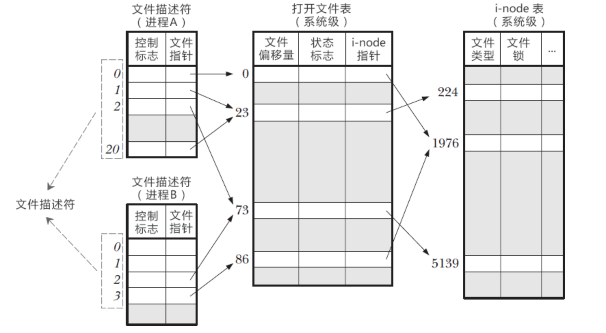

* DMA（Direct Memory Access） 功能，它可以使得设备在 CPU 不参与的情况下，能够⾃⾏完成把设备 I/O 数据放⼊到内存. Cpu-->DMA-->device<-->memory

* 键盘键入字符的发生事情：键盘设备缓存字符，向cpu发起**硬件中断**，cpu响应中断，(DMA?)从键盘设备读取字符至内存，进入中断处理函数：**放到「读缓冲区队列」**，显示设备的驱动程序会定时从「读缓冲区队列」读取数据放到「写缓冲区队列」（如果有写文件操作，大概也是去读「读缓冲区队列」？），最后把「写缓冲 区队列」的数据⼀个⼀个写⼊到显示设备的控制器的寄存器中的数据缓冲区，最后将这些数据显示在屏幕 ⾥。

* linux发送网络包过程：application --> socket发送缓冲区 --> 网络协议栈 -->网卡 ----------> 网卡 --> 网络协议栈 --> socket接收缓冲区 -->application

* 零拷贝：https://zhuanlan.zhihu.com/p/83398714

  * 在⾼并发的场景下，针对⼤⽂件的传输的⽅式，应该使⽤「异步 I/O + 直接 I/O」来替代零拷⻉技术
  * 传输⽂件的时候，我们要根据⽂件的⼤⼩来使⽤不同的⽅式： 传输⼤⽂件的时候，使⽤「异步 I/O + 直接 I/O」； 传输⼩⽂件的时候，则使⽤「零拷⻉技术」

* 一致性hash：https://segmentfault.com/a/1190000021199728

  * 对于分布式缓存这种的系统而言，映射规则失效就意味着之前缓存的失效，若同一时刻出现大量的缓存失效，则可能会出现 “缓存雪崩”，这将会造成灾难性的后果

* I/O 多路复⽤：

  * select

    * **最大限制：**单个进程能够监视的文件描述符的数量存在最大限制
    * **时间复杂度：** 对socket进行扫描时是线性扫描，即采用轮询的方法，效率较低，时间复杂度O(n)
    * **内存拷贝：**需要维护一个用来存放大量fd的数据结构，这样会使得用户空间和内核空间在传递该结构时复制开销大
    * 阻塞式调用

  * poll

    * **没有最大连接数的限制**。（基于链表来存储的）
    * 其余同select

  * epoll

    * **没有最大连接数的限制**
    * **时间复杂度低：** 边缘触发和事件驱动，监听回调，时间复杂度O(1)。
    * **内存拷贝：**利用mmap()文件映射内存加速与内核空间的消息传递，减少拷贝开销。
    * 水平触发(level-trggered)
      - 只要文件描述符关联的读内核缓冲区非空，有数据可以读取，就一直发出可读信号进行通知，
      - 当文件描述符关联的内核写缓冲区不满，有空间可以写入，就一直发出可写信号进行通知
    * 边缘触发(edge-triggered)
      * 当文件描述符关联的读内核缓冲区由空转化为非空的时候，则发出可读信号进行通知，
      * 当文件描述符关联的内核写缓冲区由满转化为不满的时候，则发出可写信号进行通知
    * ET模式在很大程度上减少了epoll事件被重复触发的次数，因此效率要比LT模式高
  
  * 多路复⽤ API 返回的事件并不⼀定可读写的，如果使⽤阻塞 I/O， 那么在调⽤ read/write 时则会发⽣程序阻塞，因此最好搭配**⾮阻塞 I/O**，以便应对极少数的特殊情况。
  
    > Under Linux, select() may report a socket file descriptor as "ready for reading", while nevertheless a subsequent read blocks. This could for example happen when data has arrived but upon examination has wrong checksum and is discarded. There may be other circumstances in which a file descriptor is spuriously reported as ready. Thus it may be safer to use O_NONBLOCK on sockets that should not block.


* Reactor模型
  * **I/O 多路复用监听事件，收到事件后，根据事件类型分配（Dispatch）给某个进程 / 线程**。
  * Reactor 负责监听和分发事件，事件类型包含连接事件、读写事件；
  * 处理资源池负责处理事件，如 read -> 业务逻辑 -> send；
  * 单 Reactor 单进程 / 线程：**Redis**：EventLoop
    * 不适⽤计算机密集型的场景，只适⽤于业务处理⾮常快速的场景
    * 无锁
  
* 多 Reactor 多进程 / 线程
  * 主线程中的 MainReactor 对象通过 select 监控连接建立事件，收到事件后通过 Acceptor 对象中的 accept  获取连接，将新的连接分配给某个子线程；
  * 子线程中的 SubReactor 对象将 MainReactor 对象分配的连接加入 select 继续进行监听，并创建一个 Handler 用于处理连接的响应事件。
  * 如果有新的事件发生时，SubReactor 对象会调用当前连接对应的 Handler 对象来进行响应。
  * Handler 对象通过 read -> 业务处理 -> send 的流程来完成完整的业务流程。
  * 特点
    * 主线程和子线程分工明确，主线程只负责接收新连接，子线程负责完成后续的业务处理。
    * 主线程和子线程的交互很简单，主线程只需要把新连接传给子线程，子线程无须返回数据，直接就可以在子线程将处理结果发送给客户端。
  
* page cache：https://spongecaptain.cool/SimpleClearFileIO/1.%20page%20cache.html

* 申请内存：
  * 应用程序通过 malloc 函数申请内存的时候，实际上申请的是虚拟内存，此时并不会分配物理内存。
  * 当应用程序读写了这块虚拟内存，CPU 就会去访问这个虚拟内存， 这时会发现这个虚拟内存没有映射到物理内存， CPU 就会产生**缺页中断**，进程会从用户态切换到内核态，并将缺页中断交给内核的 Page Fault Handler （缺页中断函数）处理。
  
* 虚拟内存作用
  * 第一，由于每个进程都有自己的页表，所以每个进程的虚拟内存空间就是相互独立的。进程也没有办法访问其他进程的页表，所以这些页表是私有的。这就解决了多进程之间地址冲突的问题。
  * 第二，页表里的页表项中除了物理地址之外，还有一些标记属性的比特，比如控制一个页的读写权限，标记该页是否存在等。在内存访问方面，操作系统提供了更好的安全性。(包装一层)
  
* 内存回收
  * 回收策略
    * 后台内存回收：异步
    * 直接内存回收：同步
  * 回收对象
    * 文件页：文件
    * 匿名页：进程（栈，堆等
  
* 硬中断和软中断
  * 硬中断（上半部）是会打断 CPU 正在执行的任务，然后立即执行中断处理程序，而软中断（下半部）是以内核线程的方式执行，并且每一个 CPU 都对应一个软中断内核线程，名字通常为「ksoftirqd/CPU 编号」，比如 0 号 CPU 对应的软中断内核线程的名字是 `ksoftirqd/0`
  
* 信号  https://os.51cto.com/article/675743.html
  * 信号的执行在该进程返回到用户模式时开始
  
  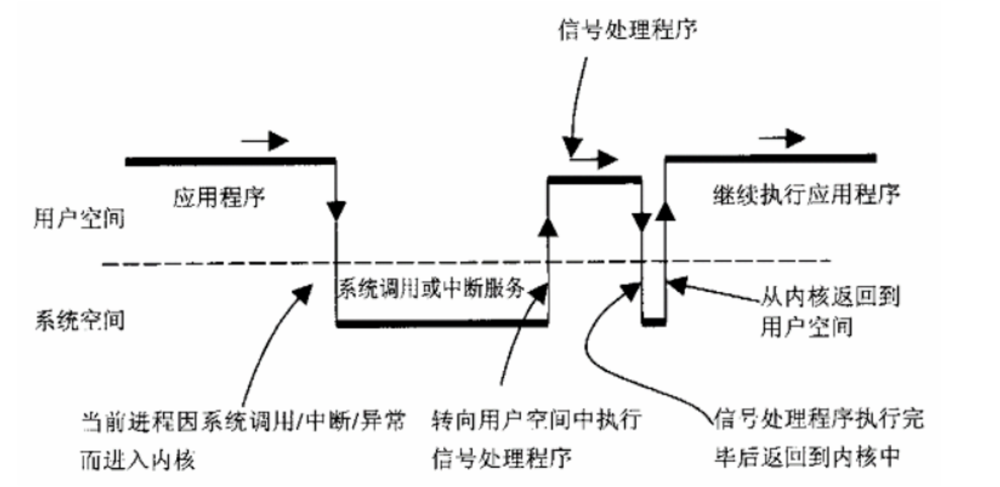
  
* 线程的崩溃：异常 ---> 内核发信号（例如：SIGSEGV非法访问）---> 信号处理函数（ ---> 退出）
  * 可通过自定义信号处理函数规避线程崩溃导致的进程崩溃
  
* 小端 **VS** 大端：一种是将低序字节存储在起始地址，这称为小端(little-endian)字节序；另一种方法是将高序字节存储在起始地址，这称为大端(big-endian)字节序。

* mmap

  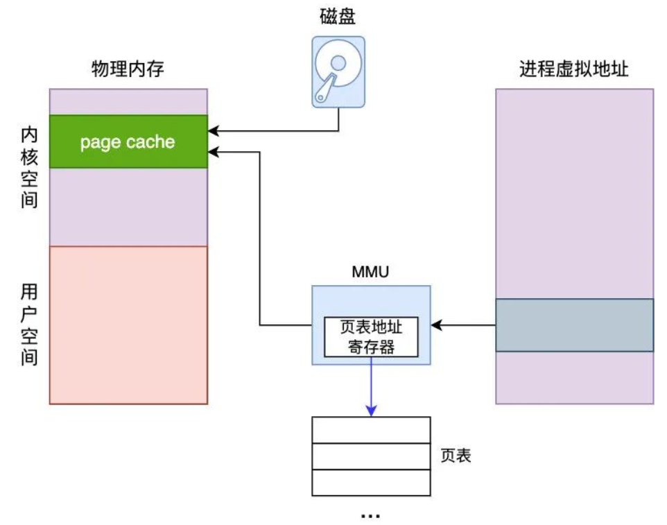

  细节：

  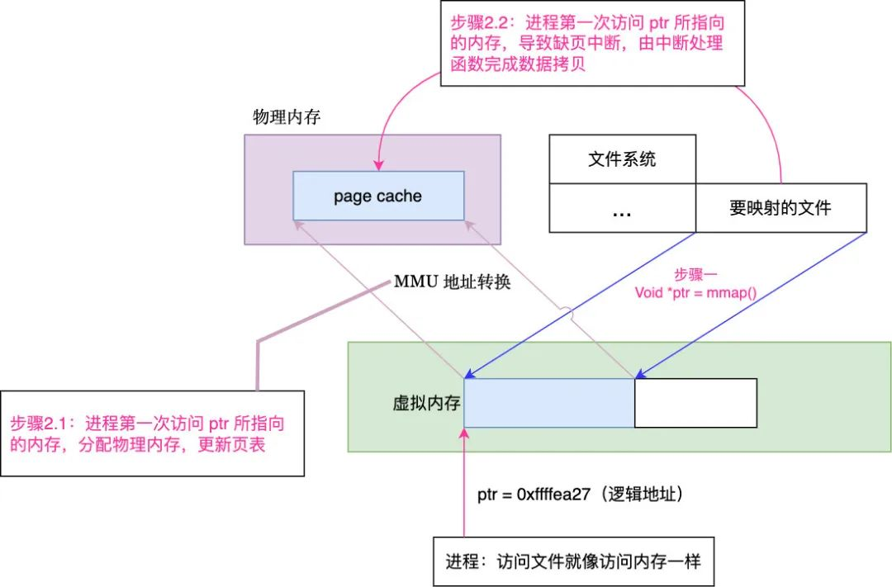

  1. 先把磁盘上的文件映射到进程的虚拟地址上（此时还未分配物理内存），即调用 mmap 函数返回指针 ptr，它指向虚拟内存中的一个地址，这样进程无需再调用 read 或 write 对文件进行读写，只需要通过 **ptr 就能操作文件**，所以如果需要对文件进行多次读写，显然使用 mmap 更高效，因为只会进行一次系统调用，比起多次 read 或 write 造成的多次系统调用显然开销会更低
  2. 但需要注意的是此时的 ptr 指向的是逻辑地址，并未真正分配物理内存，**只有通过 ptr 对文件进行读写操作时才会分配物理内存**，分配之后会更新页表，将虚拟内存与物理内存映射起来，这样虚拟内存即可通过 MMU 找到物理内存，**分配完内存后即可将文件加载到 page cache**，于是进程就可在内存中愉快地读写文件了

  好处：

  1. 省去了 CPU 拷贝，原本需要 CPU 从内核缓冲区拷贝到用户缓冲区，现在这一步省去了
  2. 节省了一半的空间: 因为不需要将 page cache 拷贝到用户空间了，可以认为用户空间和内核空间共享 page cache

  坏处：

  1. **文件无法完成拓展**：因为执行 mmap 的时候，你所能操作的范围就已经确定了，无法增加文件长度
  2. **地址映射的开销**：为了创建并维持虚拟地址空间与文件的映射关系，内核中需要有特定的数据结构来实现这一映射。内核为每个进程维护一个任务结构 task_struct，task_struct 中的 mm_struct 描述了虚拟内存的信息，mm_struct 中的 mmap 字段是一个 vm_area_struct 指针，内核中的 vm_area_struct 对象被组织成一个链表 + 红黑树的结构。
  3. **缺页中断（page fault）的开销**: 调用 mmap 内核只是建立了逻辑地址（虚拟内存）到物理地址（物理内存）的映射表，实际并没有任何数据加载到物理内存中，只有在主动读写文件的时候发现数据所在分页不在内存中时才会触发缺页中断，分配物理内存，缺页中断一次读写只会触发一个 page 的加载，一个 page 只有 4k，想象一次，如果一个文件是 1G，那就得触发 256 次缺页中断！中断的开销是很大的，那么对于大文件来说，就会发生很多次的缺页中断，这显然是不可接受的，所以一般 mmap 得配合另一个系统调用 madvise，它有个**文件预热**的功能可以**建议**内核一次性将一大段文件数据读取入内存，这样就避免了多次的缺页中断，同时为了避免文件从内存中 swap 到磁盘，也可以对这块内存区域进行锁定，避免换出
  4. **mmap 并不适合读取超大型文件**，mmap 需要**预先分配连续的虚拟内存空间**用于映射文件，如果文件较大，对于 32 位地址空间（4 G）的系统来说，可能找不到足够大的连续区域，而且如果某个文件太大的话，会挤压其他热点小文件的 page cache 空间，影响这些文件的读写性能

* 内存淘汰算法LRU缺点

* 传统的 LRU 算法法无法避免下面这两个问题：
  
  - 预读失效导致缓存命中率下降；
  - 缓存污染导致缓存命中率下降；
  
  为了避免「预读失效」造成的影响，Linux 和 MySQL 对传统的 LRU 链表做了改进：
  
  - Linux 操作系统实现两个了 LRU 链表：**活跃 LRU 链表（active list）和非活跃 LRU 链表（inactive list）**。
  - MySQL  Innodb 存储引擎是在一个 LRU 链表上划分来 2 个区域：**young 区域 和 old 区域**。
  
  但是如果还是使用「只要数据被访问一次，就将数据加入到活跃 LRU 链表头部（或者 young 区域）」这种方式的话，那么**还存在缓存污染的问题**。
  
  为了避免「缓存污染」造成的影响，Linux 操作系统和 MySQL Innodb 存储引擎分别提高了升级为热点数据的门槛：
  
  - Linux 操作系统：在内存页被访问**第二次**的时候，才将页从 inactive list 升级到 active list 里。
  
  - MySQL Innodb：在内存页被访问**第二次**的时候，并不会马上将该页从 old 区域升级到 young 区域，因为还要进行**停留在 old 区域的时间判断**：
  
  - - 如果第二次的访问时间与第一次访问的时间**在 1 秒内**（默认值），那么该页就**不会**被从 old 区域升级到 young 区域；
    - 如果第二次的访问时间与第一次访问的时间**超过 1 秒**，那么该页就**会**从 old 区域升级到 young 区域；
  
  通过提高了进入 active list  （或者 young 区域）的门槛后，就很好了避免缓存污染带来的影响。
  


### Mysql

* 连接 --> 语法、词法解析 --> 预处理 --> 优化器 --> 执行器 --> 存储引擎

* 预编译：mysql提前语法分析，将sql语句模板化或者说参数化
  * 优点：一次编译、多次运行，省去了解析优化等过程；此外预编译语句能防止sql注入

* 具体更新一条记录 `UPDATE t_user SET name = 'xiaolin' WHERE id = 1;` 的流程如下:
  
  1. 执行器负责具体执行，会调用存储引擎的接口，通过主键索引树搜索获取 id = 1 这一行记录：
  
  2. - 如果 id=1 这一行所在的数据页本来就在 buffer pool 中，就直接返回给执行器更新；
     - 如果记录不在 buffer pool，将数据页从磁盘读入到 buffer pool，返回记录给执行器。
  
  3. 开启事务， InnoDB 层更新记录前，首先要记录相应的 undo log，因为这是更新操作，需要把被更新的列的旧值记下来，也就是要生成一条 undo log，undo log 会写入 Buffer Pool 中的 Undo 页面，不过在修改该 Undo 页面前需要先记录对应的 redo log，所以**先记录修改 Undo 页面的 redo log ，然后再真正的修改 Undo 页面**。
  
  4. InnoDB 层开始更新记录，根据 WAL 技术，**先记录修改数据页面的 redo log ，然后再真正的修改数据页面**。修改数据页面的过程是修改 Buffer Pool 中数据所在的页，然后将其页设置为脏页，为了减少磁盘I/O，不会立即将脏页写入磁盘，后续由后台线程选择一个合适的时机将脏页写入到磁盘。
  
  5. 至此，一条记录更新完了。
  
  6. 在一条更新语句执行完成后，然后开始记录该语句对应的 binlog，此时记录的 binlog 会被保存到 binlog cache，并没有刷新到硬盘上的 binlog 文件，在事务提交时才会统一将该事务运行过程中的所有 binlog 刷新到硬盘。
  
  7. 事务提交（为了方便说明，这里不说组提交的过程，只说两阶段提交）：
  
  8. - **prepare 阶段**：将 redo log 对应的事务状态设置为 prepare，然后将 redo log 刷新到硬盘；
     - **commit 阶段**：将 binlog 刷新到磁盘，接着调用引擎的提交事务接口，将 redo log 状态设置为；
  
* 组提交机制

  * 秒杀中减轻mysql压力
  * mysql中redo log和binlog写盘时降低磁盘压力
  * singleflight
  * kafka

* crash safe

  * 依赖于redo log + binlog，利用两阶段提交确保一致性

* undo log

  * 实现了事务中的**原子性**，主要**用于事务回滚和 MVCC**
  * 事务回滚：版本链

* redo log

  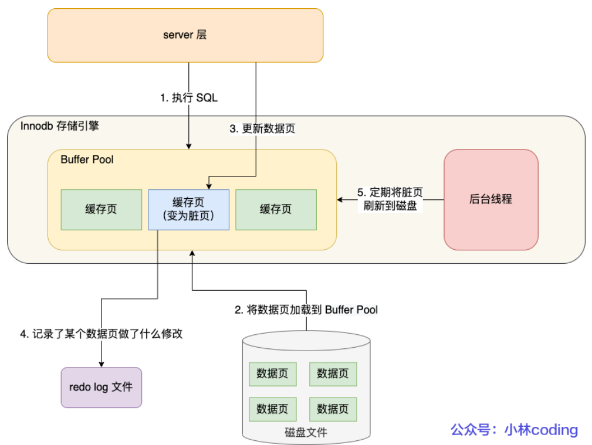

  * 作用

    * crash safe
      * 实现了事务中的**持久性**，主要**用于掉电等故障恢复**；
    * 写数据库的时候，不用每次都随机刷盘，可以安心放在内存中（crash safe、随机写 --> 顺序写

  * redo log buffer
    * redo log --> redo log buffer --> redo log file(OS) --> redo log file(Disk)

  * redo log file
    * 循环写
    * 写满时MySQL 会被阻塞，会停下来将 Buffer Pool 中的脏页刷新到磁盘中，然后标记 redo log 哪些记录可以被擦除，接着对旧的 redo log 记录进行擦除，等擦除完旧记录腾出了空间，checkpoint 就会往后移动
      * **此时的刷盘也只将redo log对应的脏页刷盘，并不理会redo log中具体的操作**

  * redo log的落盘时机

    * MySQL 正常关闭时；

    * 当 redo log buffer 中记录的写入量大于 redo log buffer 内存空间的一半时，会触发落盘；

    * InnoDB 的后台线程每隔 1 秒，将 redo log buffer 持久化到磁盘。

    * 每次事务提交时都将缓存在 redo log buffer 里的 redo log 直接持久化到磁盘（这个策略可由 innodb_flush_log_at_trx_commit 参数控制，下面会说）

      * innodb_flush_log_at_trx_commit：

        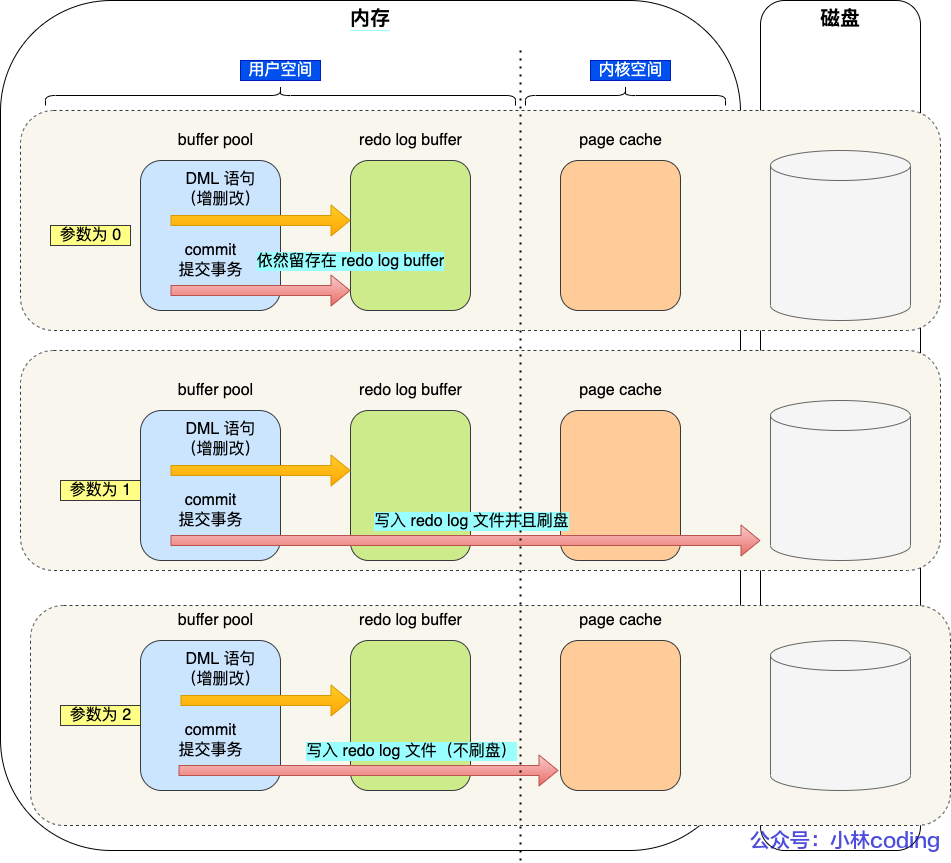

        * 当设置该**参数为 0 时**，表示每次事务提交时 ，还是**将 redo log 留在  redo log buffer 中** ，该模式下在事务提交时不会主动触发写入磁盘的操作。
        * 当设置该**参数为 1 时**，表示每次事务提交时，都**将缓存在  redo log buffer 里的  redo log 直接持久化到磁盘**，这样可以保证 MySQL 异常重启之后数据不会丢失。
        * 当设置该**参数为 2 时**，表示每次事务提交时，都只是缓存在  redo log buffer 里的  redo log **写到 redo log 文件，注意写入到「 redo log 文件」并不意味着写入到了磁盘**，因为操作系统的文件系统中有个 Page Cache（如果你想了解  Page Cache，可以看这篇 ），Page Cache 是专门用来缓存文件数据的，所以写入「 redo log文件」意味着写入到了操作系统的文件缓存。
        * InnoDB 的后台线程每隔 1 秒：
          - 针对参数 1 ：会把缓存在 redo log buffer 中的 redo log ，通过调用 `write()` 写到操作系统的 Page Cache，然后调用 `fsync()` 持久化到磁盘。**所以参数为 0 的策略，MySQL 进程的崩溃会导致上一秒钟所有事务数据的丢失**;
          - 针对参数 2 ：调用 fsync，将缓存在操作系统中 Page Cache 里的 redo log 持久化到磁盘。**所以参数为 2 的策略，较取值为 0 情况下更安全，因为 MySQL 进程的崩溃并不会丢失数据，只有在操作系统崩溃或者系统断电的情况下，上一秒钟所有事务数据才可能丢失**。
        * 数据安全性：参数 1 > 参数 2 > 参数 0
        * 写入性能：参数 0 > 参数 2> 参数 1

        

* binlog

  * 格式：row（用的多，另外可以用于快速恢复）、statement
  * 主要**用于数据备份和主从复制**
    * 定期的整库备份 + 完整的binlog
  * binlog --> binlog cache --> binlog file(OS) -->binlog file(disk)
  * 作用
    * 数据归档
    * 主从同步
  *  sync_binlog 参数
    * sync_binlog = 0 的时候，表示每次提交事务都只 write，不 fsync，后续交由操作系统决定何时将数据持久化到磁盘；
    * sync_binlog = 1 的时候，表示每次提交事务都会 write，然后马上执行 fsync；
    * sync_binlog =N(N>1) 的时候，表示每次提交事务都 write，但累积 N 个事务后才 fsync。

  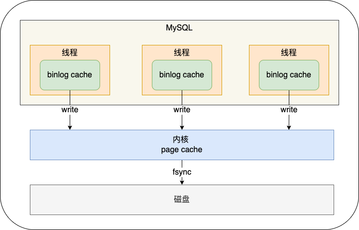

* redo log buffer **VS** binlog cache

  * redo log buffer单机一份，binlog cache一个线程一份
  * binlog需要保证事务的原子性，否则子库的主从同步只能单线程
  * redo log只是主机使用，而且同时写redo log的事务不会产生锁竞争，单机一份是安全的

* 两阶段提交

  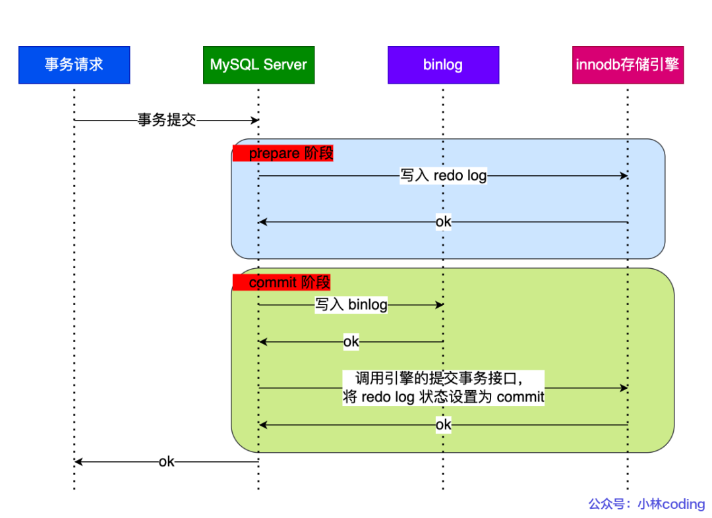

  * redo （prepare disk）---->. binlog(disk) ----> redo（commit）
  * redo和binlog通过**内部 XA 事务**关联
  * 处于 prepare 阶段的 redo log 加上完整 binlog，重启就提交事务，MySQL 为什么要这么设计?
    * binlog 已经写入了，之后就会被从库（或者用这个 binlog 恢复出来的库）使用。所以，在主库上也要提交这个事务。采用这个策略，主库和备库的数据就保证了一致性。
  * 问题：磁盘 I/O 次数高
    * 对于“双1”配置，每个事务提交都会进行两次 fsync（刷盘），一次是 redo log 刷盘，另一次是 binlog 刷盘。
  * 解决：组提交
    * 当有多个事务提交的时候，会将多个 binlog 刷盘操作合并成一个，从而减少磁盘 I/O 的次数
    * redo log(prepare) --> binlog(OS) --> redo log(disk) flush阶段 --> binlog(disk) sync阶段-->redo log(commit)
    * flush阶段：**用于支撑 redo log 的组提交**
    * sync阶段：**用于支撑 binlog的组提交**

* mysql集群架构：一主一备多从

* 从库的并行复制

  * 经典策略：同库、同表、同行的放在一个worker中执行
  * MariaDB 的并行复制策略：能够在同一组里提交的事务，一定不会修改同一行；主库上可以并行执行的事务，备库上也一定是可以并行执行的。

* 主从延时导致的不一致

  * 强制走主库（取巧
  * sleep一段时间（取巧
  * GTID保证一致性

* 临时表

  * 一个临时表只能被创建它的 session 访问，对其他线程不可见，在 session 结束的时候，会自动删除

* Buffer pool

  * Free 链表、LRU 链表、Flush 链表
  * 页面淘汰算法：分young区和old区的LRU算法
  * 自己实现buffer pool而不是直接使用mmap
    * 一是性能，二是策略。交由操作系统来做的话，底层无法干预，这两个问题无法改善。大概可以类比于操作系统是一个通用的大货车，什么都能干，但是肯定不如定制化的跑车跑得快。

* WAL：

  * WAL （Write-Ahead Logging）技术，指的是 MySQL 的写操作并不是立刻更新到磁盘上，而是先记录在日志上，然后在合适的时间再更新到磁盘上。
  * MySQL 的写操作从磁盘的「随机写」变成了「顺序写」

* count性能

  * count(*) = count(1) > count(主键) > count(字段)

  * count(字段):**不为 NULL 的记录有多少个**

    > InnoDB handles SELECT COUNT(`*`) and SELECT COUNT(`1`) operations in the same way. There is no performance difference.

  * count(1)、 count(*)、 count(主键字段)在执行的时候，如果表里存在二级索引，优化器就会选择**二级索引**进行扫描。

  * 加速count

    * 模糊：
      * show table status
      * redis
    * 精确：额外维护计数表
      * 在insert和delete时，对计数表进行加减操作
      * 缺点：可维护性不高

* 索引

  * 最左匹配 -----> 索引下推
  * 索引下推
  * 索引覆盖
  * 逐渐自增（插入快、防数据页的分裂
  * 索引失效
  * 缺点
    * 需要占用物理空间，数量越大，占用空间越大；
    * 创建索引和维护索引要耗费时间，这种时间随着数据量的增加而增大；
    * 会降低表的增删改的效率，因为每次增删改索引，都需要进行动态维护

  * 建立联合索引时，要把**区分度大**的字段排在前面，这样区分度大的字段越有可能被更多的 SQL 使用到。
  * 不建索引的场景

    * where条件里不用的
    * 经常更新的字段
  * 即使查询过程中，没有遵循最左匹配原则，某些sql查询也会走索引扫描的

    * MySQL 优化器认为直接遍历二级索引树要比遍历聚簇索引树的成本要小的多（聚簇索引树包含一些隐藏列，扫描的数据页多一些
  * 索引失效
    * 索引左模糊匹配
    * 对索引使用函数
    * 对索引使用表达式计算（select * from t where a + 1 = 1)
    * 对索引隐式类型转换：字符串 ---> 数字 
    * 联合索引非最左匹配
    * where中使用or

* 选择B+树而不选择B树

  * B+ 树的非叶子节点不存放实际的记录数据，仅存放索引，因此数据量相同的情况下，相比存储即存索引又存记录的 B 树，B+树的非叶子节点可以存放更多的索引，因此 B+ 树可以比 B 树更「**矮胖**」，查询底层节点的磁盘 I/O次数会更少。
  * B+ 树有大量的冗余节点（所有非叶子节点都是冗余索引），这些冗余索引让 B+ 树在插入、删除的效率都更高，比如删除根节点的时候，不会像 B 树那样会发生复杂的树的变化；
  * B+ 树叶子节点之间用链表连接了起来，有利于范围查询，而 B 树要实现范围查询，因此只能通过树的遍历来完成范围查询，这会涉及多个节点的磁盘 I/O 操作，范围查询效率不如 B+ 树。

* 大事务的危害

  * 锁定太多的数据，造成大量的阻塞和锁超时。
  * 回滚所需要的时间比较长。
  * 执行时间长，容易造成主从延迟。

* 优化limit分页：

  * limit l offset o：会将0～l+o行所有的数据返回给server层，再由server层返回第o～l+o行数据

  * 尽可能减少回表查询次数，直接利用非聚集索引查到第o~l+o个索引项，然后再回表查询这l项数据。

    将

    > **SELECT** film_id,description **FROM** film **ORDER** **BY** title **LIMIT** 50,5; 

    改为

    > **SELECT** film.film_id,film.description 
    > **FROM** film **INNER** **JOIN** ( 
    >   **SELECT** film_id **FROM** film **ORDER** **BY** title **LIMIT** 50,5 
    > ) **AS** tmp **USING**(film_id); 

* innodb使用b+ tree，不使用跳表原因：https://juejin.cn/post/7106131535857713160

* 意向锁

  * 意向共享锁
  * 意向排他锁
  * 意向（共享/排他）锁之间不互斥
  * 意向锁和表锁之间互斥
    * 举例
      * select ... for update(意向排他锁)
      * Alter table ... add column...(表写锁)

    * 作用：加表级锁时不需要遍历每一行来得知是否存在行级的读写锁

* 插入意向锁

  > *Gap locks in InnoDB are “purely inhibitive”, which means that their only purpose is to prevent **other** transactions from Inserting to the gap. Gap locks can co-exist. A gap lock taken by one transaction does not prevent another transaction from taking a gap lock on the same gap. There is no difference between shared and exclusive gap locks. They do not conflict with each other, and they perform the same function.*

  * **间隙锁的意义只在于阻止区间被插入**，因此是可以共存的。**一个事务获取的间隙锁不会阻止另一个事务获取同一个间隙范围的间隙锁**，共享和排他的间隙锁是没有区别的，他们相互不冲突，且功能相同。

  > An insert intention lock is a type of gap lock set by INSERT operations prior to row insertion. This lock signals the intent to insert in such a way that multiple transactions inserting into the same index gap need not wait for each other **if they are not inserting at the same position within the gap**. Suppose that there are index records with values of 4 and 7. Separate transactions that attempt to insert values of 5 and 6, respectively, each lock the gap between 4 and 7 with insert intention locks prior to obtaining the exclusive lock on the inserted row, but do not block each other because the rows are nonconflicting.

  * `插入意向锁`是一种特殊的`间隙锁`，不是表锁 —— `间隙锁`可以锁定**开区间**内的部分记录。
  * `插入意向锁`之间互不排斥，所以即使多个事务在同一区间插入多条记录，只要记录本身（`主键`、`唯一索引`）不冲突，那么事务之间就不会出现**冲突等待**。
  * **插入意向锁和间隙锁是互斥的**，可能导致死锁
    * 当其它事务持有一个间隙的间隙锁时，需要等待其它事务释放间隙锁之后，才能获取到插入意向锁，释放之前处于等待态
  
  
  
    ```mysql
    begin;																		begin;
    select * from t where a>10 for update;
    																					select * from t where a>5 for update;
    insert into t values(12,12);							insert into t values(11,11);
    //waiting																	//waiting
    deadlock
    ```
  
    
  
  * 作用：提升并发度
  * 插入操作：先插入意向锁，后加上行排他锁
  
* 插入意向锁和间隙锁导致的死锁问题

  * **设置事务等待锁的超时时间**
  * **开启主动死锁检测**
  * 业务层面解决
    * 比如select...for update和insert导致的死锁，使用唯一索引代替select...for update来保证幂等性
  
* 超大表的优化

  * 优化sql和索引
  * 用户画像，冷热分离：加缓存，member cache, redis，层级分离mysql数据
  * 主从复制或主主复制，读写分离
  * mysql自带分区表，sql条件中要带上分区条件的列，从而使查询定位到少量的分区上
  * 水平切分：**sharding key**
  * 调研引擎？

* mysql推荐单表2000万由来

  * Mysql 的表数据是以页的形式存放的，页在磁盘中不一定是连续的。
  * 页的空间是 16K, 并不是所有的空间都是用来存放数据的，会有一些固定的信息，如，页头，页尾，页码，校验码等等。
  * 在 B+ 树中，叶子节点和非叶子节点的数据结构是一样的，区别在于，叶子节点存放的是实际的行数据，而非叶子节点存放的是主键和页号。
  * 索引结构不会影响单表最大行数，2000w 也只是推荐值，**超过了这个值可能会导致 B + 树层级更高，影响查询性能**。


### Go

* Type、Value和Kind

* gmp：https://go.cyub.vip/gmp/gmp-model.html

  * 用户态阻塞

    当goroutine因为channel操作或者network I/O而阻塞时（实际上golang已经用netpoller实现了goroutine网络I/O阻塞不会导致M被阻塞，仅阻塞G），对应的G会被放置到某个wait队列(如channel的waitq)，该G的状态由_Gruning变为_Gwaitting，而M会跳过该G尝试获取并执行下一个G，如果此时没有runnable的G供M运行，那么M将解绑P，并进入sleep状态；当阻塞的G被另一端的G2唤醒时（比如channel的可读/写通知），G被标记为runnable，尝试加入G2所在P的runnext，然后再是P的Local队列和Global队列。

  * 系统调用阻塞

    当G被阻塞在某个系统调用上时，此时G会阻塞在_Gsyscall状态，M也处于 block on syscall 状态，此时的M可被抢占调度：执行该G的M会与P解绑，而P则尝试与其它idle的M绑定，继续执行其它G。如果没有其它idle的M，但P的Local队列中仍然有G需要执行，则创建一个新的M；当系统调用完成后，G会重新尝试获取一个idle的P进入它的Local队列恢复执行，如果没有idle的P，G会被标记为runnable加入到Global队列。

* 协程

  * 协程必须与内核级线程绑定之后才能执行
  * 线程由 CPU 调度是抢占式的，协程由用户态调度是协作式的，一个协程让出 CPU 后，才执行下一个协程

* 协程的优点

  * 相比线程，其启动的代价很小，以很小栈空间启动（2Kb左右）
  * 能够动态地伸缩栈的大小，最大可以支持到Gb级别
  * 工作在用户态，切换成很小
  * 与线程关系是n:m，即可以在n个系统线程上多工调度m个Goroutine

* 内核级线程的优点

  - 在多处理器系统中，内核能够并行执行同一进程内的多个线程
  - 如果进程中的一个线程被阻塞，不会阻塞其他线程，是能够切换同一进程内的其他线程继续执行
  - 当一个线程阻塞时，内核根据选择可以运行另一个进程的线程，而用户空间实现的线程中，运行时系统始终运行自己进程中的线程

  缺点：

  * 线程的创建与删除都需要CPU参与，成本大
  * 数量受内核限制

* 用户级线程的优点：

  - 创建和销毁线程、线程切换代价等线程管理的代价比内核线程少得多, 因为保存线程状态的过程和调用程序都只是本地过程
  - 线程能够利用的表空间和堆栈空间比内核级线程多

  缺点：

  - 线程发生I/O或页面故障引起的阻塞时，如果调用阻塞系统调用则内核由于不知道有多线程的存在，而会阻塞整个进程从而阻塞所有线程, 因此同一进程中只能同时有一个线程在运行
  - 资源调度按照进程进行，多个处理机下，同一个进程中的线程只能在同一个处理机下分时复用

* G-M-P分别代表：

  - G - Goroutine，Go协程，是参与调度与执行的最小单位
  - M - Machine，指的是系统级线程
  - P - Processor，指的是逻辑处理器，P关联了的本地可运行G的队列(也称为LRQ)。

* 当G因系统调用(syscall)阻塞时会阻塞M，此时P会和M解绑即**hand off**，并寻找新的idle的M，若没有idle的M就会新建一个M。

* 当G因channel或者network I/O阻塞时，不会阻塞M，M会寻找其他runnable的G；当阻塞的G恢复后会重新进入runnable进入P队列等待执行

* 在任一时刻，只能最多有和逻辑CPU数目（P）一样多的协程在同时执行

* defer：延迟调用队列（一个后进先出队列）

  * 一个延迟调用的**实参**是在此**调用**对应的延迟调用语句被执行时被估值的
  * 一个匿名函数体内的表达式是在此**函数**被执行的时候才会被逐渐估值的

* panic和recover

* 一些致命性错误不属于恐慌，比如栈溢出和内存不足，不能被恢复。它们一旦产生，程序将崩溃。

* 通道

  * **不要让计算通过共享内存来通讯，而应该让它们通过通讯来共享内存**
  * 关闭一个nil通道或者一个已经关闭的通道将产生一个恐慌。
  * 向一个已关闭的通道发送数据也将导致一个恐慌。
  * 向一个nil通道发送数据或者从一个nil通道接收数据将使当前协程永久阻塞。
  * 一个通道内部维护了三个队列
    * 接收数据协程队列
    * 发送数据协程队列
    * 数据缓冲队列
  * 在任何时刻，如果缓冲队列不为空，则接收数据协程队列必为空。
  * 在任何时刻，如果缓冲队列未满，则发送数据协程队列必为空。


### Web

* 粘性session和非粘性session
* 一致性hash：负载均衡，解决数据迁移，虚拟节点提高均衡性


### 计算机网络

#### HTTP

* HTTPS 是在 HTTP 与 TCP 层之间增加了 SSL/TLS 安全传输层
  * 信息加密：混合加密的⽅式实现信息的机密性
  * 校验机制：摘要算法的⽅式来实现完整性
  * 身份证书：将服务器公钥放⼊到数字证书中
  
  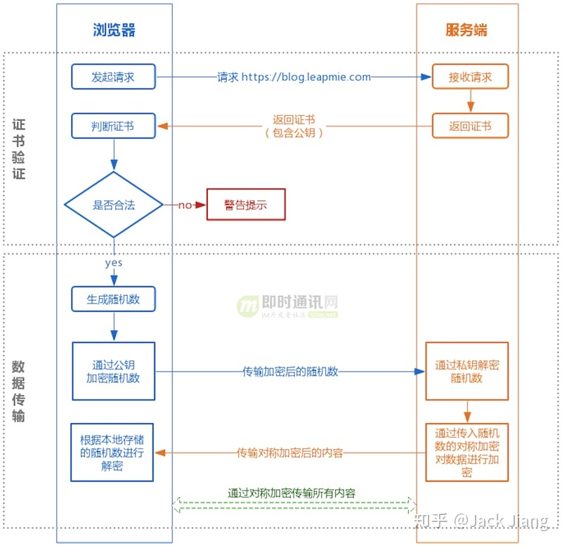
  
  **①** **证书验证阶段：**
  
  - 1）浏览器发起 HTTPS 请求；
  - 2）服务端返回 HTTPS 证书；
  - 3）客户端验证证书是否合法，如果不合法则提示告警。
  
  **② 数据传输阶段：**
  
  - 1）当证书验证合法后，在本地生成随机数；
  - 2）通过公钥加密随机数，并把加密后的随机数传输到服务端；
  - 3）服务端通过私钥对随机数进行解密；
  - 4）服务端通过客户端传入的随机数构造对称加密算法，对返回结果内容进行加密后传输。
  
* 为什么数据传输是用对称加密？
  
  **首先：**非对称加密的加解密效率是非常低的，而 http 的应用场景中通常端与端之间存在大量的交互，非对称加密的效率是无法接受的。
  
  **另外：**在 HTTPS 的场景中只有服务端保存了私钥，一对公私钥只能实现单向的加解密，所以HTTPS 中内容传输加密采取的是对称加密，而不是非对称加密。
  
* HTTP演变经过
  * 1.0 --> 1.1
    * 使⽤ TCP ⻓连接的⽅式改善了 HTTP/1.0 短连接造成的性能开销。
    *  ⽀持管道（pipeline）⽹络传输，只要第⼀个请求发出去了，不必等其回来，就可以发第⼆个请求出去，可以 减少整体的响应时间。
    * 问题：队头阻塞：https://zhuanlan.zhihu.com/p/330300133
      * 在切换到发送新资源之前，必须**完整地**传输资源响应。如果前面的资源创建缓慢（例如，从数据库查询动态生成的`index.html`）或者，如果前面的资源很大。这些问题可能会引起队头阻塞问题。
  * 1.1 --> 2
    * 头部压缩
    * 二进制格式
    * 数据流
      * 引入“帧”（frames）标识每个资源块属于哪个“流”（stream），多路复用解决**应用层的队头阻塞**问题
    * 服务器推送
    * 问题：tcp的某个包的丢失可能导致所有的 HTTP 请求都必须等 待这个丢了的包被重传回来。
  * 2 --> 3
    * Tcp --> udp 解决**传输层的队头阻塞**问题
  
* HTTP VS RPC
  * 纯裸TCP是能收发数据，但它是个**无边界**的数据流，上层需要定义**消息格式**用于定义**消息边界**。于是就有了各种协议，HTTP和各类RPC协议就是在TCP之上定义的应用层协议。
  * **RPC本质上不算是协议，而是一种调用方式**，而像gRPC和thrift这样的具体实现，才是协议，它们是实现了RPC调用的协议。目的是希望程序员能像调用本地方法那样去调用远端的服务方法。同时RPC有很多种实现方式，**不一定非得基于TCP协议**。
  * 从发展历史来说，**HTTP主要用于b/s架构，而RPC更多用于c/s架构。但现在其实已经没分那么清了，b/s和c/s在慢慢融合。**很多软件同时支持多端，所以对外一般用HTTP协议，而内部集群的微服务之间则采用RPC协议进行通讯。
  * RPC其实比HTTP出现的要早，且比目前主流的HTTP1.1**性能**要更好，所以大部分公司内部都还在使用RPC。
  * **HTTP2.0**在**HTTP1.1**的基础上做了优化，性能可能比很多RPC协议都要好，但由于是这几年才出来的，所以也不太可能取代掉RPC。
  

#### TCP

* TCP是有三个特点，**面向连接**、**可靠**、基于**字节流**。
  
* TCP 和 UDP 区别： 
  
  * 连接 
    * TCP 是⾯向连接的传输层协议，传输数据前先要建⽴连接。 
    * UDP 是不需要连接，即刻传输数据。
  * 服务对象 
    * TCP 是⼀对⼀的两点服务，即⼀条连接只有两个端点。
    *  UDP ⽀持⼀对⼀、⼀对多、多对多的交互通信 
  * 可靠性 
    * TCP 是可靠交付数据的，数据可以⽆差错、不丢失、不重复、按需到达。
    *  UDP 是尽最⼤努⼒交付，不保证可靠交付数据。 
  * 拥塞控制、流量控制 
    * TCP 有拥塞控制和流量控制机制，保证数据传输的安全性。 
    * UDP 则没有，即使⽹络⾮常拥堵了，也不会影响 UDP 的发送速率。
  * ⾸部开销 
    * TCP ⾸部⻓度较⻓，会有⼀定的开销，⾸部在没有使⽤「选项」字段时是 20 个字节，如果使⽤了「选项」 字段则会变⻓的。 
    * UDP ⾸部只有 8 个字节，并且是固定不变的，开销较⼩。 
  *  传输⽅式 
    * TCP 是流式传输，没有边界，但保证顺序和可靠。 
    * UDP 是⼀个包⼀个包的发送，是有边界的，但可能会丢包和乱序。
  * 分⽚不同
    *  TCP 的数据⼤⼩如果⼤于 MSS ⼤⼩，则会在传输层进⾏分⽚，⽬标主机收到后，也同样在传输层组装 TCP 数据包，如果中途丢失了⼀个分⽚，只需要传输丢失的这个分⽚。 
    * UDP 的数据⼤⼩如果⼤于 MTU ⼤⼩，则会在 IP 层进⾏分⽚，⽬标主机收到后，在 IP 层组装完数据，接着 再传给传输层，但是如果中途丢了⼀个分⽚，在实现可靠传输的 UDP 时则就需要重传所有的数据包，这样 传输效率⾮常差，所以通常 UDP 的报⽂应该⼩于 MTU。
  
* 重传机制

  * 超时重传
  * 快速重传
  * SACK：Selective Acknowledgment 选择性确认

* 流量控制：双端的收发能力

  * 滑动窗口
  * 窗口探测
  * 糊涂窗⼝综合症
    * Nagle 算法，让发送⽅避免发送⼩数据
    * 窗口探测

* 拥塞控制：网络情况

  * 拥塞窗口
  * 慢启动 
  * 拥塞避免 
  * 拥塞发⽣ 
    * 超时重传
    * 快速重传：当发送⽅收到 3 个重复 ACK 时，就会触发快速重传，⽴刻重发丢失数据包

* 连接时延：在第三次握⼿发起 HTTP GET 请求，需要 2 个 RTT 的时延

* MSS

  * MSS选项用于在TCP连接建立时，收发双方协商通信时每一个报文段所能承载的最大数据长度。
  * 在分⽚传输中，⼀旦某个分⽚丢失，则会造成整个 IP 数据报作废，所以 TCP 引⼊了 MSS 也就是在 TCP 层进⾏ 分⽚不由 IP 层分⽚（否则重传效率低），那么对于 UDP 我们尽量不要发送⼀个⼤于 MTU 的数据报⽂。

* 三次握手

  * ⼀开始，客户端和服务端都处于 CLOSED 状态。先是服务端主动监听某个端⼝，处于 LISTEN 状态

  * 客户端随机初始化序号（ client_isn ），同时把 SYN 标志 位置为 1，之后客户端处于 SYN-SENT 状态。

  * 服务端收到客户端的 SYN 报⽂后，⾸先服务端也随机初始化⾃⼰的序号（ server_isn ），其次把 TCP ⾸部的「确认应答号」字段填⼊ client_isn + 1 , 接着把 SYN 和 ACK 标志位置为 1 ，最后把该报⽂发给客户端，该报⽂也不包含应⽤层数据，之后服务端处于 SYNRCVD 状态

  * 客户端收到服务端报⽂后，回应最后⼀个应答报⽂，⾸先该应答报⽂ TCP ⾸部 ACK 标志位 置为 1 ，其次「确认应答号」字段填⼊ server_isn + 1 ，最后把报⽂发送给服务端，这次报⽂可以携带客 户到服务器的数据，之后客户端处于 ESTABLISHED 状态。

  * 服务器收到客户端的应答报⽂后，也进⼊ ESTABLISHED 状态。

  * 为什么三次握手

    * **三次握⼿保证双⽅具有接收和发送的能⼒**

    * 三次握⼿才可以阻⽌重复历史连接的初始化（主要原因）

      > The principle reason for the three-way handshake is to prevent old duplicate connection initiations from causing confusion.

      如果是两次握⼿连接，就不能判断当前连接是否是历史连接，三次握⼿则可以在客户端（发送⽅）准备发送第三次 报⽂时，客户端因有⾜够的上下⽂来判断当前连接是否是历史连接（包含随机序列号的功劳

    *  三次握⼿才可以同步双⽅的初始序列号 

    * 三次握⼿才可以避免资源浪费

  * 序列号随机

    * 客户端随机原因：避免历史重复连接
    * 服务端随机原因：避免黑客冒充  https://www.cnblogs.com/Brake/p/13557055.html

  * IP 层会分⽚，为什么 TCP 层还需要 MSS 呢？

    * 么当如果⼀个 IP 分⽚丢失，整个 IP 报⽂的所有分⽚都得重传（IP不保证数据完整性），效率不高

  * 握手失败

    * 第三次失败：服务端在第二次握手失败后超时重试不行后断开连接，客户端连接则是处于established状态，直至主动发送数据，超时重试不行后断开（另外有保活机制）

  * 半连接队列，也称 SYN 队列

  * 全连接队列，也称 accepet 队列

  * 服务端收到客户端发起的 SYN 请求后，内核会把该连接存储到**半连接队列**，并向客户端响应 SYN+ACK，接着客 户端会返回 ACK，服务端收到第三次握⼿的 ACK 后，内核会把连接从半连接队列移除，然后创建新的完全的连 接，并将其添加到 **全连接**队列，等待进程调⽤ accept 函数时把连接取出来

  *  SYN 洪泛：

    * 客户端不回复第三次握⼿ ACK，这样就 会使得服务端有⼤量的处于 SYN_RECV 状态的 TCP 连接
    * 解决：syncookies，第二次握手期间连接不进入半连接队列，而是返回客户端cookie，在第三次握手时通过校验该cookie来完成握手连接

* 四次挥手

  * 客户端主动调用关闭连接的函数，于是就会发送 FIN 报文，这个  FIN 报文代表客户端**不会再发送数据**了，进入 FIN_WAIT_1 状态；
  * 服务端收到了 FIN 报文，然后马上回复一个 ACK 确认报文，此时服务端进入 CLOSE_WAIT 状态。在收到 FIN 报文的时候，TCP 协议栈会为 FIN 包插入一个文件结束符 EOF 到接收缓冲区中，服务端应用程序可以通过 read 调用来感知这个 FIN 包，这个 EOF 会被**放在已排队等候的其他已接收的数据之后**，所以必须要得继续 read 接收缓冲区已接收的数据；
  * 接着，当服务端在 read 数据的时候，最后自然就会读到 EOF，接着 **read() 就会返回 0，这时服务端应用程序如果有数据要发送的话，就发完数据后才调用关闭连接的函数，如果服务端应用程序没有数据要发送的话，可以直接调用关闭连接的函数**，这时服务端就会发一个 FIN 包，这个  FIN 报文代表服务端不会再发送数据了，之后处于 LAST_ACK 状态；
  * 客户端接收到服务端的 FIN 包，并发送 ACK 确认包给服务端，此时客户端将进入 TIME_WAIT 状态；
  * 服务端收到 ACK 确认包后，就进入了最后的 CLOSE 状态；
  * 客户端经过 2MSL 时间之后，也进入 CLOSE 状态；

* 为什么TCP 挥手需要四次？

  * 服务器收到客户端的 FIN 报文时，内核会马上回一个 ACK 应答报文，**但是服务端应用程序可能还有数据要发送，所以并不能马上发送 FIN 报文，而是将发送 FIN 报文的控制权交给服务端应用程序**：

    - 如果服务端应用程序有数据要发送的话，就发完数据后，才调用关闭连接的函数；
    - 如果服务端应用程序没有数据要发送的话，可以直接调用关闭连接的函数，

    从上面过程可知，**是否要发送第三次挥手的控制权不在内核，而是在被动关闭方（上图的服务端）的应用程序，因为应用程序可能还有数据要发送，由应用程序决定什么时候调用关闭连接的函数，当调用了关闭连接的函数，内核就会发送 FIN 报文了，**所以服务端的 ACK 和 FIN 一般都会分开发送。

* 为什么 TIME_WAIT 等待的时间是 2MSL？

  * MSL 是 Maximum Segment Lifetime，报⽂最⼤⽣存时间，它是任何报⽂在⽹络上存在的最⻓时间
  * **防⽌具有相同「四元组」的「旧」数据包被收到**； 2MSL⾜以让两个⽅向上的数据包都被丢弃，使得原来 连接的数据包在⽹络中都⾃然消失，再出现的数据包⼀定都是新建⽴连接所产⽣的。
  * **保证「被动关闭连接」的⼀⽅能被正确的关闭**，即保证最后的 ACK 能让被动关闭⽅接收，从⽽帮助其正常关 闭；

* TIME_WAIT 过多的危害：如果发起连接⼀⽅的 TIME_WAIT 状态过多，占满了所有端⼝资源，则会导致⽆法创建新连接。

* 粗暴关闭 vs 优雅关闭

  * close 函数，同时 socket **关闭发送方向和读取方向**，也就是 socket 不再有发送和接收数据的能力；

    * 如果客户端是用 close 函数来关闭连接，那么在 TCP 四次挥手过程中，如果收到了服务端发送的数据，由于客户端已经不再具有发送和接收数据的能力，所以客户端的内核会回 **RST** 报文给服务端，然后内核会释放连接，这时就不会经历完成的 TCP 四次挥手，所以我们常说，调用 close 是粗暴的关闭。

    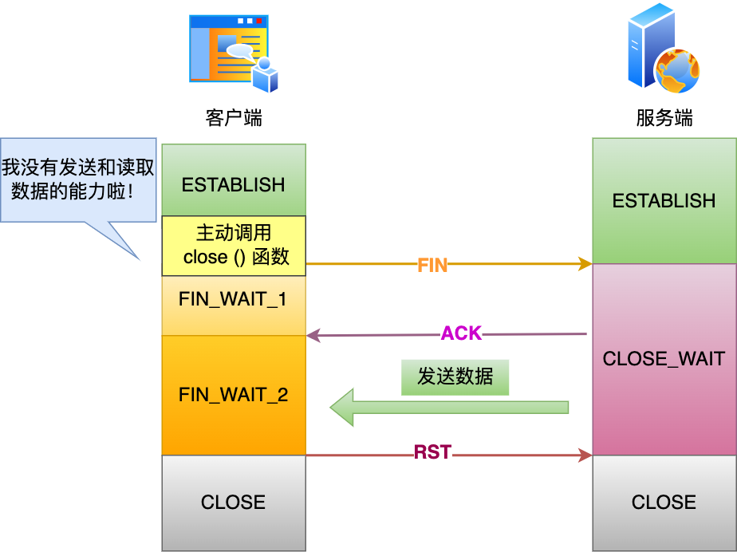

    当服务端收到 RST 后，内核就会释放连接，当服务端应用程序再次发起读操作或者写操作时，就能感知到连接已经被释放了：

    - 如果是读操作，则会返回 RST 的报错，也就是我们常见的Connection reset by peer。
    - 如果是写操作，那么程序会产生 SIGPIPE 信号，应用层代码可以捕获并处理信号，如果不处理，则默认情况下进程会终止，异常退出。

  * shutdown 函数，可以指定 socket **只关闭发送方向而不关闭读取方向**，也就是 socket 不再有发送数据的能力，但是还是具有接收数据的能力；

    * 相对的，shutdown 函数因为可以指定只关闭发送方向而不关闭读取方向，所以即使在 TCP 四次挥手过程中，如果收到了服务端发送的数据，客户端也是可以正常读取到该数据的，然后就会经历完整的 TCP 四次挥手，所以我们常说，调用 shutdown 是优雅的关闭。

    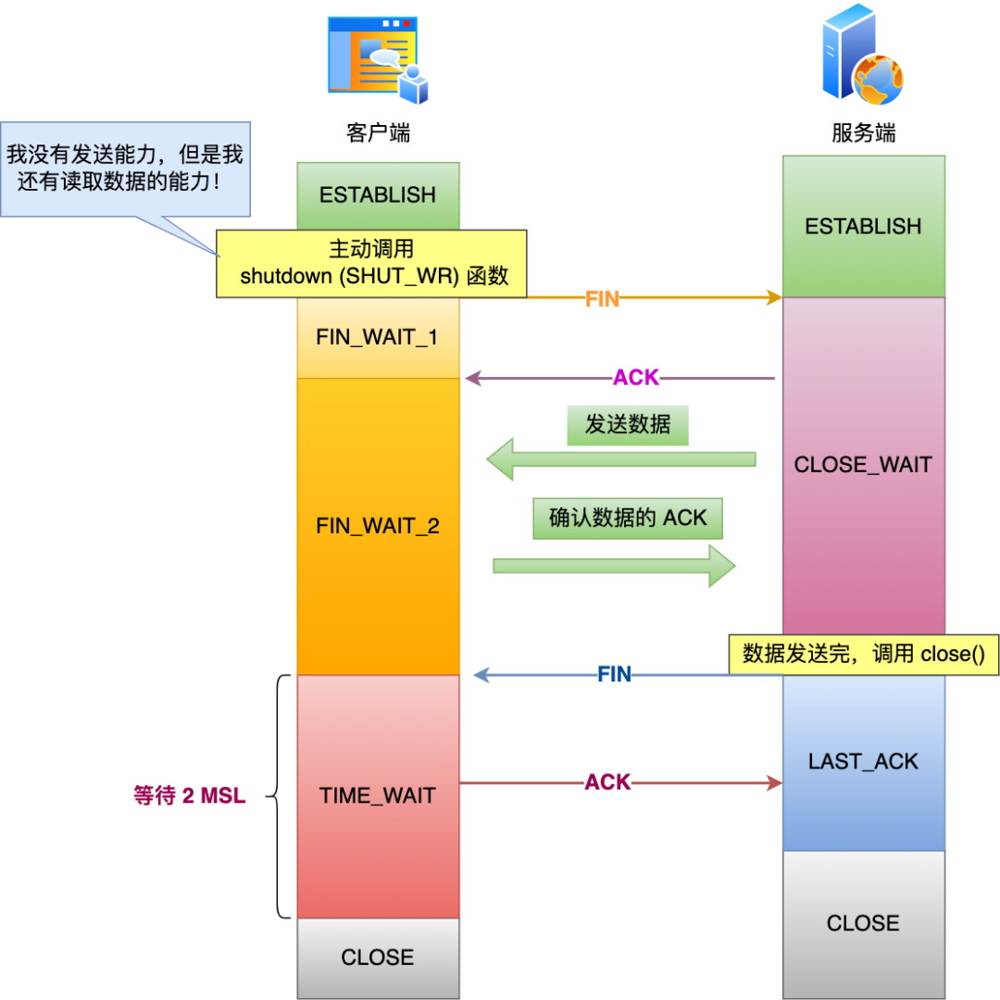

*  TCP 延迟确认机制

  * 当有响应数据要发送时，ACK 会随着响应数据一起立刻发送给对方
  * 当没有响应数据要发送时，ACK 将会延迟一段时间，以等待是否有响应数据可以一起发送
  * 如果在延迟等待发送 ACK 期间，对方的第二个数据报文又到达了，这时就会立刻发送 ACK
  * 「**没有数据要发送」并且「开启了 TCP 延迟确认机制」，那么第二和第三次挥手就会合并传输，这样就出现了三次挥手。**

* TCP保活机制

* TCP 和 UDP 可以同时绑定相同的端口吗？

  * 可以，传输层有两个传输协议分别是 TCP 和 UDP，**在内核中是两个完全独立的软件模块**

  

* 多个 TCP 服务进程可以绑定同一个端口吗？

  * 如果两个 TCP 服务进程同时绑定的 IP 地址和端口都相同，那么执行 bind() 时候就会出错，错误是“Address already in use”。

  *  0.0.0.0  地址，相当于把主机上的所有 IP 地址都绑定了

* 重启 TCP 服务进程时，为什么会有“Address in use”的报错信息？

  * 主动发起挥手方进入TIME_WAIT阶段，时长为2MSL
  * 当 TCP 服务进程重启时，服务端会出现 TIME_WAIT 状态的连接，TIME_WAIT 状态的连接使用的 IP+PORT 仍然被认为是一个有效的 IP+PORT 组合，相同机器上不能够在该 IP+PORT 组合上进行绑定，那么执行 bind() 函数的时候，就会返回了 Address already in use 的错误。
  * 解决：SO_REUSEADDR
  * 如果当前启动进程绑定的 IP+PORT 与处于TIME_WAIT 状态的连接占用的 IP+PORT 存在冲突，但是新启动的进程使用了 SO_REUSEADDR 选项，那么该进程就可以绑定成功

* 客户端的端口号可以重用吗？

  * TCP 连接是由四元组（源IP地址，源端口，目的IP地址，目的端口）唯一确认的，那么只要四元组中其中一个元素发生了变化，那么就表示不同的 TCP 连接的。所以如果客户端已使用端口 64992 与服务端 A 建立了连接，那么客户端要与服务端 B 建立连接，还是可以使用端口 64992 的，因为内核是通过四元祖信息来定位一个 TCP 连接的，并不会因为客户端的端口号相同，而导致连接冲突的问题

* 客户端 TCP 连接 TIME_WAIT 状态过多，会导致端口资源耗尽而无法建立新的连接吗？

  * TCP连接由四元组确定

  * 如果客户端都是与同一个服务器（目标地址和目标端口一样）建立连接，那么如果客户端 TIME_WAIT 状态的连接过多，当端口资源被耗尽，就无法与这个服务器再建立连接了。但是，**因为只要客户端连接的服务器不同，端口资源可以重复使用的**。

* 如何解决客户端 TCP 连接 TIME_WAIT 过多，导致无法与同一个服务器建立连接的问题？

  * 打开 `net.ipv4.tcp_tw_reuse` 这个内核参数。

  * 开启了这个内核参数后，客户端调用 connect  函数时，如果选择到的端口，已经被相同四元组的连接占用的时候，就会判断该连接是否处于  TIME_WAIT 状态，如果该连接处于 TIME_WAIT 状态并且 TIME_WAIT 状态持续的时间超过了 1 秒，那么就会重用这个连接，然后就可以正常使用该端口了。

* 服务端只bind了ip和端口，没有调用listen，此时客户端向这个服务端socket发送数据，会发生什么

  * **客户端对服务端发起 SYN 报文后，服务端回了 RST 报文**

  * RST 报文：**因某种原因引起出现的错误连接，也用来拒绝非法数据和请求**

* **每一个**socket执行listen时，内核都会自动创建一个半连接队列和全连接队列。

* **半连接队列（SYN队列）**，服务端收到**第一次握手**后，会将sock加入到这个队列中，队列内的sock都处于SYN_RECV 状态。

  * 底层：**hash表**

* **全连接队列（ACCEPT队列）**，在服务端收到**第三次握手**后，会将半连接队列的sock取出，放到全连接队列中。队列里的sock都处于 ESTABLISHED状态。这里面的连接，就**等着服务端执行accept()后被取出了。**

  * 执行accept()只是为了从全连接队列里取出一条连接
  * 底层：链表

* 全连接队列满了会怎样？

  * `tcp_abort_on_overflow`设置为 0，全连接队列满了之后，会丢弃这个第三次握手ACK包，并且开启定时器，重传第二次握手的SYN+ACK，如果重传超过一定限制次数，还会把对应的**半连接队列里的连接**给删掉
  * `tcp_abort_on_overflow`设置为 1，全连接队列满了之后，就直接发RST给客户端，效果上看就是连接断了

* 半连接队列满了会怎么样？

  * syn flood攻击
  * 丢弃
  * cookie

* cookies方案为什么不直接取代半连接队列？

  * 因为服务端并不会保存连接信息，所以如果传输过程中数据包丢了，也不会重发第二次握手的信息
  * 耗CPU，如果此时攻击者构造大量的**第三次握手包（ACK包）**，同时带上各种瞎编的cookies信息，服务端收到ACK包后**以为是正经cookies**，憨憨地跑去解码（**耗CPU**），最后发现不是正经数据包后才丢弃，此时受到攻击的服务器可能会因为**CPU资源耗尽**导致没能响应正经请求。


#### IP

* 源IP地址和⽬标IP地址在传输过程中是不会变化的，只有源 MAC 地址和⽬标 MAC ⼀直在变化
* 当主机号全为 1 时，就表示该⽹络的⼴播地址
* CIDR：32 ⽐特的 IP 地址被划分为两部分，前⾯是⽹络号，后⾯是主机号
* IPv4 VS IPv6
  * 取消了⾸部校验和字段
  * 取消了分⽚/重新组装相关字段
  * 取消选项字段
* DNS协议
  * 根 DNS 服务器、 顶级域 DNS 服务器（com）、 权威 DNS 服务器（server.com）、本地 DNS 服务器
* ARP协议
  * 主机会通过⼴播发送 ARP 请求，这个包中包含了想要知道的 MAC 地址的主机 IP 地址。 当同个链路中的所有设备收到 ARP 请求时，会去拆开 ARP 请求包⾥的内容，如果 ARP 请求包中的⽬标 IP 地址与⾃⼰的 IP 地址⼀致，那么这个设备就将⾃⼰的 MAC 地址塞⼊ ARP 响应包返回给主机。
* DHCP协议
  * 全程使⽤ UDP ⼴播通信
  * DHCP 中继代理：对不同⽹段的 IP 地址分配也 可以由⼀个 DHCP 服务器统⼀进⾏管理
* NAT
  * 不同私有 IP 地址转换 IP 地址为同一公有地址 ，但是以不同的端⼝号作为区分
  * 问题：外部⽆法主动与 NAT 内部服务器建⽴连接
  * 解决： NAT 穿透技术
* ICMP
  * ICMP(Internet Control Message Protocol) 报⽂是封装在 IP 包⾥⾯，它⼯作在⽹络层，是 IP 协议的助⼿
  * 主要的功能包括：确认 IP 包是否成功送达⽬标地址、报告发送过程中 IP 包被废弃的原因和改善⽹络设置 等
  * ping（echo request、echo reply

#### 数据链路层

* MTU：以太网1500字节

#### 「当键⼊⽹址后，到网页显示，其间发生了什么」

1. 查缓存
2. 解析 URL
3. 查询服务器域名对应的 IP 地址，⽣产 HTTP 请求信息
4. TCP三次握手
   1. IP层（路由表：一个机子一张，不是一个网卡一张
   2. 数据链路层：Mac地址（ARP协议
   3. 物理层：网卡
5. 发送HTTP请求
6. 如果 HTTP 请求消息⽐较⻓，超过了 MSS 的⻓度，这时 TCP 就需要把 HTTP 的数据拆解成⼀块块的数据发送， ⽽不是⼀次性发送所有数据。

#### 网络设备

* 交换机：数据链路层设备
  * 交换机的端⼝不具有 MAC 地址
* 路由器：IP层设备
  * 路由器的各个端⼝都具有 MAC 地址和 IP 地址

### Redis

* 数据结构  https://time.geekbang.org/column/intro/100084301

  * 全局hash
  
  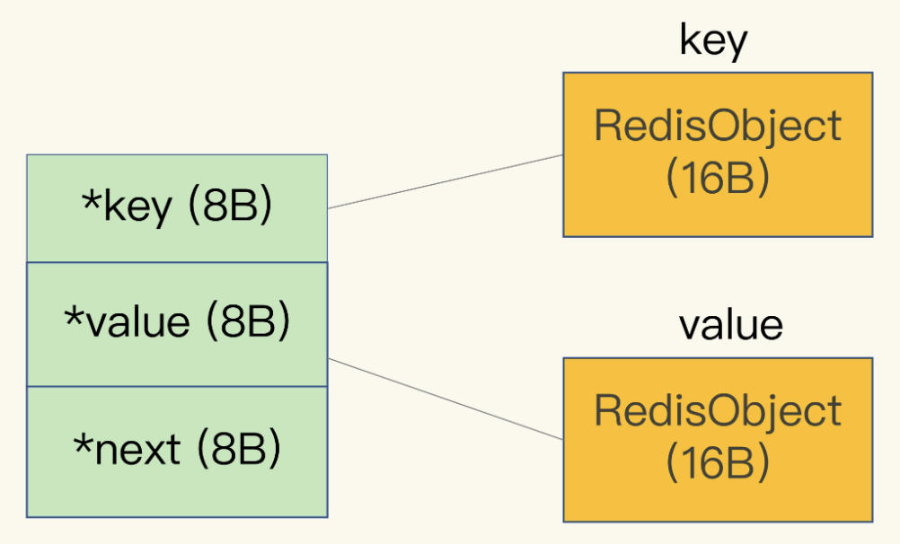
  
  
  
  * redisObject
  
  ```c
  typedef struct redisObject {
      unsigned type:4; //redisObject的数据类型，4个bits
      unsigned encoding:4; //redisObject的编码类型，4个bits
      unsigned lru:LRU_BITS;  //redisObject的LRU时间，LRU_BITS为24个bits
      int refcount; //redisObject的引用计数，4个字节
      void *ptr; //指向值的指针，8个字节
  } robj;
  
  // type：面向用户的数据类型（String/List/Hash/Set/ZSet等）
  // encoding：每一种数据类型，可以对应不同的底层数据结构来实现（SDS/ziplist/intset/hashtable/skiplist等）
  ```
  
  
  
  * zskiplist
  
    ```c
    typedef struct zset {
        dict *dict;
        zskiplist *zsl;
    } zset;
    
    typedef struct zskiplist {
        struct zskiplistNode *header, *tail;
        unsigned long length;
        int level;
    } zskiplist;
    
    typedef struct zskiplistNode {
        sds ele;
        double score;
        struct zskiplistNode *backward; // 方便反序遍历
        struct zskiplistLevel {
            struct zskiplistNode *forward;
            unsigned long span;
        } level[];
    } zskiplistNode;
    ```
  
    * 跳表在创建结点时，随机生成每个结点的层数
    * 使用跳表而不是红黑树、B树
      * skiplist 更省内存：25% 概率的随机层数，可通过公式计算出 skiplist 平均每个节点的指针数是 1.33 个，平衡二叉树每个节点指针是 2 个（左右子树） - skiplist 遍历更友好
      * skiplist **范围查找**时，找到大于目标元素后，向后遍历链表即可，平衡树需要通过中序遍历方式来完成，实现也略复杂
    * Sorted Set 既可以使用跳表支持数据的范围查询，还能使用哈希表支持根据元素直接查询它的权重
    * zskiplist不足：内存
    * 如果有序集合的元素个数小于 `128` 个，并且每个元素的值小于 `64` 字节时，Redis 会使用**压缩列表**作为 Zset 类型的底层数据结构；
    * 如果有序集合的元素不满足上面的条件，Redis 会使用**跳表**作为 Zset 类型的底层数据结构；
    * 在 Redis 7.0 中，Zset不再由压缩列表实现，转而交由 listpack 数据结构来实现。


  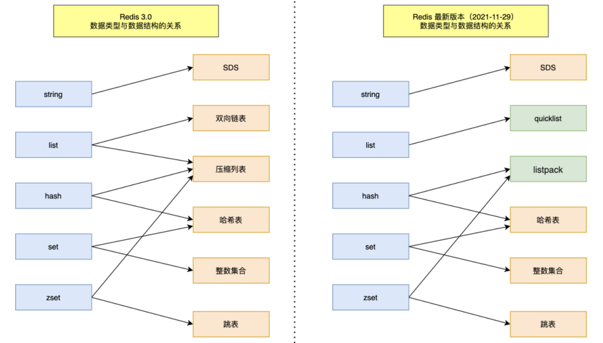

  * SDS：simple dynamic string
    
    ```c
    typedef char *sds;
    
    struct __attribute__ ((__packed__)) sdshdr8 {
        uint8_t len; /* used */
        uint8_t alloc; /* excluding the header and null terminator */
        unsigned char flags; /* 3 lsb of type, 5 unused bits */
        char buf[];
    };
    /* 类似有sdshdr16 */
    ```
    
    
    
    * 嵌入式字符串
      * Redis 规定嵌入式字符串最大以 64 字节存储
      * 在目前的x86体系下，一般的缓存行大小是64字节，redis为了一次能加载完成，因此采用64自己作为embstr类型(保存redisObject)的最大长度。
    
    ```c
    robj *createStringObject(const char *ptr, size_t len) {
        if (len <= OBJ_ENCODING_EMBSTR_SIZE_LIMIT)
            return createEmbeddedStringObject(ptr,len);
        else
            return createRawStringObject(ptr,len);
    }
    
    // rawString
    robj *createRawStringObject(const char *ptr, size_t len) {
        return createObject(OBJ_STRING, sdsnewlen(ptr,len));
    }
    
    robj *createObject(int type, void *ptr) {
        //给redisObject结构体分配空间
        robj *o = zmalloc(sizeof(*o));
        //设置redisObject的类型
        o->type = type;
        //设置redisObject的编码类型，此处是OBJ_ENCODING_RAW，表示常规的SDS
        o->encoding = OBJ_ENCODING_RAW;
        //直接将传入的指针赋值给redisObject中的指针。
        o->ptr = ptr;
        o->refcount = 1;
        …
        return o;
    }
    
    // embeddedString
    robj *createEmbeddedStringObject(const char *ptr, size_t len) {
      	// redisObject的size + sdshdr8的size + 字符串长度 + 1（末尾'\0'）
        robj *o = zmalloc(sizeof(robj)+sizeof(struct sdshdr8)+len+1);
        ...
    }
    ```


  

  * 整数数组

    ```c++
    typedef struct intset {
        uint32_t encoding;
        uint32_t length;
        int8_t contents[];
    } intset;
    ```

    * 整数集合的升级（不支持降级操作
      * 好处：节省内存资源

    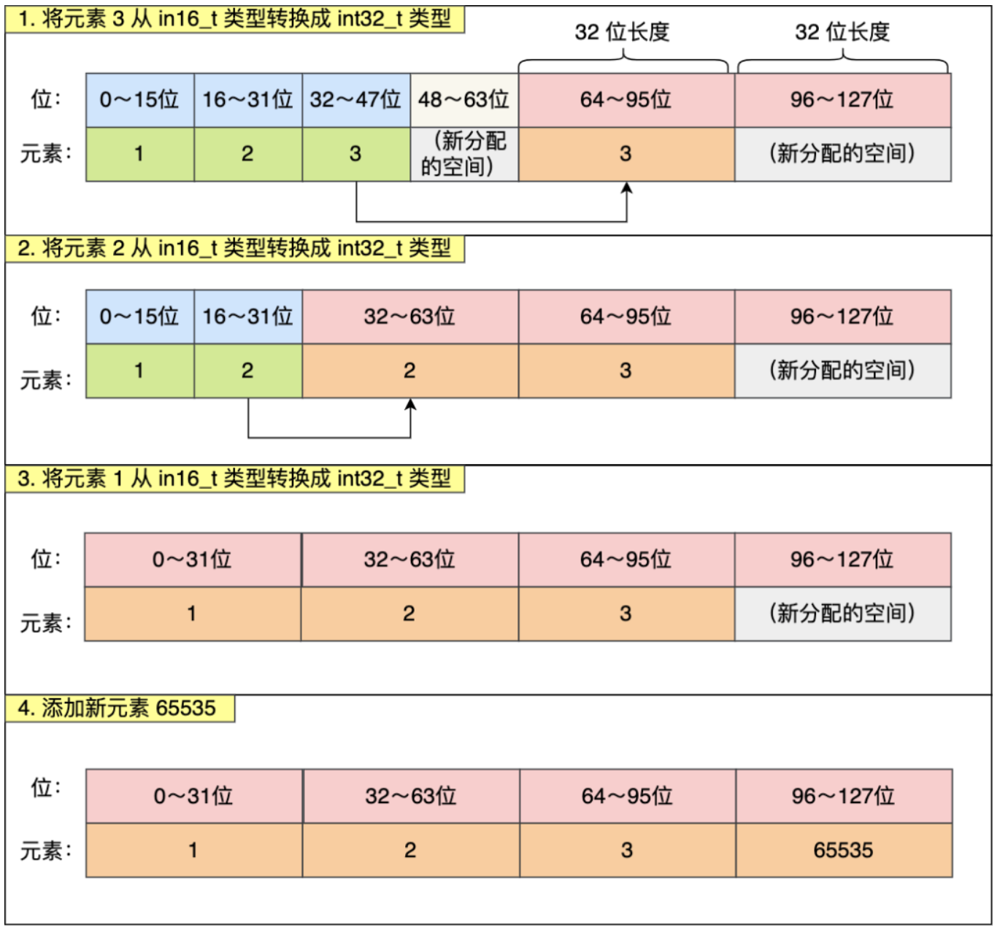

  * quicklist

    * 一个 quicklist 就是一个链表，而链表中的每个元素又是一个 ziplist
    * 缺点：增加了内存开销

    ```c++
    typedef struct quicklistNode {
        struct quicklistNode *prev;     //前一个quicklistNode
        struct quicklistNode *next;     //后一个quicklistNode
        unsigned char *zl;              //quicklistNode指向的ziplist
        unsigned int sz;                //ziplist的字节大小
        unsigned int count : 16;        //ziplist中的元素个数 
        unsigned int encoding : 2;   //编码格式，原生字节数组或压缩存储
        unsigned int container : 2;  //存储方式
        unsigned int recompress : 1; //数据是否被压缩
        unsigned int attempted_compress : 1; //数据能否被压缩
        unsigned int extra : 10; //预留的bit位
    } quicklistNode;
    
    
    typedef struct quicklist {
        quicklistNode *head;      //quicklist的链表头
        quicklistNode *tail;      //quicklist的链表尾
        unsigned long count;     //所有ziplist中的总元素个数
        unsigned long len;       //quicklistNodes的个数
        ...
    } quicklist;
    ```

    

  * ziplist

    

    * 针对不同长度的数据，使用不同大小的元数据信息（prevlen 和 encoding），这种方法可以有效地节省内存开销
    * 连续内存存储：每个元素紧凑排列，内存利用率高 
    *  变长编码：存储数据时，采用变长编码（满足数据长度的前提下，尽可能少分配内存） 
    * 寻找元素需遍历：存放太多元素，性能会下降（适合少量数据存储） 
    *  级联更新：更新、删除元素，会引发级联更新（因为内存连续，前面数据膨胀/删除了，后面要跟着一起动）

  * listpack

    * 用一块连续的内存空间来紧凑地保存数据，同时为了节省内存空间，listpack 列表项使用了多种编码方式，来表示不同长度的数据，这些数据包括整数和字符串

    

    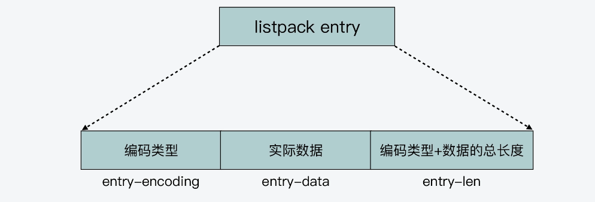

    * 列表项避免连锁更新：**不会记录前一项的长度信息**
    * 支持正向遍历
      * 通过编码类型和实际储存计算entry总长度
    * 支持反向遍历
      * 通过总字节数定位到listpack尾部，再通过entry-len的编码方式判读entry-len读取结束
        * 最高位为 1，表示 entry-len 还没有结束，当前字节的左边字节仍然表示 entry-len 的内容；
        * 最高位为 0，表示当前字节已经是 entry-len 最后一个字节了

  * hash

    ```c
    // hash table
    typedef struct dictht {
        dictEntry **table;
        unsigned long size;
        unsigned long sizemask;
        unsigned long used;
    } dictht;
    
    //union节省内存
    typedef struct dictEntry {
        void *key;
        union {
            void *val;
            uint64_t u64;
            int64_t s64;
            double d;
        } v;
        struct dictEntry *next;
    } dictEntry;
    
    //两个dictht，交替使用，
    typedef struct dict {
        dictType *type;
        void *privdata;
        dictht ht[2];
        long rehashidx; /* rehashing not in progress if rehashidx == -1 */
        unsigned long iterators; /* number of iterators currently running */
    } dict;
    ```

    * 什么时候触发 rehash

    ```c
    //如果Hash表为空，将Hash表扩为初始大小
    if (d->ht[0].size == 0) 
       return dictExpand(d, DICT_HT_INITIAL_SIZE);
     
    //如果Hash表承载的元素个数超过其当前大小，并且可以进行扩容，或者Hash表承载的元素个数已是当前大小的5倍
    if (d->ht[0].used >= d->ht[0].size &&(dict_can_resize ||
                  d->ht[0].used/d->ht[0].size > dict_force_resize_ratio))
    {
        return dictExpand(d, d->ht[0].used*2);
    }
    
    
    void dictEnableResize(void) {
        dict_can_resize = 1;
    }
     
    void dictDisableResize(void) {
        dict_can_resize = 0;
    }
    
    // 启用扩容功能的条件是：当前没有 RDB 子进程，并且也没有 AOF 子进程
    // RDB 子进程和 AOF 子进程将主进程数据页设为只读，此时rehash进一步增加内存的压力，因此错开时间
    void updateDictResizePolicy(void) {
        if (server.rdb_child_pid == -1 && server.aof_child_pid == -1)
            dictEnableResize();
        else
            dictDisableResize();
    }
    ```

    * 渐进式rehash

      * 过程

        * 给「哈希表 2」 分配空间；
        * **在 rehash 进行期间，每次哈希表元素进行新增、删除、查找或者更新操作时，Redis 除了会执行对应的操作之外，还会顺序将「哈希表 1 」中索引位置上的所有 key-value 迁移到「哈希表 2」 上**；
        * 随着处理客户端发起的哈希表操作请求数量越多，最终会把「哈希表 1 」的所有 key-value 迁移到「哈希表 2」，从而完成 rehash 操作。

      * 触发条件

        * 当负载因子大于等于 1 ，并且 Redis 没有在执行 bgsave 命令或者 bgrewiteaof 命令，也就是没有执行 RDB 快照或没有进行 AOF 重写的时候，就会进行 rehash 操作。

          * 考虑RDB、AOF子进程的原因RDB、AOF都会因为写时复制导致内存使用增加，如果此时再增加哈希表2，会进一步增加内存压力

        * 当负载因子大于等于 5 时，此时说明哈希冲突非常严重了，不管有没有有在执行 RDB 快照或 AOF 重写，都会强制进行 rehash 操作。

          

      * 源码分析

        * dictAddRaw，dictGenericDelete，dictFind，dictGetRandomKey，dictGetSomeKeys都是针对**当前dict**判断其是否存在rehash，每次迁移一个桶，**不判断其他对象**
        * 定期rehash
          * 只会迁移全局哈希表中的数据，不会定时迁移 Hash/Set/Sorted Set 下的哈希表的数据，这些哈希表只会在操作数据时做实时的渐进式 rehash


    

  * redis启动

    * 默认配置，配置文件配置、启动参数配置
    * initServer：完成各项初始化工作
    * eventloop

  * EventLoop

    

    * 执行流程

      * 首先，先调用**处理发送队列函数**，看是发送队列里是否有任务，如果有发送任务，则通过 write 函数将客户端发送缓存区里的数据发送出去，如果这一轮数据没有发生完，就会注册写事件处理函数，等待 epoll_wait 发现可写后再处理 。

      * 接着，调用 epoll_wait 函数等待事件的到来：

      * 

      * - 如果是**连接事件**到来，则会调用**连接事件处理函数**，该函数会做这些事情：调用 accpet 获取已连接的 socket ->  调用 epoll_ctr 将已连接的 socket 加入到 epoll -> 注册「读事件」处理函数；
        - 如果是**读事件**到来，则会调用**读事件处理函数**，该函数会做这些事情：调用 read 获取客户端发送的数据 -> 解析命令 -> 处理命令 -> 将客户端对象添加到发送队列 -> 将执行结果写到发送缓存区等待发送；
        - 如果是**写事件**到来，则会调用**写事件处理函数**，该函数会做这些事情：通过 write 函数将客户端发送缓存区里的数据发送出去，如果这一轮数据没有发生完，就会继续注册写事件处理函数，等待 epoll_wait 发现可写后再处理 。

    * select VS poll VS epoll

    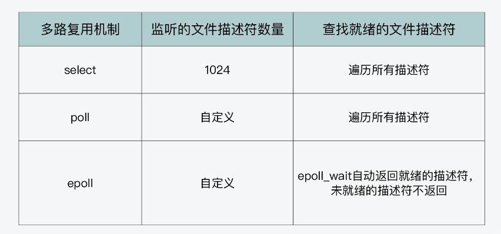

    * epoll

    ```c
    int sock_fd,conn_fd; //监听套接字和已连接套接字的变量
    sock_fd = socket() //创建套接字
    bind(sock_fd)   //绑定套接字
    listen(sock_fd) //在套接字上进行监听，将套接字转为监听套接字
        
    epfd = epoll_create(EPOLL_SIZE); //创建epoll实例，
    //创建epoll_event结构体数组，保存套接字对应文件描述符和监听事件类型    
    ep_events = (epoll_event*)malloc(sizeof(epoll_event) * EPOLL_SIZE);
    
    //创建epoll_event变量
    struct epoll_event ee
    //监听读事件
    ee.events = EPOLLIN;
    //监听的文件描述符是刚创建的监听套接字
    ee.data.fd = sock_fd;
    
    //将监听套接字加入到监听列表中    
    epoll_ctl(epfd, EPOLL_CTL_ADD, sock_fd, &ee); 
        
    while (1) {
       //等待返回已经就绪的描述符 
       n = epoll_wait(epfd, ep_events, EPOLL_SIZE, -1); 
       //遍历所有就绪的描述符     
       for (int i = 0; i < n; i++) {
           //如果是监听套接字描述符就绪，表明有一个新客户端连接到来 
           if (ep_events[i].data.fd == sock_fd) { 
              conn_fd = accept(sock_fd); //调用accept()建立连接
              ee.events = EPOLLIN;  
              ee.data.fd = conn_fd;
              //添加对新创建的已连接套接字描述符的监听，监听后续在已连接套接字上的读事件      
              epoll_ctl(epfd, EPOLL_CTL_ADD, conn_fd, &ee); 
                    
           } else { //如果是已连接套接字描述符就绪，则可以读数据
               ...//读取数据并处理
           }
       }
    }
    ```

* Recator模型

  * Reactor 模型的基本工作机制
    * 客户端的不同类请求会在服务器端触发连接、读、写三类事件，这三类事件的监听、分发和处理又是由 reactor、acceptor、handler 三类角色来完成的，然后这三类角色会通过事件驱动框架来实现交互和事件处理。
  * 单线程Reactor模式
  * 多线程Reactor模式
  * 主从Reactor模式
  * http://gee.cs.oswego.edu/dl/cpjslides/nio.pdf

  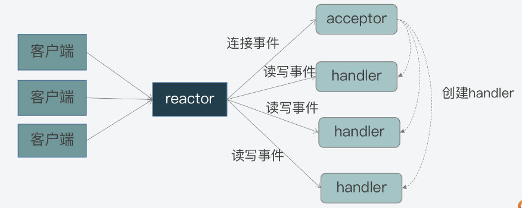

* 事件驱动（Eventloop）

  * 事件类型及其数据结构

    * IO事件
      * 分类：可读事件、可写事件、屏障事件
      * IO事件创建：aeCreateFileEvent
      * 连接请求（读事件）
        * acceptTcpHandler（initServer中注册的监听事件）
        * 注意：从客户端来的都是可读事件（因为需要解析请求并处理）
      * 输出缓冲区未完全写回（写事件）
        * sendReplyToClient

    ```c
    typedef struct aeFileEvent {
        int mask; /* 事件类型掩码 one of AE_(READABLE|WRITABLE|BARRIER) */
        aeFileProc *rfileProc; /* READABLE事件处理函数 */
        aeFileProc *wfileProc; /* WRITABLE事件处理函数 */
        void *clientData;
    } aeFileEvent;
    ```

    * 时间事件
      * 时间事件的触发处理
        * 事件驱动框架的 aeMain 函数会循环调用 aeProcessEvents 函数，来处理各种事件。而 aeProcessEvents 函数在执行流程的最后，会调用 processTimeEvents 函数处理相应到时的任务。
        * proecessTimeEvent：从时间事件链表上逐一取出每一个事件，然后根据当前时间判断该事件的触发时间戳是否已满足。如果已满足，那么就调用该事件对应的回调函数进行处理。

    ```c
    typedef struct aeTimeEvent {
        long long id; //时间事件ID
        long when_sec; //事件到达的秒级时间戳
        long when_ms; //事件到达的毫秒级时间戳
        aeTimeProc *timeProc; //时间事件触发后的处理函数
        aeEventFinalizerProc *finalizerProc;  //事件结束后的处理函数
        void *clientData; //事件相关的私有数据
        struct aeTimeEvent *prev;  //时间事件链表的前向指针
        struct aeTimeEvent *next;  //时间事件链表的后向指针
    } aeTimeEvent;
    ```

  * 相关逻辑

    ```c
    // aeMain: eventloop
    void aeMain(aeEventLoop *eventLoop) {
        eventLoop->stop = 0;
        while (!eventLoop->stop) {
            if (eventLoop->beforesleep != NULL)
                eventLoop->beforesleep(eventLoop);
            aeProcessEvents(eventLoop, AE_ALL_EVENTS|AE_CALL_AFTER_SLEEP);
        }
    }
    
    // aeProcessEvents: 通过epoll，进行事件捕获，通过注册的回调，进行事件处理
    int aeProcessEvents(aeEventLoop *eventLoop, int flags)
    {
        int processed = 0, numevents;
     
        /* 若没有事件处理，则立刻返回*/
        if (!(flags & AE_TIME_EVENTS) && !(flags & AE_FILE_EVENTS)) return 0;
        /*如果有IO事件发生，或者紧急的时间事件发生，则开始处理*/
        if (eventLoop->maxfd != -1 || ((flags & AE_TIME_EVENTS) && !(flags & AE_DONT_WAIT))) {
           ... 
           //调用aeApiPoll函数捕获事件 
           numevents = aeApiPoll(eventLoop, tvp);
           ...
        }
        /* 检查是否有时间事件，若有，则调用processTimeEvents函数处理 */
        if (flags & AE_TIME_EVENTS)
            processed += processTimeEvents(eventLoop);
        /* 返回已经处理的文件或时间*/
        return processed; 
    }
    
    // aeCreateFileEvent: 注册事件
    int aeCreateFileEvent(aeEventLoop *eventLoop, int fd, int mask,
            aeFileProc *proc, void *clientData)
    {
      	...
        aeApiAddEvent(eventLoop, fd, mask)
        ...
    }
    
    // 在初始化server的时候，注册监听事件 acceptTcpHandler
    void initServer(void) {
        …
        for (j = 0; j < server.ipfd_count; j++) {
            if (aeCreateFileEvent(server.el, server.ipfd[j], AE_READABLE,
                acceptTcpHandler,NULL) == AE_ERR)
                {
                    serverPanic("Unrecoverable error creating server.ipfd file event.");
                }
      }
      …
    }
    
    // acceptTcpHandler
    void acceptTcpHandler(aeEventLoop *el, int fd, void *privdata, int mask) {
      	...
        acceptCommonHandler(cfd,0,cip);
      	...
    }
    
    // acceptCommonHandler ---> createClient ---> aeCreateFileEvent
    client *createClient(int fd) {
      aeCreateFileEvent(server.el,fd,AE_READABLE,readQueryFromClient, c)
    }
    ```

    

* 单线程

  * 以守护进程的方式运行

    ```c
    void daemonize(void) {
        int fd;
    
        if (fork() != 0) exit(0); /* parent exits */
      	// 让进程摆脱原会话的控制、让进程摆脱原进程组的控制和让进程摆脱原控制终端的控制
        setsid(); /* create a new session */
    
        /* Every output goes to /dev/null. If Redis is daemonized but
         * the 'logfile' is set to 'stdout' in the configuration file
         * it will not log at all. */
        if ((fd = open("/dev/null", O_RDWR, 0)) != -1) {
            dup2(fd, STDIN_FILENO);
            dup2(fd, STDOUT_FILENO);
            dup2(fd, STDERR_FILENO);
            if (fd > STDERR_FILENO) close(fd);
        }
    }
    ```

  * **「接收客户端请求->解析请求 ->进行数据读写等操作->发生数据给客户端」这个过程是由一个线程（主线程）来完成的**
  * Redis 还启动了 3 个**线程**来执行**文件关闭**、**AOF 同步写**和**惰性删除**等操作
  
    * 主线程和三个线程之间是生产者-消费者模型
  
    ```c
    // 消费线程 (while(1)轮询,不断从list中拿取任务)
    void *bioProcessBackgroundJobs(void *arg) {
        while(1) {
            listNode *ln;
    
            /* The loop always starts with the lock hold. */
            if (listLength(bio_jobs[type]) == 0) {
                pthread_cond_wait(&bio_newjob_cond[type],&bio_mutex[type]);
                continue;
            }
            /* Pop the job from the queue. */
            ln = listFirst(bio_jobs[type]);
            job = ln->value;
            /* It is now possible to unlock the background system as we know have
             * a stand alone job structure to process.*/
            pthread_mutex_unlock(&bio_mutex[type]);
    
            /* Process the job accordingly to its type. */
            if (type == BIO_CLOSE_FILE) {
                close((long)job->arg1);
            } else if (type == BIO_AOF_FSYNC) {
                redis_fsync((long)job->arg1);
            } else if (type == BIO_LAZY_FREE) {
                /* What we free changes depending on what arguments are set:
                 * arg1 -> free the object at pointer.
                 * arg2 & arg3 -> free two dictionaries (a Redis DB).
                 * only arg3 -> free the skiplist. */
                if (job->arg1)
                    lazyfreeFreeObjectFromBioThread(job->arg1);
                else if (job->arg2 && job->arg3)
                    lazyfreeFreeDatabaseFromBioThread(job->arg2,job->arg3);
                else if (job->arg3)
                    lazyfreeFreeSlotsMapFromBioThread(job->arg3);
            } else {
                serverPanic("Wrong job type in bioProcessBackgroundJobs().");
            }
        }
    }
    
    // 生产函数（往对应任务队列中add任务）
    void bioCreateBackgroundJob(int type, void *arg1, void *arg2, void *arg3){
        //创建新的任务
        struct bio_job *job = zmalloc(sizeof(*job));
        //设置任务数据结构中的参数
        job->time = time(NULL);
        job->arg1 = arg1;
        job->arg2 = arg2;
        job->arg3 = arg3;
        pthread_mutex_lock(&bio_mutex[type]);
        listAddNodeTail(bio_jobs[type],job);  //将任务加到bio_jobs数组的对应任务列表中
        bio_pending[type]++; //将对应任务列表上等待处理的任务个数加1
        pthread_cond_signal(&bio_newjob_cond[type]);
        pthread_mutex_unlock(&bio_mutex[type]);
    }
    ```
  * 高并发原因、单线程原因
    * 大部分操作**都在内存中完成**
    * **避免了多线程之间的竞争**
    *  **I/O 多路复用机制**
    * **CPU 并不是制约 Redis 性能表现的瓶颈所在**
    * 并非所有操作都是在主线程之内完成
    
  * Redis 6.0之后使用多 IO 线程
  
* 持久化

  * AOF
    * 写后日志
      * **避免额外的检查开销**
      * **数据可能会丢失**
      
    * 持久化策略
    
      * always：主线程同步fsync
      * everysec：后台线程每间隔1秒fsync
      * no：由OS完成fsync
    
    * AOF重写
    
      
    
      * 由后台子进程 bgrewriteaof 来完成的
    
      * AOF重写缓冲区
        
        * 管道(pipe)：单向通信
        
        ```c
        int main() 
        { 
            int fd[2], nr = 0, nw = 0; 
            char buf[128]; 
            pipe(fd); 
            pid = fork(); 
             
          if(pid == 0) {
              //子进程调用read从fd[0]描述符中读取数据
                printf("child process wait for message\n"); 
                nr = read(fds[0], buf, sizeof(buf)) 
                printf("child process receive %s\n", buf);
          }else{ 
               //父进程调用write往fd[1]描述符中写入数据
                printf("parent process send message\n"); 
                strcpy(buf, "Hello from parent"); 
                nw = write(fd[1], buf, sizeof(buf)); 
                printf("parent process send %d bytes to child.\n", nw); 
            } 
            return 0; 
        } 
        ```
        
      * AOF 重写是在子进程中执行，但在此期间父进程还会接收写操作，为了保证新的 AOF 文件数据更完整，所以父进程需要把在这期间的写操作缓存下来，然后发给子进程，让子进程追加到 AOF 文件中 
    
        * 如果完全交由父进程完成，则会阻塞其余请求的相应
    
      * 因为需要父子进程传输数据，所以需要用到操作系统提供的进程间通信机制，这里 Redis 用的是「管道」，管道只能是一个进程写，另一个进程读，特点是单向传输 
    
      * AOF 重写时，父子进程用了 3 个管道，分别传输不同类别的数据：
    
        *  父进程传输数据给子进程的管道：发送 AOF 重写期间新的写操作
        * 子进程完成重写后通知父进程的管道：让父进程停止发送新的写操作
        *  父进程确认收到子进程通知的管道：父进程通知子进程已收到通知（**防止父进程已经结束**）
    
      *  AOF 重写的完整流程是：父进程 fork 出子进程，子进程迭代实例所有数据，写到一个临时 AOF 文件，在写文件期间，父进程收到新的写操作，会先缓存到 buf（**AOF重写缓冲**） 中，之后 buf 中的数据，由**管道描述符上注册的写事件**通过管道发给子进程，子进程会从管道中读取这些命令，暂存下来直到备份完成后，再将这部分追加到 AOF 文件中，最后 rename 这个临时 AOF 文件为新文件，替换旧的 AOF 文件，重写结束
    
    * 子进程收到父进程回复的ack时管道内还有数据怎么处理？
    
      * 父进程收到子进程ack后设置server.aof_stop_sending_diff为1，然后回复ack 子进程收到ack时会再次调用aofReadDiffFromParent尝试把管道里可能存在的数据都读出来 最后一步将aof_child_diff的内容写入文件，并将文件名rename为temp-rewriteaof-bg-pid.aof 父进程在serverCron中调用wait3来确认重写子进程执行结果，读取子进程重写的aof文件，在文件末尾再次写入子进程执行结束后父进程积累的数据，最后将文件名重命名成最终文件
    
  * RDB
    
    * 全量快照
    * 持久化文件体积小（二进制 + 压缩）
    * 写盘频率低（定时写入）
    
  * 混合持久化
    * AOF 重写日志时，重写子进程以RDB写入，重写缓冲区里的增量命令会以 AOF 方式写入

  * Redis 源码中在有 RDB 子进程运行时，不会启动 AOF 重写子进程

    * 无论是生成 RDB 还是 AOF 重写，都需要创建子进程，然后把实例中的所有数据写到磁盘上，这个过程中涉及到两块
      * CPU：写盘之前需要先迭代实例中的所有数据，在这期间会耗费比较多的 CPU 资源，两者同时进行，CPU 资源消耗大
      * 磁盘：同样地，RDB 和 AOF 重写，都是把内存数据落盘，在这期间 Redis 会持续写磁盘，如果同时进行，磁盘 IO 压力也会较大
    * 整体来说都是为了资源考虑，所以不会让它们同时进行。

* 主从复制

  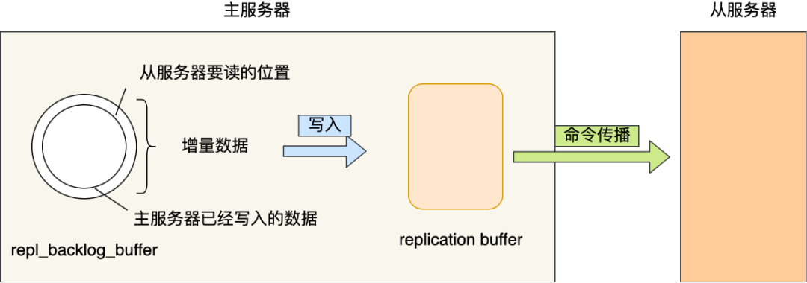

  * 异步
  * 第一次RDB全量，后续通过offset增量复制
  * replication buffer：基于长连接的命令传播，主从通信buffer
  * repl_backlog_buffer：一个「**环形**」缓冲区，用于主从服务器断连后，从中找到差异的数据

* 哨兵

  * KeepAlive
  * 主观下线，客观下线
  * 选leader
  * 选出新master，主从故障转移
  * 通知客户的主节点已更换

* 由哨兵leader进行的主从故障转移过程

  * 第一步：在已下线主节点（旧主节点）属下的所有「从节点」里面，挑选出一个从节点，并将其转换为主节点，选择的规则：
  * 第二步：让已下线主节点属下的所有「从节点」修改复制目标，修改为复制「新主节点」；
  * 第三步：将新主节点的 IP 地址和信息，通过「发布者/订阅者机制」通知给客户端；
    * 客户端会订阅哨兵的指定频道

  * 第四步：继续监视旧主节点，当这个旧主节点重新上线时，将它设置为新主节点的从节点；发布者/订阅者模式

* 切片集群

  * 缓存量过大，单机内存无法承担
  * 哈希槽
  * 路由
    * 客户端路由：Redis Cluster 
      * Redis Cluster 无需部署哨兵集群，集群内 Redis 节点通过 Gossip 协议互相探测健康状态，在故障时可发起自动切换。
    * proxy ：Codis
  * redis cluster
    * 实例之间可以通过相互传递消息，获得最新的哈希槽分配信息，但是，客户端是无法主动感知这些变化的。这就会导致，它缓存的分配信息和最新的分配信息不一致
    * 解决：重定向机制
      * 当客户端把一个键值对的操作请求发给一个实例时，如果这个实例上并没有这个键值对映射的哈希槽，那么，这个实例就会给客户端返回下面的 MOVED 命令响应结果，这个结果中就包含了新实例的访问地址。
      * hash槽部分迁移时，客户端就会收到一条 ASK 报错信息；旧的Redis实例返回ASK错误，说明要查找的key不在旧Redis实例上，在新的Redis实例上(已经迁移过去了)。但是槽位没有迁移完成，在新的Redis实例上不会管理这个槽位。如果直接从新实例上获取，就会返回-MOVED错误。ASK指令的目标就是打开新实例的选项，告诉它下一条指令不能不理，而要当成自己的槽位来处理。

* 脑裂

  * 主节点正常运行，哨兵错误判断其下线，重新选主，使集群中出现两个master节点===> 原master节点被降级为servant节点，数据清空，接收rdb全量同步，导致数据丢失
  * 针对脑裂易出现的场景：网络不好的场景下，即主节点和从节点、哨兵断连时，主节点**禁止写策略**

* 过期删除策略：「惰性删除+定期删除」

  * 惰性删除
    * **不主动删除过期键，每次从数据库访问 key 时，都检测 key 是否过期，如果过期则删除该 key。**
  * 定期删除
    * **每隔一段时间「随机」从数据库中取出一定数量的 key 进行检查，并删除其中的过期key。**
  * **从库对过期的处理是被动的**
    * 从库不做过期扫描，其过期键处理依靠主服务器控制，**主库在 key 到期时，会在 AOF 文件里增加一条 del 指令，同步到所有的从库**
    * 原因是从库不写的原则，避免主从同步混乱(从库先删除，主库同步过来的日志又让删除，导致混乱)

* 内存淘汰策略

  * LRU

    * 传统的LRU算法内存和性能都不足够友好
    * 策略：
      * allkeys-lru
      * volatile-lru
    * **随机采样的方式来淘汰数据**
      * 首先是设置了全局 LRU 时钟，并在键值对创建时获取全局 LRU 时钟值作为访问时间戳，以及在每次访问时获取全局 LRU 时钟值，更新访问时间戳。
        * 全局 LRU本质上就是一个缓存，减少系统调用的次数
      * 使用了固定大小的待淘汰数据集合（EvictionPoolLRU数组），每次随机选择一些 key 加入待淘汰数据集合中。最后，再按照待淘汰集合中 key 的空闲时间长度，删除空闲时间最长的 key。这样一来，Redis 就**近似**实现了 LRU 算法的效果了。

  * LFU

    * 策略：
      * allkeys-lru
      * volatile-lru
    * **访问次数按访问间隔时间衰减**
    * **访问次数按概率增加**

  * 同步删除

    第一步：从全局hash表中删除（同步）

    第二步：释放内存空间（同步）

  * 异步删除

    第一步：从全局hash表中删除（同步）

    第二步：释放内存空间（异步）

  * 注意：

    * delete命令是同步删除
    * unlink命令是异步删除
    * redis内部内存过载而引发的删除依赖于配置

    ```c
    void delCommand(client *c) {
        delGenericCommand(c,0);
    }
    
    void unlinkCommand(client *c) {
        delGenericCommand(c,1);
    }
    
    /* This command implements DEL and LAZYDEL. */
    void delGenericCommand(client *c, int lazy) {
        int numdel = 0, j;
    
        for (j = 1; j < c->argc; j++) {
            expireIfNeeded(c->db,c->argv[j]);
            int deleted  = lazy ? dbAsyncDelete(c->db,c->argv[j]) :
                                  dbSyncDelete(c->db,c->argv[j]);
            if (deleted) {
                signalModifiedKey(c->db,c->argv[j]);
                notifyKeyspaceEvent(NOTIFY_GENERIC,
                    "del",c->argv[j],c->db->id);
                server.dirty++;
                numdel++;
            }
        }
        addReplyLongLong(c,numdel);
    }
    ```

    

  ```c
  // 确定删除开销，开销小则仍同步删除
  //如果要淘汰的键值对包含超过64个元素
  if (free_effort > LAZYFREE_THRESHOLD && val->refcount == 1) {
     atomicIncr(lazyfree_objects,1);
     bioCreateBackgroundJob(BIO_LAZY_FREE,val,NULL,NULL); //创建惰性删除的后台任务，交给后台线程执行
     dictSetVal(db->dict,de,NULL);  //将被淘汰键值对的value设置为NULL
  }
  
  if (de) {
     dictFreeUnlinkedEntry(db->dict,de);
     ...
     return 1;
  }
  ```

  

* 缓存设计

  * 缓存雪崩
    * redis宕机或者大量缓存数据在同一时间过期
    * 大量缓存数据在同一时间过期的解决：
      * 缓存预热
      * 均匀设置过期时间
      * 通过分布式锁，保证同一时间内只有一个请求来构建缓存
      * 后台更新缓存，让缓存“永久有效”，并将更新缓存的工作交由后台线程定时更新
        * 此种方法下缓存仍可能被redis内存淘汰
        * 解决方法：
          * 检测缓存是否有效
          * 在业务线程发现缓存数据失效后（缓存数据被淘汰），通过消息队列发送一条消息通知后台线程更新缓存
    * redis宕机的解决：
      * 服务熔断或请求限流机制
      * 构建 Redis 缓存高可靠集群
  * 缓存击穿
    * 某个热点数据过期
    * 解决：
      * 通过分布式锁，保证同一时间内只有一个请求来构建缓存
      * 不给热点数据设置过期时间
  * 缓存穿透
    * 数据既不在缓存中，也不在数据库中
    * 解决：
      * 非法请求的限制
      * 设置空值或者默认值
      * 使用布隆过滤器快速判断

* 缓存更新策略

  * 只读缓存

    * 只读缓存指读请求会先经过Redis，写操作不会经过Redis，但是会删除相应的数据。当再次读取数据时，会发生缓存缺失，然后从数据库中读取并写入缓存
    * 延时双删
    * 过期时间

  * 读写缓存

    * Write Through（读穿 / 写穿）策略
      * 同时写入缓存Cache和后端存储
    * Write Back（写回）策略
      * 内存和磁盘
      * Write Back（写回）策略在更新数据的时候，只更新缓存，同时将缓存数据设置为脏的，然后立马返回，并不会更新数据库。对于数据库的更新，会通过批量异步更新的方式进行

  * Cache Aside（旁路缓存）策略

    .png)

    * Redis 和 MySQL 的更新策略（区别于内存和磁盘）
    * 应用程序直接与「数据库、缓存」交互，并负责对缓存的维护

* 大key影响

  * 操作阻塞主线程
  * 内存占满，切片无效
  * 网络带宽
  * 解决：
    * 业务切片，高频操作再做缓存
    * 删除：sscan批量删除、异步删除

* 管道pipeline：批处理

* 回滚能力：无

* 分布式锁

  * 第一步是，客户端获取当前时间（t1）。

  * 第二步是，客户端按顺序依次向 N 个 Redis 节点执行加锁操作：

  * - 加锁操作使用 SET 命令，带上 NX，EX/PX 选项，以及带上客户端的唯一标识。
    - 如果某个 Redis 节点发生故障了，为了保证在这种情况下，Redlock 算法能够继续运行，我们需要给「加锁操作」设置一个超时时间（不是对「锁」设置超时时间，而是对「加锁操作」设置超时时间）。

  * 第三步是，一旦客户端完成了和所有 Redis 节点的加锁操作，客户端就要计算整个加锁过程的总耗时（t2）。

  * 缺点：**超时时间不好设置**

    * 续约

* 项目：直播流热度统计
  * 使用zset
    * key：streamID
    * value：userID 
    * weight：timestamp
  * 问题：大key导致负载不均衡，单机容量不够（无法靠横向扩展解决
  * 不使用 流 --> 人数 的原因
    * 减少代码侵入
    * 避免额外的数据同步
    * 本地调用优于远程调用
  * 解决：分片
  * 又问题：分片导致查询时间*n
  * 解决：本地缓存，本地淘汰时使用singleflight（src/internal/singleflight 组提交，防止穿透、降延时
  * 又问题：全局锁，影响并发
  * 解决：1. 业务层分shard 2.放弃singleflight（延时增加，此处不考虑redis的承受能力
  * 又问题：固定分片数导致冷流不必要分片，徒增redis请求
  * 解决：动态分片，一致性hash，减少影响


### 缓存和数据库的一致性

* 高一致性：分布式事务
* 低一致性：
  * **先更新数据库再删缓存**
    * 删缓存操作可以异步（交给消息队列，超时重试）
    * redis设置过期时间（兜底
    * 可让缓存监听binlog（让redis把自己伪装成一个 MySQL 的从节点
  
  * 先删缓存再更新数据库
    * 延时双删
  

### 线上问题排查

* log文件 grep -w panic -rn ./
* Systemctl status 服务名、journalctl -u 服务名
* dmesg ：输出内核环形缓冲区信息(display message)。内核环形缓冲区是物理内存的一部分，用于保存内核的日志消息。它具有固定的大小，这意味着一旦缓冲区已满，较旧的日志记录将被覆盖。


### 消息队列

* **异步处理**、**流量控制**和**服务解耦**

* 发布 - 订阅模型：应对一个消息多个消费的场景

* 分布式事务的实现方式

  * 两阶段提交
  * 事务消息

* 消息队列是如何实现分布式事务

  * 事务消息

  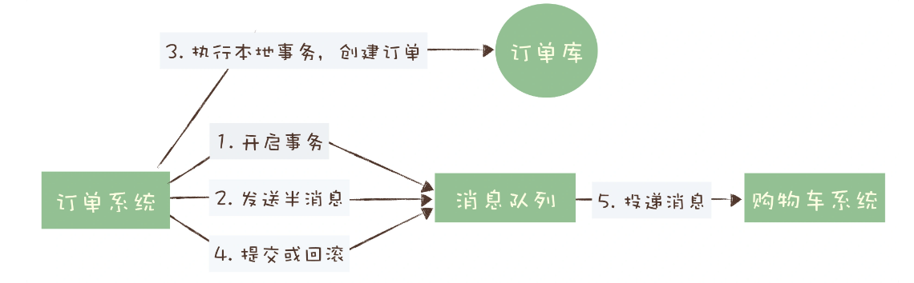

  * 首先，订单系统在消息队列上开启一个事务。然后订单系统给消息服务器发送一个“半消息”，这个半消息不是说消息内容不完整，它包含的内容就是完整的消息内容，半消息和普通消息的唯一区别是，**在事务提交之前，对于消费者来说，这个消息是不可见的**。
  * 半消息发送成功后，订单系统就可以执行本地事务了，在订单库中创建一条订单记录，并提交订单库的数据库事务。然后根据本地事务的执行结果决定提交或者回滚事务消息。如果订单创建成功，那就提交事务消息，购物车系统就可以消费到这条消息继续后续的流程。如果订单创建失败，那就回滚事务消息，购物车系统就不会收到这条消息。这样就基本实现了“**要么都成功，要么都失败**”的一致性要求。

* 是否有消息丢失

  * 分布式链路追踪系统，追踪每一条消息
  * 利用消息队列的有序性，在 Producer 端，我们给每个发出的消息附加一个连续递增的序号，然后在 Consumer 端来检查这个序号的连续性。
    * 在发消息的时候必须要指定分区，并且，在每个分区单独检测消息序号的连续性。
    * Producer 是多实例时，消息序号需要附加上 Producer 的标识，Consumer 端按照每个 Producer 分别来检测序号的连续性。
    * Consumer 实例的数量最好和分区数量一致，做到 Consumer 和分区一一对应，这样会比较方便地在 Consumer 内检测消息序号的连续性。

* 确保消息可靠传递（消息不丢）

  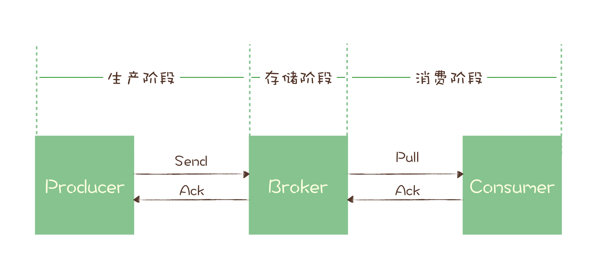

  * 生产阶段: 在这个阶段，从消息在 Producer 创建出来，经过网络传输发送到 Broker 端。

    * 在生产阶段，需要注意代码中的发送返回
      * 同步发送
      * 异步发送

  * 存储阶段: 在这个阶段，消息在 Broker 端存储，如果是集群，消息会在这个阶段被复制到其他的副本上

    * 配置刷盘或复制相关参数
    * 集群（配图kafka）

    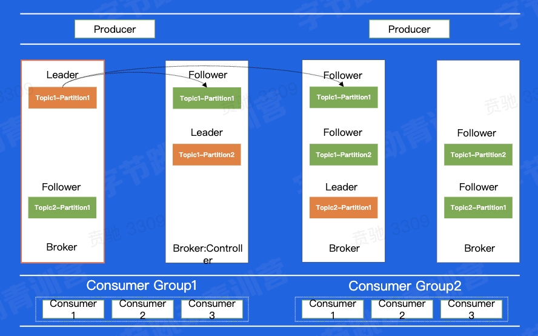

  * 消费阶段: 在这个阶段，Consumer 从 Broker 上拉取消息，经过网络传输发送到 Consumer 上

    * **在处理完全部消费业务逻辑之后，再发送消费确认**
    * 确保消费速度，防止消息过久不被消费导致被mq删除

* mq的服务质量标准

  * At most once: 至多一次。消息在传递时，最多会被送达一次。换一个说法就是，没什么消息可靠性保证，允许丢消息。一般都是一些对消息可靠性要求不太高的监控场景使用，比如每分钟上报一次机房温度数据，可以接受数据少量丢失。
  * At least once: 至少一次。消息在传递时，至少会被送达一次。也就是说，不允许丢消息，但是允许有少量重复消息出现。
  * Exactly once：恰好一次。消息在传递时，只会被送达一次，不允许丢失也不允许重复，这个是最高的等级。
  * 大部分消息队列提供的服务质量都是 At least once，包括 RocketMQ、RabbitMQ 和 Kafka ，即**消息队列无法保证消息不重复**

* mq重复消费

  * **At least once + 幂等消费 = Exactly oncex**

  * Consumer做好消费的幂等性

    * 业务处理逻辑本身就是幂等的
    * 数据库的唯一性约束
    * 设置前置条件

  * Producer重复发送

    * 全局ID

    * 如果consumer做好了消费的幂等性，那么producer重复发送将不再是问题

  * 业务处理逻辑非幂等，那就消息先去重，根据业务ID(标识消息唯一性的就行)，去查询是否消费过此消息了，消费了，则抛弃，否则就消费

    * 全局ID（分布式锁）
    * 检查消费状态，然后更新数据并且设置消费状态（分布式锁）
    * 一个partition由一个consumer消费，但是**一个consumer之内需要慎重考虑多线程消费**，可能会导致数据不一致的现象

    > 对于同一条消息：“全局 ID 为 8，操作为：给 ID 为 666 账户增加 100 元”，有可能出现这样的情况：
    >
    > t0 时刻：Consumer A 收到条消息，检查消息执行状态，发现消息未处理过，开始执行“账户增加 100 元”；
    >
    > t1 时刻：Consumer B 收到条消息，检查消息执行状态，发现消息未处理过，因为这个时刻，Consumer A 还未来得及更新消息执行状态。
    >
    > 这样就会导致账户被错误地增加了两次 100 元

* RocketMQ

  * 一个topic存在多个队列，在生产者生产消息的时候可以指定把消息放到哪个队列。 

  * 消费者有一个消费组的概念，消费组里面有多个消费者，可以同时消费多个队列，比如消费组1里面有consumer A，consumer B两个消费者，那么A，B两个消费者可以同时消费一个队列，也可以消费多个队列，组内是竞争关系，A消费了某个消息，B就不能再消费这条消息，与此同时，这个队列上的offset（对于消费组1的offset）会往后移动。消费组2还是有自己的offset，对于同一个队列，每个消费组之间是共享关系，这样就不用存多份数据，只需维护每个消费组在队列上的offerset就好。 

  

  * 如何顺序消费，可以根据对应的比如用户ID/订单ID，通过一致性hash把相应的数据生产到对应的队列，然后消费这个队列就OK，每个消费组肯定是顺序消费的，队列可以保证顺序消费

  * 队列的存在实现了多实例并行生产和消费

  * 每队列每消费组维护一个消费位置（offset），记录这个消费组在这个队列上消费到哪儿了。

  * **每个队列只能被一个消费者实例占用**

  * RocketMQ 中的分布式事务实现

    * 在 RocketMQ 中的事务实现中，增加了**事务反查**的机制来解决事务消息提交失败的问题。如果 Producer 也就是订单系统，在提交或者回滚事务消息时发生网络异常，RocketMQ 的 Broker 没有收到提交或者回滚的请求，Broker 会定期去 Producer 上反查这个事务对应的本地事务的状态，然后根据反查结果决定提交或者回滚这个事务。
    * 为了支撑这个事务反查机制，我们的业务代码需要实现一个反查本地事务状态的接口，告知 RocketMQ 本地事务是成功还是失败。

    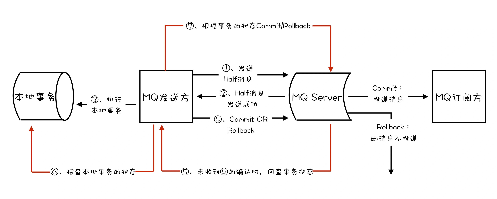

* Kafka

  * 概念同RocketMQ：唯一需要注意的是在Kafka中队列（queue）被称为分区（partition）
  * Kafka ：异步批量
    * 同步收发消息的响应时延比较高，因为当客户端发送一条消息的时候，Kafka 并不会立即发送出去，而是要等一会儿攒一批再发送
    * **Kafka 不太适合在线业务场景**

* mq使用性能

  * 发送端性能优化
    * 并发数
    * 批量大小
    * 消息体量大，无法发挥批处理的优势，可使用扩容发送方的发送缓冲区、减小消息大小等方式
  * 消费端性能优化
    * 保证消费端的消费性能要高于生产端的发送性能，这样的系统才能健康的持续运行
    * 水平扩容：**在扩容 Consumer 的实例数量的同时，必须同步扩容主题中的分区（也叫队列）数量**，确保 Consumer 的实例数和分区数量是相等的
    * **同步且非缓存消费的重要性**：如果使用内存队列来缓存mq中的消息，启动多个线程执行业务逻辑，如果收消息的节点发生宕机，在内存队列中还没来及处理的这些消息就会丢失。

* 消息积压

  * producer单位时间内发送的消息增多
    * 通过扩容消费端的实例数来提升总体的消费能力
    * 优化消费逻辑
    * 系统降级
  * 消费失败导致的一条消息反复消费这种情况比较多

* 消费确认机制

  * 在同一个消费组里面，每个队列只能被一个消费者实例占用

* 消息乱序

  * 消息传输的有序性是否有必要
  * 每次消息发送时生成唯一递增的 ID

  * 消费失败--->重试机制导致的消息乱序
    * SUSPEND_CURRENT_QUEUE_A_MOMENT，意思是先等一会，再接着处理这批消息，而不是把这批消息放入重试队列里去处理其他消息。细节：当前队列会挂起（此消息后面的消息停止消费，直到此消息完成消息重新消费的整个过程），然后此消息会在消费者的线程池中重新消费，即不需要Broker重新创建新的消息（不涉及重试队列），如果消息重新消费超过maxReconsumerTimes最大次数时，进入死信队列。当消息放入死信队列时，Broker服务器认为消息时消费成功的，继续消费该队列后续消息。

* kafka批量消息

  * kafka在producer、服务 端、consumer中批消息都不会被解开，一直是作为一条“批消息”来进行处理的，consumer 从 Broker 拉到一批消息后，在客户端把批消息解开，再一条一条交给用户代码处理（consumer消费失败，批重发？还是at least once，需要确保消费的幂等性）

* kafka零拷贝：https://zhuanlan.zhihu.com/p/83398714

  * 零拷贝加速消费过程
  * 原始

  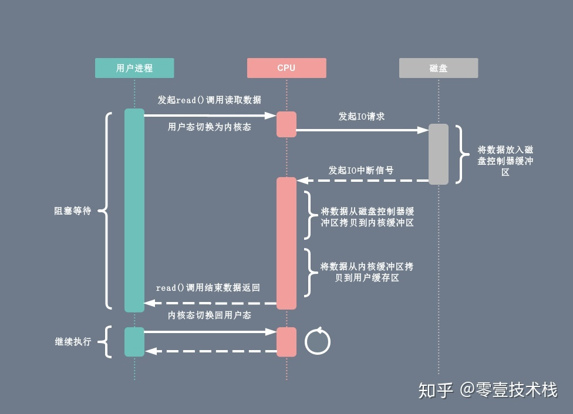

  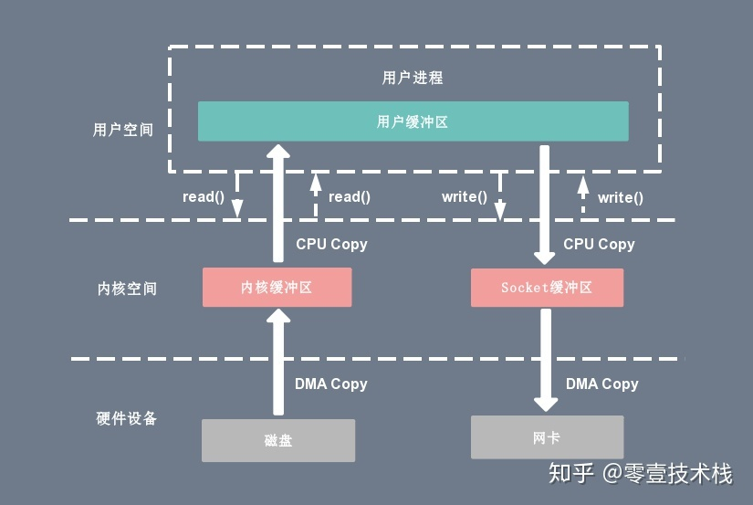

  * DMA

  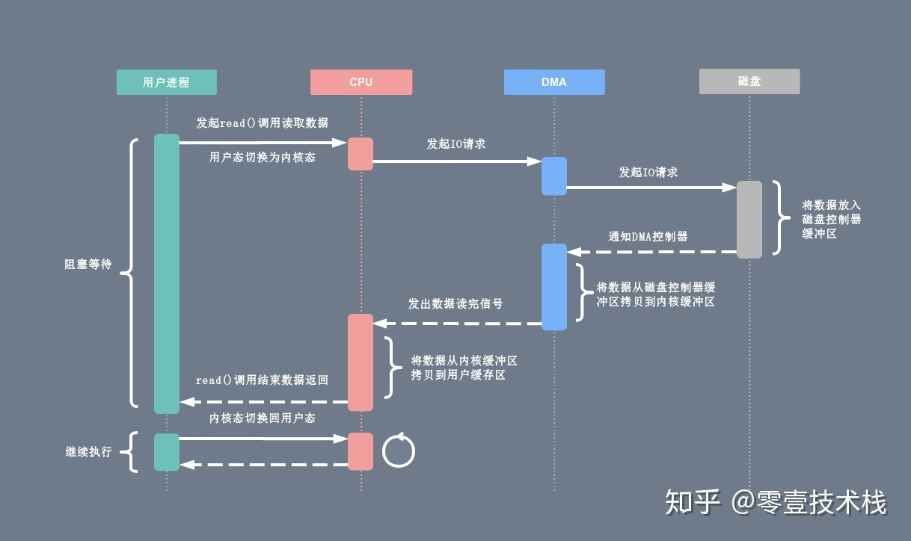

  * 通过**sendfile**系统调用，CPU 将读缓冲区（read buffer）中的数据拷贝到的网络缓冲区（socket buffer）

  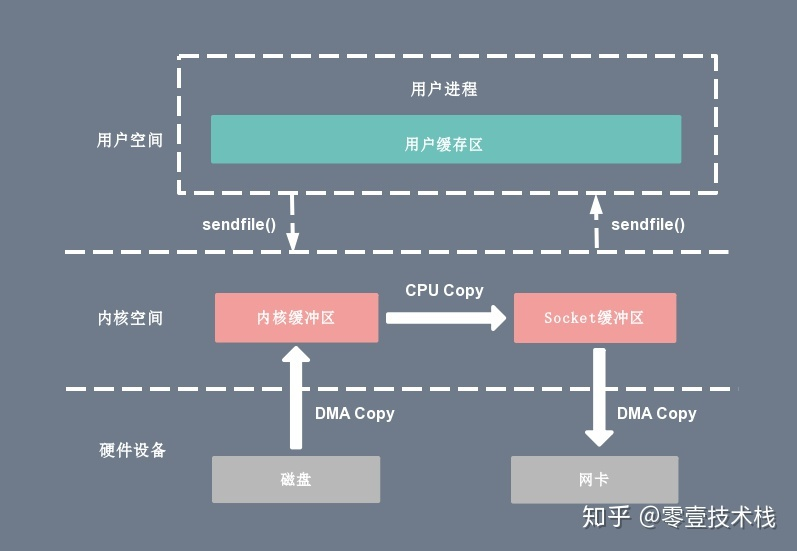

  * sendfile + DMA gather copy，由 DMA 根据内存地址、地址偏移量将数据批量地从读缓冲区（read buffer）拷贝到网卡设备中

  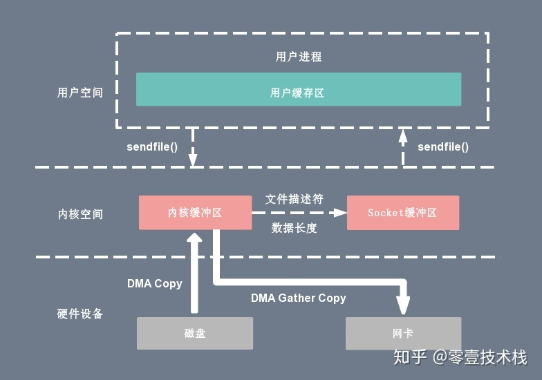

* kafka数据可靠性

  * 本地只是使用page cache，（没有类似mysql的wal日志
    * 消息队列它的读写比例大致是 1：1，page cache足够满足需求
    * Kafka 它并不是只靠磁盘来保证数据的可靠性，它更依赖的是，**在不同节点上的多副本来解决数据可靠性问题**

* 数据压缩

  * producer（数据压缩） ---> 服务端 ----> consumer（数据解压）
  * 即：Kafka 的压缩和解压都是在客户端完成的

* kafka：Replica

  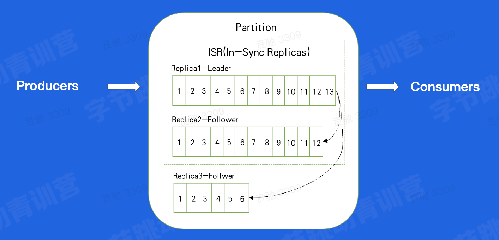

  

* kakfa：consumer rebalance

  consumer分配partition的方式

  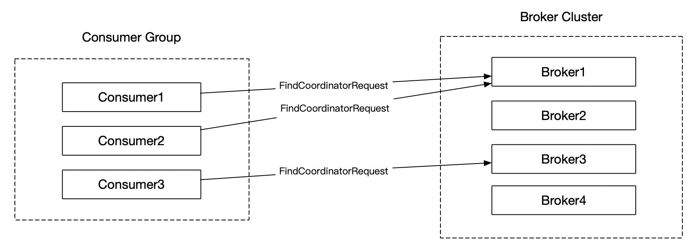

  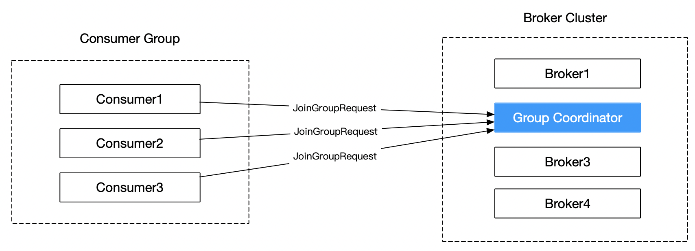

  .png)

  .png)

  .png)

* RocketMQ：消费重试和死信队列

.png)

* 消息的定位

  * commitlog：存储消息的文件（固定大小，比如1G

  * consumeQueue：索引文件

    * 快速定位

    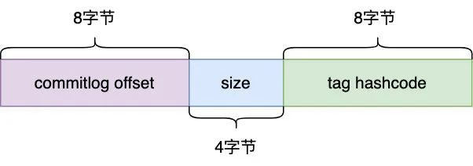

    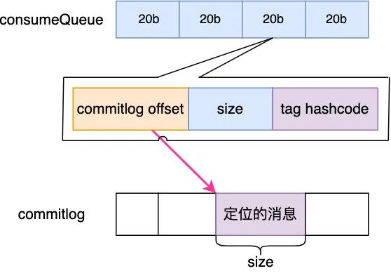

  * 消息的写入与消费过程（不考虑分区

    * 消息写入：首先是消息被顺序写入 commitlog 文件中，写入后此消息在文件中的偏移（commitlog offset）和大小（size）会被顺序写入相应的 consumeQueue 文件中
    * 消费消息：每个消费者都有一个**消费进度**，由于每个 consumeQueue 文件是根据偏移量来命名的，首先消费进度可根据**二分查找**快速定位到进度是在哪个 consumeQueue 文件，进一步定义到是在此文件的哪个位置，由此可以读取到消息的 commitlog offset 和 size，然后由于 commitlog 每个文件的命名都是按照偏移量命名的，那么根据 commitlog offset 显然可以根据**二分查找**快速定位到消息是在哪个 commitlog 文件，进而再获取到消息在文件中的具体位置从而读到消息

* 消息的写入与消费过程（考虑分区，即多个consumeQueue

   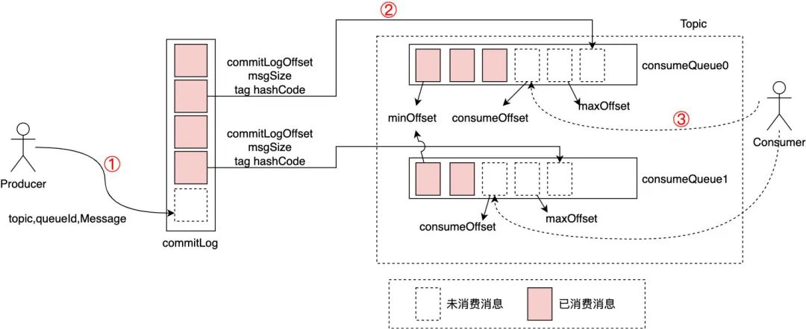

  * 首先 producer 发送 topic，queueId，message 到 Broker 中，Broker 将消息通过顺序写的形式持久化到 commitlog 中，这里的 queueId 是 Topic 中指定的 consumeQueue 0，consumeQueue 1，consumeQueue …，一般通过负载均衡的方式轮询写入对应的队列，比如当前消息写入 consumeQueue 0，下一条写入 consumeQueue 1,…，不断地循环
  * 持久化之后可以知道消息在 commitlog 文件中的偏移量和消息体大小，如果 consumer 指定订阅了 topic 和 tag，还会算出 tag hashCode，这样的话就可以将这三者顺序写入 queueId 对应的 consumeQueue 中
  * 消费者消费：每一个 consumeQueue 都能找到每个消费者的消息进度（consumeOffset），据此可以快速定位其所在的 consumeQueue 的文件位置，取出 commitlog offset，size，tag hashcode 这三个值，然后首先根据 tag hashcode 来过滤消息，**如果匹配上了（for循环）再根据** commitlog offset，size 这两个元素到 commitlog 中去查找相应的消息然后再发给消费者

* tag

  * 把消息按业务类型划分成 Topic 粒度还是有点大，所以我们有时还需要进一步对某个 Topic 下的消息进行分类，我们将这些分类称为 **tag**，producer 在发消息的时候会指定 topic 和 tag，Broker 也会把 topic, tag 持久化到文件中，那么 consumer 就可以只订阅它感兴趣的 topic + tag 消息了

* **注意**：所有 Topic 的消息都写入同一个 commitlog 文件（而不是每个 Topic 对应一个 commitlog 文件），然后消息写入后会根据 topic,queueId 找到 Topic 所在的 consumeQueue 再写入

  即topic的分区只是逻辑分区，依赖于consumeQueue

* NameServer

  * `注册中心`：中间层（一般称其为 nameserver）

  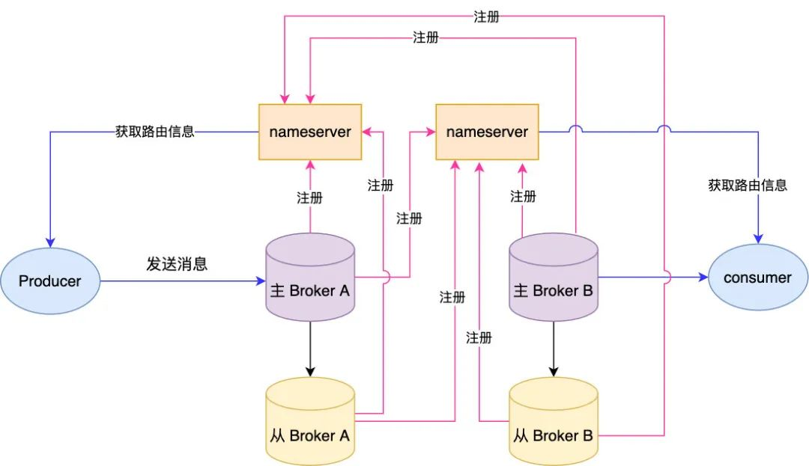

  *  producer 和 consumer 就可以通过与 nameserver 建立长连接来定时（比如每隔 30 s）拉取这些路由信息从而更新到本地，发送/消费消息的时候就可以依据这些路由信息进行发送/消费

  

### 序列化

* 序列化后的数据最好是易于人类阅读的；
* 实现的复杂度是否足够低；
* 序列化和反序列化的速度越快越好；
* 序列化后的信息密度越大越好，也就是说，同样的一个结构化数据，序列化之后占用的存储空间越小越好；
* 为什么不能直接把内存中，对象对应的二进制数据直接通过网络发送出去？
  * 不通用， 不同系统， 不同语言的组织可能都是不一样的， 而且还存在很多引用， 指针，并不是直接数据块。

### 传输协议

* 使用分隔符
  * 内部传输分隔符时使用转义符
* 增加句长字段
* tcp连接：全双工的通道
  * 问：双端同时收发数据，会发生消息时序混乱的场景
    * 给每个请求加一个序号，这个序号在本次会话内保证唯一，然后在响应中带上请求的序号
    * 双端序列号分离，比如双端一个使用奇数，另一个使用偶数作为序号

### 高并发场景下的OOM和卡死

* 原因

  * 垃圾回收的stop the world

  * 高并发下垃圾回收的不及时
  * 高并发场景下，短时间内就会创建大量的对象，这些对象将会迅速占满内存，这时候，由于没有内存可以使用了，垃圾回收被迫开始启动，并且，这次被迫执行的垃圾回收面临的是占满整个内存的海量对象，它执行的时间也会比较长，相应的，这个回收过程会导致进程长时间暂停。进程长时间暂停，又会导致大量的请求积压等待处理，垃圾回收刚刚结束，更多的请求立刻涌进来，迅速占满内存，再次被迫执行垃圾回收，进入了一个恶性循环。如果垃圾回收的速度跟不上创建对象的速度，还可能会产生内存溢出的现象。

* 处理方式

  * 优化代码中处理请求的业务逻辑，尽量少的创建一次性对象
  * 自行回收并重用对象（池化）
  * 绕开自动垃圾回收机制，自己来实现内存管理
    * 增加了程序的复杂度
    * 引起内存泄漏

### 秒杀服务

* 网关

  * 方案一

    * 网关在收到请求后，将请求放入请求消息队列

    * 后端服务从请求消息队列中获取 APP 请求，完成后续秒杀处理过程，然后返回结果。

  * 方案二

    * 预估出秒杀服务的处理能力
    * 设计令牌桶（消息队列），单位时间内只发放固定数量的令牌到令牌桶中，规定服务在处理请求之前必须先从令牌桶中拿出一个令牌，如果令牌桶中没有令牌，则拒绝请求

* 后端服务器

  * 消息队列异步处理

* 数据库

  * 分库分表
  * 减轻写操作压力
    * 中间件实现批处理
  * 减轻读操作压力
    * redis分担读请求
    * redis缓存更新策略
      * 监听binlog
      * 定时触发更新

### JAVA线程池参数

**核心线程数：corePoolSize**

线程池中活跃的线程数，即使它们是空闲的，除非设置了allowCoreThreadTimeOut为true。allowCoreThreadTimeOut的值是控制核心线程数是否在没有任务时是否停止活跃的线程，当它的值为true时，在线程池没有任务时，所有的工作线程都会停止。

**最大线程数：maximumPoolSize**

线程池所允许存在的最大线程数。

**多余线程存活时长：keepAliveTime**

线程池中除核心线程数之外的线程（多余线程）的最大存活时间，如果在这个时间范围内，多余线程没有任务需要执行，则多余线程就会停止。(注意：多余线程数 = 最大线程数 - 核心线程数)

**时间单位：unit**

多余线程存活时间的单位，可以是分钟、秒、毫秒等。

**任务队列：workQueue**

线程池的任务队列，使用线程池执行任务时，任务会先提交到这个队列中，然后工作线程取出任务进行执行，当这个队列满了，线程池就会执行拒绝策略。

**线程工厂：threadFactory**

创建线程池的工厂，线程池将使用这个工厂来创建线程池，自定义线程工厂需要实现ThreadFactory接口。

**拒绝执行处理器（也称拒绝策略）：handler**

当线程池无空闲线程，并且任务队列已满，此时将线程池将使用这个处理器来处理新提交的任务。

### docker

**容器的本质是一种特殊的进程**

* 粗略过程：clone(namespace) --> mount --> exec

  * **dockerinit** 会负责完成根目录的准备、挂载设备和目录、配置 hostname 等一系列需要在容器内进行的初始化操作。最后，它通过 execv() 系统调用，让应用进程取代自己，成为容器里的 PID=1 的进程。

* **Cgroups 技术是用来制造约束的主要手段**

* **Namespace 技术则是用来修改进程视图的主要方法**

  * CLONE_NEWPID:让进程看不见其余进程（pid的角度隔离
  * Mount Namespace:修改文件系统视图
    * 挂载根目录：容器镜像
  * 用户运行在容器里的应用进程，跟宿主机上的其他进程**一样**，都由宿主机操作系统统一管理，只不过这些被隔离的进程拥有额外设置过的 Namespace 参数
  * 问题：共享操作系统内核

* 容器：单进程模型

  * 防止出现：容器是正常运行的，但是里面的应用早已经挂了的情况

* AUFS（advance union file system）

  容器镜像中“层”

  * 只读层(read only+whiteout)
  * init层：本地用户信息
  * 可读写层（read write）
  * 删除只读层里的一个文件：在可读写层创建一个 whiteout 文件，把只读层里的文件“遮挡”起来。
  * 删除只读层里的一个文件：在可读写层创建一个一样的文件进行修改，而相同的文件上层会覆盖掉下层。

* volumn

  * 容器 Volume 里的信息，并不会被 docker commit 提交掉
    * 由于启用mount namespace之后才挂载，宿主机在可读写层是看不到挂载目录的

### K8S

**容器编排**

> 运行在大规模集群中的各种任务之间，实际上存在着各种各样的关系。这些关系的处理，才是作业编排和管理系统最困难的地方。

docker --> pod --> deployment --> service, secret,job,daemonset,cronjob

* Kubelet通过CRI（container runtime interface）调用容器，容器在通过OCI（底层规范）和宿主机os交互

* Kubernetes 项目中，推崇的使用方法是：

  * 首先，通过一个“编排对象”，比如 Pod、Job、CronJob 等，来描述你试图管理的应用；

  * 然后，再为它定义一些“服务对象”，比如 Service、Secret、Horizontal Pod Autoscaler（自动水平扩展器）等。这些对象，会负责具体的平台级功能。

* 容器的“单进程模型”，并不是指容器里只能运行“一个”进程，而是指容器没有管理多个进程的能力。

* Pod 是 Kubernetes 里的原子调度单位

  * docker实例和pod的关系类比于进程和进程组的关系
  * Pod 里的所有容器，共享的是同一个 Network Namespace，并且可以声明共享同一个 Volume
  * 在Pod 中，Infra 容器是第一个被创建的容器，而其他用户定义的容器，则通过 **Join Network Namespace** 的方式，与 Infra 容器关联在一起

* pod和container属性区别

  * 凡是跟容器的 Linux Namespace 相关的属性，一定是 Pod 级别的
  * 凡是调度、网络、存储，以及安全相关的属性，基本上是 Pod 级别的

* Pod 对象在 Kubernetes 中的生命周期（status，condition

  * pending
  * running：它包含的容器都已经创建成功，并且至少有一个正在运行中
    * **Running** health prober 通过
    * **Ready** readiness prober 通过：决定的这个 Pod 是不是能被通过 Service 的方式访问到，不影响Pod生命周期
  * succeeded：正常退出
  * failed：Pod 里所有容器以不正常的状态（非 0 的返回码）退出
  * unkonwn

* Secret

  * 是帮你把 Pod 想要访问的加密数据，存放到 **Etcd** 中。然后，你就可以通过在 Pod 的容器里挂载 Volume 的方式，访问到这些 Secret 里保存的信息了。

* pod的恢复策略:restartPolicy=always/onFailure/never

* 控制器模式

  * control loop完成调谐（Reconcile）

  * 这些控制循环最后的执行结果，要么就是创建、更新一些 Pod（或者其他的 API 对象、资源），要么就是删除一些已经存在的 Pod（或者其他的 API 对象、资源）
  * Deployment -- > ReplicaSet --> Pod

  ```go
  for {
    实际状态 := 获取集群中对象X的实际状态（Actual State）
    期望状态 := 获取集群中对象X的期望状态（Desired State）
    if 实际状态 == 期望状态{
      什么都不做
    } else {
      执行编排动作，将实际状态调整为期望状态
    }
  }
  ```

* 水平伸缩

  * RollingUpdateStrategy

* StatefulSet：有状态应用

  * 拓扑状态（依赖 headless service
    * headless service保证了pod的可解析身份，将 Pod 的拓扑状态（比如：哪个节点先启动，哪个节点后启动），按照 Pod 的“名字 + 编号”的方式固定下来
  * 存储状态（依赖PV/PVC
    * PVC（Persistent Volume Claim）
    * PV（Persistent Volume）
    * 把一个 Pod，比如 web-0，删除之后，这个 Pod 对应的 PVC 和 PV，并不会被删除，而这个 Volume 里已经写入的数据，也依然会保存在远程存储服务里
    * 在这个新的 web-0 Pod 被创建出来之后，Kubernetes 为它查找名叫 www-web-0 的 PVC 时，就会直接找到旧 Pod 遗留下来的同名的 PVC，进而找到跟这个 PVC 绑定在一起的 PV。
  * StatefulSet直接管理pod（区别于deployment管理replicaSet）

* Service

  * Normal Service: 以 Service 的 VIP（Virtual IP，即：虚拟 IP）方式访问
    * DNS---->Service的IP
  * Headless Service: 以 Service 的 DNS 方式访问
    * DNS---->某个Pod的IP

* DaemonSet

  * 这个 Pod 运行在 Kubernetes 集群里的每一个节点（Node）上；
  * 每个节点上只有一个这样的 Pod 实例；

* 声明式API

  * 首先，所谓“声明式”，指的就是我只需要提交一个定义好的 API 对象来“声明”，我所期望的状态是什么样子。
  * 其次，“声明式 API”允许有多个 API 写端，以 PATCH 的方式对 API 对象进行修改，而无需关心本地原始 YAML 文件的内容。

### 微服务

* 负载均衡

* 服务治理

* 服务注册、发现

* Istio

  * Envoy 容器：运行在每一个应用 Pod 里（sidecar）
  * Envoy 容器通过配置 Pod 里的 iptables 规则，把整个 Pod 的进出流量接管下来
  * Istio 的控制面板（Control Plane）里的 Pilot 组件，通过调用每个 Envoy 容器的 API，对这个 Envoy 代理进行配置，从而实现微服务治理

* service mesh

  * 流量控制
  * proxy：接管入口和出口流量
  * 注册中心
  * 配置中心
  * 数据面板：负责发现目标服务实例地址列表并转发请求
  * 控制面板：负责管理服务注册表的所有服务注册信息

* 发展历史

  * 单体 ---> 多服务
    * 通信？
    * http、rpc
    * 高可用？
    * 网关（nginx），配置文件
    * 配置文件维护成本？
    * 服务注册中心

* 服务注册中心

  * 服务注册

    * 服务提供者
    * 服务消费者
    * 服务注册表
    * 订阅者模型

  * 客户端发现模式

    * 客户端负责确定服务提供者的可用实例地址列表和负载均衡策略。客户端访问服务注册表，定时同步目标服务的实例地址列表，然后基于负载均衡算法选择目标服务的一个可用实例地址发送请求。
    * 自注册
      * 服务实例调用服务注册表的注册接口进行实例地址注册。
      * 主动探活和被动探活：服务实例还可以提供服务运行状况检查接口，服务注册表定期访问接口检查服务实例是否健康和处理请求。服务注册表可能要求服务实例定期调用“心跳”API以防止服务实例注册过期。
    * 客户端发现：当服务客户端调用目标服务时，它会查询服务注册表以获取服务实例地址列表。为了提高性能，客户端缓存服务实例地址列表。然后，服务客户端使用负载均衡算法（如循环或随机）来选择服务实例发送请求。

  * 服务端发现模式

    * 反向代理
    * 服务客户端通过路由器（或者负载均衡器）访问目标服务。路由器负责查询服务注册表，获取目标服务实例的地址列表转发请求。
    * 优点：
      - 部署平台提供服务发现功能，负责处理服务发现的所有方面。因此，无论使用任何语言，所有的服务提供者和消费者都可以轻松地使用服务发现机制。
      - 服务发现功能对于服务客户端而言是透明的，因此，服务发现功能的相关更新对于服务客户端是无感知的。
    * 缺点：
      - 部署平台的服务发现功能仅支持发现使用该平台部署的服务。例如，基于Kubernetes 的服务发现仅适应于在Kubernetes上部署运行的服务。
      - 服务的架构增加了一次转发，延迟时间会增加。整个系统增加了一个故障点，系统的运维难度增加。最关键的是负责转发请求的路由器或者负载均衡器可能变成性能的瓶颈。
      - 微服务的一个目标是故障隔离，将整个系统切割为多个服务共同运行，如果某服务无法正常运行，只会影响到整个系统的相关部分功能，其它功能能够正常运行，即去中心化。然而，服务端发现模式实际上是集中式的做法，如果路由器或者负载均衡器无法提供服务，那么将导致整个系统瘫痪。

  * service mesh

    * Sidecars，即数据面板（Data Plane），负责发现目标服务实例地址列表并转发请求。
    * Pilots，即控制面板（Control Plane），负责管理服务注册表的所有服务注册信息。

    

    - 自注册：Sidecar实例，而不是服务本身，负责调用服务注册表的注册接口进行实例地址注册；负责定期调用“心跳”API以续租服务实例注册信息。
    - 客户端发现：Sidecar实例负责与控制面板之间基于双向流式实时同步服务数据。当服务客户端发送请求时，负责转发请求的Sidecar实例查询本地缓存的目标服务实例地址列表，基于负载均衡算法选择一个可用的实例地址转发请求。

  * 健康检查

    * 服务主动探活
    * 注册中心主动发起健康检查
    * 由调用方负载均衡进行健康检查

  * 注册中心故障？

    * 服务调用方缓存服务节点

* 负载均衡器

  * DNS负载均衡
  * 利用sidecar做负载均衡
  * 负载均衡算法
    * round robin
    * weighted round robin
    * weighted random
    * two random choices
    * sticky session
  * 服务发现后的节点保护
    * 主动健康检查
  * 节点染色


### 项目

```
Driver{
	NewQuerier() Querier //模仿连接
}
Querier interface{
	BatchQuery()
	TotalCount()
}
```


### 数据结构

* 滑动窗口

  ```go
  func minSubArrayLen(target int, nums []int) int {
      cur := 0
      res := len(nums) + 1
      left := 0
      n := len(nums)
      for right := 0;right< n;right++{
          // 右操作
          for left<=right&&//判断{
              //左操作
            	//判断
          }
        	//判断
      }
      return res
  }
  ```

* alice、bob

  > 对于两个玩家、分先后手、博弈类型的题目，一般可以使用动态规划来解决。

  定义**状态**

  * 从后往前
  * 从前往后
  
* kmp算法

  .png)

  ```go
  func strStr(haystack, needle string) int {
  	m, n := len(haystack), len(needle)
  	pi := make([]int, n)
    // pi[i]表示needle最大的相同真前缀和真后缀的长度
    // 计算方式如上图所示
  	for i := 1; i < n; i++ {
  		j := pi[i-1]
  		for j > 0 && needle[j] != needle[i] {
  			j = pi[j-1]
  		}
  		if needle[j] == needle[i] {
  			pi[i] = j + 1
  		}
  	}
    //下面的循环中每个i对应的j表示haystack[i-j+1:i] == needle[:j]，即最大的j，使得haystack[i-j+1:i]与needle中长度为j的前缀相同
  	j := 0
  	for i := 0; i < m; i++ {
  		for j > 0 && needle[j] != haystack[i] {
  			j = pi[j-1]
  		}
  		if needle[j] == haystack[i]{
  			j ++
  		}
  		if j == n{
  			return i - n + 1
  		}
  	}
  	return -1
  }
  ```

.png)

* 堆

  ```go
  type IHeap [][2]int
  
  func (h IHeap) Len() int           { return len(h) }
  func (h IHeap) Less(i, j int) bool { return h[i][1] < h[j][1] }
  func (h IHeap) Swap(i, j int)      { h[i], h[j] = h[j], h[i] }
  
  func (h *IHeap) Push(x interface{}) {
      *h = append(*h, x.([2]int))
  }
  
  func (h *IHeap) Pop() interface{} {
      old := *h
      n := len(old)
      x := old[n-1]
      *h = old[0 : n-1]
      return x
  }
  ```

* 线段数组

  * **单点修改**：更改数组中一个元素的值 O(logN)
  * **区间查询**：查询一个区间内所有元素的和 O(logN)

  ```go
  // BINARY INDEX TREE
  7
  ```
  
  * 最近公共父节点
  
  ```go
  func lowestCommonAncestor(root *TreeNode, p *TreeNode, q *TreeNode) *TreeNode {
  	if root == nil {
  		return nil
  	}
  	if root == p || root == q {
  		return root
  	}
  	left := lowestCommonAncestor(root.Left, p, q)
  	right := lowestCommonAncestor(root.Right, p, q)
  	if left != nil && right != nil {
  		return root
  	}
  	if left != nil {
  		return left
  	}
  	return right
  }
  ```
  


### Java

* TreeMap实现原理：红黑树
* ThreadLocal：ThreadLocal可以让线程拥有自己**独享**的变量，就是说多个线程共享同一个ThreadLocal对象，但是每个线程都可以通过ThreadLocal的get方法获取或set方法设置属于该线程的变量副本，变量只属于该线程并且其他线程无关；


### 作业编排

* https://zhuanlan.zhihu.com/p/415851066
