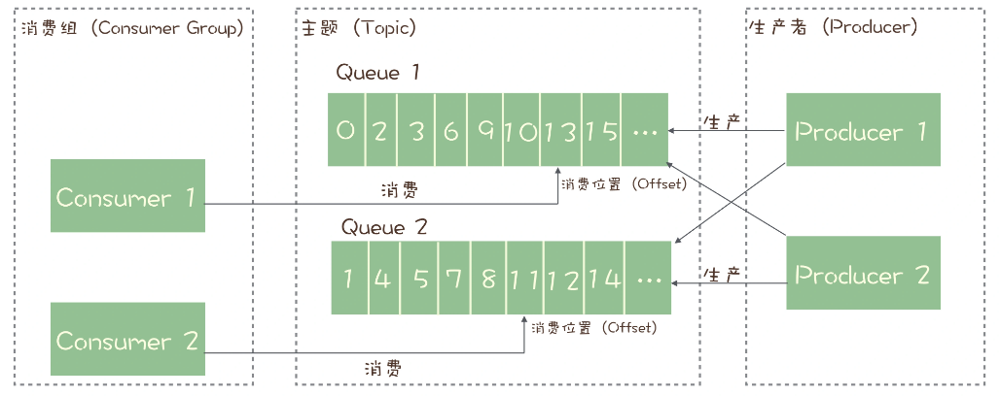

### OS

* 用户线程VS内核线程：用户线程创建销毁消耗少，不需要走内核（用户态和内核态的切换），不消耗内核线程资源（内核能创建的内核线程有限），但是内核不感知用户线程，一个用户线程的阻塞会导致整个进程的阻塞（一人有难，全家牵连），而且分到的时间片也会被分给所有的用户线程（多人只分到一块蛋糕）执行时间短

  

* User --> user cache --> page cache --> disk :一般的缓冲，非直接IO

* 直接IO：User --> user cache -->  disk  (不走内核缓冲page cache，直接调设备驱动)

  * https://cloud.tencent.com/developer/news/406991

* 阻塞 I/O：等待「内核数据准备好」和「数据从内核态拷⻉到⽤户态」这两个过程

* 文件系统：http://c.biancheng.net/view/3066.html

* DMA（Direct Memory Access） 功能，它可以使得设备在 CPU 不参与的情况下，能够⾃⾏完成把设备 I/O 数据放⼊到内存. Cpu-->DMA-->device<-->memory

* 键盘键入字符的发生事情：键盘设备缓存字符，向cpu发起**硬件中断**，cpu响应中断，(DMA?)从键盘设备读取字符至内存，进入中断处理函数：**放到「读缓冲区队列」**，显示设备的驱动程序会定时从「读缓冲区队列」读取数据放到「写缓冲区队列」（如果有写文件操作，大概也是去读「读缓冲区队列」？），最后把「写缓冲 区队列」的数据⼀个⼀个写⼊到显示设备的控制器的寄存器中的数据缓冲区，最后将这些数据显示在屏幕 ⾥。

* linux发送网络包过程：application --> socket发送缓冲区 --> 网络协议栈 -->网卡 ----------> 网卡 --> 网络协议栈 --> socket接收缓冲区 -->application

* 零拷贝：https://zhuanlan.zhihu.com/p/83398714

  * 在⾼并发的场景下，针对⼤⽂件的传输的⽅式，应该使⽤「异步 I/O + 直接 I/O」来替代零拷⻉技 术
  * 传输⽂件的时候，我们要根据⽂件的⼤⼩来使⽤不同的⽅式： 传输⼤⽂件的时候，使⽤「异步 I/O + 直接 I/O」； 传输⼩⽂件的时候，则使⽤「零拷⻉技术」

* 一致性hash：https://segmentfault.com/a/1190000021199728

* I/O 多路复⽤：

  * select

    * **最大限制：**单个进程能够监视的文件描述符的数量存在最大限制
    * **时间复杂度：** 对socket进行扫描时是线性扫描，即采用轮询的方法，效率较低，时间复杂度O(n)
    * **内存拷贝：**需要维护一个用来存放大量fd的数据结构，这样会使得用户空间和内核空间在传递该结构时复制开销大
    * 阻塞式调用

  * poll

    * **没有最大连接数的限制**。（基于链表来存储的）
    * 其余同select

  * epoll

    * **没有最大连接数的限制**
    * **时间复杂度低：** 边缘触发和事件驱动，监听回调，时间复杂度O(1)。
    * **内存拷贝：**利用mmap()文件映射内存加速与内核空间的消息传递，减少拷贝开销。
    * **边缘触发：**只有**新数据**到来才触发
    * **⽔平触发：**只要有数据就触发
    * ET模式在很大程度上减少了epoll事件被重复触发的次数，因此效率要比LT模式高

  * 多路复⽤ API 返回的事件并不⼀定可读写的，如果使⽤阻塞 I/O， 那么在调⽤ read/write 时则会发⽣程序阻塞，因此最好搭配**⾮阻塞 I/O**，以便应对极少数的特殊情况。

    > Under Linux, select() may report a socket file descriptor as "ready for reading", while nevertheless a subsequent read blocks. This could for example happen when data has arrived but upon examination has wrong checksum and is discarded. There may be other circumstances in which a file descriptor is spuriously reported as ready. Thus it may be safer to use O_NONBLOCK on sockets that should not block.


* Reactor模型
  * **I/O 多路复用监听事件，收到事件后，根据事件类型分配（Dispatch）给某个进程 / 线程**。
  * Reactor 负责监听和分发事件，事件类型包含连接事件、读写事件；
  * 处理资源池负责处理事件，如 read -> 业务逻辑 -> send；
  * 单 Reactor 单进程 / 线程：**Redis**：EventLoop
    * 不适⽤计算机密集型的场景，只适⽤于业务处理⾮常快速的场景
    * 无锁
* 多 Reactor 多进程 / 线程
  * 主线程中的 MainReactor 对象通过 select 监控连接建立事件，收到事件后通过 Acceptor 对象中的 accept  获取连接，将新的连接分配给某个子线程；
  * 子线程中的 SubReactor 对象将 MainReactor 对象分配的连接加入 select 继续进行监听，并创建一个 Handler 用于处理连接的响应事件。
  * 如果有新的事件发生时，SubReactor 对象会调用当前连接对应的 Handler 对象来进行响应。
  * Handler 对象通过 read -> 业务处理 -> send 的流程来完成完整的业务流程。
  * 特点
    * 主线程和子线程分工明确，主线程只负责接收新连接，子线程负责完成后续的业务处理。
    * 主线程和子线程的交互很简单，主线程只需要把新连接传给子线程，子线程无须返回数据，直接就可以在子线程将处理结果发送给客户端。
* page cache：https://spongecaptain.cool/SimpleClearFileIO/1.%20page%20cache.html
* 申请内存：
  * 应用程序通过 malloc 函数申请内存的时候，实际上申请的是虚拟内存，此时并不会分配物理内存。
  * 当应用程序读写了这块虚拟内存，CPU 就会去访问这个虚拟内存， 这时会发现这个虚拟内存没有映射到物理内存， CPU 就会产生**缺页中断**，进程会从用户态切换到内核态，并将缺页中断交给内核的 Page Fault Handler （缺页中断函数）处理。
* 虚拟内存作用
  * 第一，由于每个进程都有自己的页表，所以每个进程的虚拟内存空间就是相互独立的。进程也没有办法访问其他进程的页表，所以这些页表是私有的。这就解决了多进程之间地址冲突的问题。
  * 第二，页表里的页表项中除了物理地址之外，还有一些标记属性的比特，比如控制一个页的读写权限，标记该页是否存在等。在内存访问方面，操作系统提供了更好的安全性。(包装一层)
* 内存回收
  * 回收策略
    * 后台内存回收：异步
    * 直接内存回收：同步
  * 回收对象
    * 文件页：文件
    * 匿名页：进程（栈，堆等
* 硬中断和软中断
  * 硬中断（上半部）是会打断 CPU 正在执行的任务，然后立即执行中断处理程序，而软中断（下半部）是以内核线程的方式执行，并且每一个 CPU 都对应一个软中断内核线程，名字通常为「ksoftirqd/CPU 编号」，比如 0 号 CPU 对应的软中断内核线程的名字是 `ksoftirqd/0`
* 信号  https://os.51cto.com/article/675743.html
  * 信号的执行在该进程返回到用户模式时开始
* 线程的崩溃：内核发信号（例如：SIGSEGV非法访问）---> 信号处理函数（ ---> 退出）
  * 可通过自定义信号处理函数规避线程崩溃导致的进程崩溃

### Mysql

* 连接 --> 语法、词法解析 --> 预处理 --> 优化器 --> 执行器 --> 存储引擎

* 预编译：mysql提前语法分析，将sql语句模板化或者说参数化
  * 优点：一次编译、多次运行，省去了解析优化等过程；此外预编译语句能防止sql注入

* 组提交机制

  * 秒杀中减轻mysql压力
  * mysql中redo log和binlog写盘时降低磁盘压力
  * singleflight

* crash safe

  * 依赖于redo log + binlog，利用两阶段提交确保一致性

* redo log

  * crash safe
    * 实现了事务中的**持久性**，主要**用于掉电等故障恢复**；
  * 写数据库的时候，不用每次都随机刷盘，可以安心放在内存中（crash safe、随机写 --> 顺序写
  * redo log buffer
    * redo log --> redo log buffer --> redo log file(OS) --> redo log file(Disk)
  * redo log file
    * 循环写
    * 写满时MySQL 会被阻塞，会停下来将 Buffer Pool 中的脏页刷新到磁盘中，然后标记 redo log 哪些记录可以被擦除，接着对旧的 redo log 记录进行擦除，等擦除完旧记录腾出了空间，checkpoint 就会往后移动
      * **此时的刷盘也只将redo log对应的脏页刷盘，并不理会redo log中具体的操作**

* binlog

  * 格式：row（用的多，另外可以用于快速恢复）、statement
  * 主要**用于数据备份和主从复制**
  * binlog --> binlog cache --> binlog file(OS) -->binlog file(disk)

* redo log buffer VS binlog cache

  * redo log buffer单机一份，binlog cache一个线程一份
  * binlog需要保证事务的原子性，否则子库的主从同步只能单线程
  * redo log只是主机使用，而且同时写redo log的事务不会产生锁竞争，单机一份是安全的

* 两阶段提交

  * redo （prepare disk）---->. binlog(disk) ----> redo（commit）
  * redo和binlog通过**内部 XA 事务**关联
  * 问题：磁盘 I/O 次数高
  * 解决：组提交
    * 当有多个事务提交的时候，会将多个 binlog 刷盘操作合并成一个，从而减少磁盘 I/O 的次数
    * redo log(prepare) --> binlog(OS) --> redo log(disk) --> binlog(disk) -->redo log(commit)

* undo log

  * 实现了事务中的**原子性**，主要**用于事务回滚和 MVCC**
  * 事务回滚：版本链

* mysql集群架构：一主一备多从

* 从库的并行复制

  * 经典策略：同库、同表、同行的放在一个worker中执行
  * MariaDB 的并行复制策略：能够在同一组里提交的事务，一定不会修改同一行；主库上可以并行执行的事务，备库上也一定是可以并行执行的。

* 主从延时导致的不一致

  * 强制走主库（取巧
  * sleep一段时间（取巧
  * GTID保证一致性

* 临时表

  * 一个临时表只能被创建它的 session 访问，对其他线程不可见，在 session 结束的时候，会自动删除

* Buffer pool

  * Free 链表、LRU 链表、Flush 链表
  * 页面淘汰算法：分young区和old区的LRU算法
  * 自己实现buffer pool而不是直接使用mmap
    * 一是性能，二是策略。交由操作系统来做的话，底层无法干预，这两个问题无法改善。大概可以类比于操作系统是一个通用的大货车，什么都能干，但是肯定不如定制化的跑车跑得快。

* WAL：

  * WAL （Write-Ahead Logging）技术，指的是 MySQL 的写操作并不是立刻更新到磁盘上，而是先记录在日志上，然后在合适的时间再更新到磁盘上。
  * MySQL 的写操作从磁盘的「随机写」变成了「顺序写」

* count性能

  * count(*) = count(1) > count(主键) > count(字段)

  * count(字段):**不为 NULL 的记录有多少个**

    > InnoDB handles SELECT COUNT(`*`) and SELECT COUNT(`1`) operations in the same way. There is no performance difference.

  * count(1)、 count(*)、 count(主键字段)在执行的时候，如果表里存在二级索引，优化器就会选择**二级索引**进行扫描。

  * 加速count

    * 模糊：show table status
    * 精确：额外维护这个计数表

* 索引

  * 最左匹配 -----> 索引下推
  * 索引下推
  * 索引覆盖
  * 逐渐自增（插入快、防数据页的分裂
  * 索引失效
  * 缺点
    * 需要占用物理空间，数量越大，占用空间越大；
    * 创建索引和维护索引要耗费时间，这种时间随着数据量的增加而增大；
    * 会降低表的增删改的效率，因为每次增删改索引，都需要进行动态维护

  * 建立联合索引时，要把**区分度大**的字段排在前面，这样区分度大的字段越有可能被更多的 SQL 使用到。
  * 不建索引的场景

    * where条件里不用的
    * 经常更新的字段
  * 即使查询过程中，没有遵循最左匹配原则，某些sql查询也会走索引扫描的

    * MySQL 优化器认为直接遍历二级索引树要比遍历聚簇索引树的成本要小的多（聚簇索引树包含一些隐藏列，扫描的数据页多一些
  * 索引失效
    * 索引左模糊匹配
    * 对索引使用函数
    * 对索引使用表达式计算（select * from t where a + 1 = 1)
    * 对索引隐式类型转换：字符串 ---> 数字 
    * 联合索引非最左匹配
    * where中使用or

* 选择B+树而不选择B树

  * B+ 树的非叶子节点不存放实际的记录数据，仅存放索引，因此数据量相同的情况下，相比存储即存索引又存记录的 B 树，B+树的非叶子节点可以存放更多的索引，因此 B+ 树可以比 B 树更「**矮胖**」，查询底层节点的磁盘 I/O次数会更少。
  * B+ 树有大量的冗余节点（所有非叶子节点都是冗余索引），这些冗余索引让 B+ 树在插入、删除的效率都更高，比如删除根节点的时候，不会像 B 树那样会发生复杂的树的变化；
  * B+ 树叶子节点之间用链表连接了起来，有利于范围查询，而 B 树要实现范围查询，因此只能通过树的遍历来完成范围查询，这会涉及多个节点的磁盘 I/O 操作，范围查询效率不如 B+ 树。

* 大事务的危害

  * 锁定太多的数据，造成大量的阻塞和锁超时。
  * 回滚所需要的时间比较长。
  * 执行时间长，容易造成主从延迟。

* 优化limit分页：

  * limit l offset o：会将o～l+o行所有的数据返回给server层，再由server层返回第l~o行数据

  * 尽可能的使用覆盖索引扫描

    将

    > **SELECT** film_id,description **FROM** film **ORDER** **BY** title **LIMIT** 50,5; 

    改为

    > **SELECT** film.film_id,film.description 
    > **FROM** film **INNER** **JOIN** ( 
    >   **SELECT** film_id **FROM** film **ORDER** **BY** title **LIMIT** 50,5 
    > ) **AS** tmp **USING**(film_id); 

* innodb使用b+ tree，不使用跳表原因：https://juejin.cn/post/7106131535857713160

* 意向锁

  * 意向共享锁
  * 意向排他锁
  * 意向（共享/排他）锁之间不互斥
  * 意向锁和表锁之间互斥
    * 举例
      * select ... for update(意向排他锁)
      * Alter table ... add column...(表写锁)

    * 作用：加表级锁时不需要遍历每一行来得知是否存在行级的读写锁

* 插入意向锁

  > An insert intention lock is a type of gap lock set by INSERT operations prior to row insertion. This lock signals the intent to insert in such a way that multiple transactions inserting into the same index gap need not wait for each other if they are not inserting at the same position within the gap. Suppose that there are index records with values of 4 and 7. Separate transactions that attempt to insert values of 5 and 6, respectively, each lock the gap between 4 and 7 with insert intention locks prior to obtaining the exclusive lock on the inserted row, but do not block each other because the rows are nonconflicting.

  * `插入意向锁`是一种特殊的`间隙锁`，不是表锁 —— `间隙锁`可以锁定**开区间**内的部分记录。

  * `插入意向锁`之间互不排斥，所以即使多个事务在同一区间插入多条记录，只要记录本身（`主键`、`唯一索引`）不冲突，那么事务之间就不会出现**冲突等待**。

  * **插入意向锁和间隙锁是互斥的**，可能导致死锁

    ```mysql
    begin;																		begin;
    select * from t where a>10 for update;
    																					select * from t where a>5 for update;
    insert into t values(12,12);							insert into t values(11,11);
    //waiting																	//waiting
    deadlock
    ```

    

  * 作用：提升并发度
  * 插入操作：先插入意向锁，后加上行排他锁

### Go

* Type、Value和Kind

* gmp：https://go.cyub.vip/gmp/gmp-model.html

  * 用户态阻塞

    当goroutine因为channel操作或者network I/O而阻塞时（实际上golang已经用netpoller实现了goroutine网络I/O阻塞不会导致M被阻塞，仅阻塞G），对应的G会被放置到某个wait队列(如channel的waitq)，该G的状态由_Gruning变为_Gwaitting，而M会跳过该G尝试获取并执行下一个G，如果此时没有runnable的G供M运行，那么M将解绑P，并进入sleep状态；当阻塞的G被另一端的G2唤醒时（比如channel的可读/写通知），G被标记为runnable，尝试加入G2所在P的runnext，然后再是P的Local队列和Global队列。

  * 系统调用阻塞

    当G被阻塞在某个系统调用上时，此时G会阻塞在_Gsyscall状态，M也处于 block on syscall 状态，此时的M可被抢占调度：执行该G的M会与P解绑，而P则尝试与其它idle的M绑定，继续执行其它G。如果没有其它idle的M，但P的Local队列中仍然有G需要执行，则创建一个新的M；当系统调用完成后，G会重新尝试获取一个idle的P进入它的Local队列恢复执行，如果没有idle的P，G会被标记为runnable加入到Global队列。

* 协程

  * 协程必须与内核级线程绑定之后才能执行
  * 线程由 CPU 调度是抢占式的，协程由用户态调度是协作式的，一个协程让出 CPU 后，才执行下一个协程

* 协程的优点

  * 相比线程，其启动的代价很小，以很小栈空间启动（2Kb左右）
  * 能够动态地伸缩栈的大小，最大可以支持到Gb级别
  * 工作在用户态，切换成很小
  * 与线程关系是n:m，即可以在n个系统线程上多工调度m个Goroutine

* 内核级线程的优点

  - 在多处理器系统中，内核能够并行执行同一进程内的多个线程
  - 如果进程中的一个线程被阻塞，不会阻塞其他线程，是能够切换同一进程内的其他线程继续执行
  - 当一个线程阻塞时，内核根据选择可以运行另一个进程的线程，而用户空间实现的线程中，运行时系统始终运行自己进程中的线程

  缺点：

  * 线程的创建与删除都需要CPU参与，成本大
  * 数量受内核限制

* 用户级线程的优点：

  - 创建和销毁线程、线程切换代价等线程管理的代价比内核线程少得多, 因为保存线程状态的过程和调用程序都只是本地过程
  - 线程能够利用的表空间和堆栈空间比内核级线程多

  缺点：

  - 线程发生I/O或页面故障引起的阻塞时，如果调用阻塞系统调用则内核由于不知道有多线程的存在，而会阻塞整个进程从而阻塞所有线程, 因此同一进程中只能同时有一个线程在运行
  - 资源调度按照进程进行，多个处理机下，同一个进程中的线程只能在同一个处理机下分时复用

* G-M-P分别代表：

  - G - Goroutine，Go协程，是参与调度与执行的最小单位
  - M - Machine，指的是系统级线程
  - P - Processor，指的是逻辑处理器，P关联了的本地可运行G的队列(也称为LRQ)。

* 当G因系统调用(syscall)阻塞时会阻塞M，此时P会和M解绑即**hand off**，并寻找新的idle的M，若没有idle的M就会新建一个M。

* 当G因channel或者network I/O阻塞时，不会阻塞M，M会寻找其他runnable的G；当阻塞的G恢复后会重新进入runnable进入P队列等待执行(流程5.3)

* 在任一时刻，只能最多有和逻辑CPU数目（P）一样多的协程在同时执行

* defer：延迟调用队列（一个后进先出队列）

  * 一个延迟调用的**实参**是在此**调用**对应的延迟调用语句被执行时被估值的
  * 一个匿名函数体内的表达式是在此**函数**被执行的时候才会被逐渐估值的

* panic和recover

* 一些致命性错误不属于恐慌，比如栈溢出和内存不足，不能被恢复。它们一旦产生，程序将崩溃。

* 通道

  * **不要让计算通过共享内存来通讯，而应该让它们通过通讯来共享内存**
  * 关闭一个nil通道或者一个已经关闭的通道将产生一个恐慌。
  * 向一个已关闭的通道发送数据也将导致一个恐慌。
  * 向一个nil通道发送数据或者从一个nil通道接收数据将使当前协程永久阻塞。
  * 一个通道内部维护了三个队列
    * 接收数据协程队列
    * 发送数据协程队列
    * 数据缓冲队列


### Web

* 粘性session和非粘性session
* 一致性hash：负载均衡，解决数据迁移，虚拟节点提高均衡性


### 计算机网络

#### HTTP

* HTTPS 是在 HTTP 与 TCP 层之间增加了 SSL/TLS 安全传输层
  * 信息加密：混合加密的⽅式实现信息的机密性
  * 校验机制：摘要算法的⽅式来实现完整性
  * 身份证书：将服务器公钥放⼊到数字证书中
* HTTP演变经过
  * 1.0 --> 1.1
    * 使⽤ TCP ⻓连接的⽅式改善了 HTTP/1.0 短连接造成的性能开销。
    *  ⽀持管道（pipeline）⽹络传输，只要第⼀个请求发出去了，不必等其回来，就可以发第⼆个请求出去，可以 减少整体的响应时间。
    * 问题：队头阻塞：https://zhuanlan.zhihu.com/p/330300133
      * 在切换到发送新资源之前，必须**完整地**传输资源响应。如果前面的资源创建缓慢（例如，从数据库查询动态生成的`index.html`）或者，如果前面的资源很大。这些问题可能会引起队头阻塞问题。
  * 1.1 --> 2
    * 头部压缩
    * 二进制格式
    * 数据流
      * 引入“帧”（frames）标识每个资源块属于哪个“流”（stream），多路复用解决**应用层的队头阻塞**问题
    * 服务器推送
    * 问题：tcp的某个包的丢失可能导致所有的 HTTP 请求都必须等 待这个丢了的包被重传回来。
  * 2 --> 3
    * Tcp --> udp 解决**传输层的队头阻塞**问题

#### TCP

* TCP 和 UDP 区别： 
  * 连接 
    * TCP 是⾯向连接的传输层协议，传输数据前先要建⽴连接。 
    * UDP 是不需要连接，即刻传输数据。
  * 服务对象 
    * TCP 是⼀对⼀的两点服务，即⼀条连接只有两个端点。
    *  UDP ⽀持⼀对⼀、⼀对多、多对多的交互通信 
  * 可靠性 
    * TCP 是可靠交付数据的，数据可以⽆差错、不丢失、不重复、按需到达。
    *  UDP 是尽最⼤努⼒交付，不保证可靠交付数据。 
  * 拥塞控制、流量控制 
    * TCP 有拥塞控制和流量控制机制，保证数据传输的安全性。 
    * UDP 则没有，即使⽹络⾮常拥堵了，也不会影响 UDP 的发送速率。
  * ⾸部开销 
    * TCP ⾸部⻓度较⻓，会有⼀定的开销，⾸部在没有使⽤「选项」字段时是 20 个字节，如果使⽤了「选项」 字段则会变⻓的。 
    * UDP ⾸部只有 8 个字节，并且是固定不变的，开销较⼩。 6. 传输⽅式 TCP 是流式传输，没有边界，但保证顺序和可靠。 UDP 是⼀个包⼀个包的发送，是有边界的，但可能会丢包和乱序。
  * 分⽚不同
    *  TCP 的数据⼤⼩如果⼤于 MSS ⼤⼩，则会在传输层进⾏分⽚，⽬标主机收到后，也同样在传输层组装 TCP 数据包，如果中途丢失了⼀个分⽚，只需要传输丢失的这个分⽚。 
    * UDP 的数据⼤⼩如果⼤于 MTU ⼤⼩，则会在 IP 层进⾏分⽚，⽬标主机收到后，在 IP 层组装完数据，接着 再传给传输层，但是如果中途丢了⼀个分⽚，在实现可靠传输的 UDP 时则就需要重传所有的数据包，这样 传输效率⾮常差，所以通常 UDP 的报⽂应该⼩于 MTU。

* 重传机制

  * 超时重传
  * 快速重传
  * SACK：Selective Acknowledgment 选择性确认

* 流量控制：双端的收发能力

  * 滑动窗口
  * 窗口探测
  * 糊涂窗⼝综合症
    * Nagle 算法，让发送⽅避免发送⼩数据
    * 窗口探测

* 拥塞控制：网络情况

  * 拥塞窗口
  * 慢启动 
  * 拥塞避免 
  * 拥塞发⽣ 
    * 超时重传
    * 快速重传：当发送⽅收到 3 个重复 ACK 时，就会触发快速重传，⽴刻重发丢失数据包

* 连接时延：在第三次握⼿发起 HTTP GET 请求，需要 2 个 RTT 的时延

* MSS

  * MSS选项用于在TCP连接建立时，收发双方协商通信时每一个报文段所能承载的最大数据长度。
  * 在分⽚传输中，⼀旦某个分⽚丢失，则会造成整个 IP 数据报作废，所以 TCP 引⼊了 MSS 也就是在 TCP 层进⾏ 分⽚不由 IP 层分⽚（否则重传效率低），那么对于 UDP 我们尽量不要发送⼀个⼤于 MTU 的数据报⽂。

* 三次握手

  * ⼀开始，客户端和服务端都处于 CLOSED 状态。先是服务端主动监听某个端⼝，处于 LISTEN 状态

  * 客户端随机初始化序号（ client_isn ），同时把 SYN 标志 位置为 1，之后客户端处于 SYN-SENT 状态。

  * 服务端收到客户端的 SYN 报⽂后，⾸先服务端也随机初始化⾃⼰的序号（ server_isn ），其次把 TCP ⾸部的「确认应答号」字段填⼊ client_isn + 1 , 接着把 SYN 和 ACK 标志位置为 1 ，最后把该报⽂发给客户端，该报⽂也不包含应⽤层数据，之后服务端处于 SYNRCVD 状态

  * 客户端收到服务端报⽂后，回应最后⼀个应答报⽂，⾸先该应答报⽂ TCP ⾸部 ACK 标志位 置为 1 ，其次「确认应答号」字段填⼊ server_isn + 1 ，最后把报⽂发送给服务端，这次报⽂可以携带客 户到服务器的数据，之后客户端处于 ESTABLISHED 状态。

  * 服务器收到客户端的应答报⽂后，也进⼊ ESTABLISHED 状态。

  * 为什么三次握手

    * **三次握⼿保证双⽅具有接收和发送的能⼒**

    * 三次握⼿才可以阻⽌重复历史连接的初始化（主要原因）

      > The principle reason for the three-way handshake is to prevent old duplicate connection initiations from causing confusion.

      如果是两次握⼿连接，就不能判断当前连接是否是历史连接，三次握⼿则可以在客户端（发送⽅）准备发送第三次 报⽂时，客户端因有⾜够的上下⽂来判断当前连接是否是历史连接（包含随机序列号的功劳

    *  三次握⼿才可以同步双⽅的初始序列号 

    * 三次握⼿才可以避免资源浪费

  * 序列号随机

    * 客户端随机原因：避免历史重复连接
    * 服务端随机原因：避免黑客冒充  https://www.cnblogs.com/Brake/p/13557055.html

  * IP 层会分⽚，为什么 TCP 层还需要 MSS 呢？

    * 么当如果⼀个 IP 分⽚丢失，整个 IP 报⽂的所有分⽚都得重传（IP不保证数据完整性），效率不高

  * 握手失败

    * 第三次失败：服务端在第二次握手失败后超时重试不行后断开连接，客户端连接则是处于established状态，直至主动发送数据，超时重试不行后断开（另外有保活机制）

  * 半连接队列，也称 SYN 队列

  * 全连接队列，也称 accepet 队列

  * 服务端收到客户端发起的 SYN 请求后，内核会把该连接存储到**半连接队列**，并向客户端响应 SYN+ACK，接着客 户端会返回 ACK，服务端收到第三次握⼿的 ACK 后，内核会把连接从半连接队列移除，然后创建新的完全的连 接，并将其添加到 **全连接**队列，等待进程调⽤ accept 函数时把连接取出来

  *  SYN 洪泛：

    * 客户端不回复第三次握⼿ ACK，这样就 会使得服务端有⼤量的处于 SYN_RECV 状态的 TCP 连接
    * 解决：syncookies，第二次握手期间连接不进入半连接队列，而是返回客户端cookie，在第三次握手时通过校验该cookie来完成握手连接

* 四次挥手

  * 客户端打算关闭连接，此时会发送⼀个 TCP ⾸部 FIN 标志位被置为 1 的报⽂，也即 FIN 报⽂，之后客 户端进⼊ FIN_WAIT_1 状态。 
  * 服务端收到该报⽂后，就向客户端发送 ACK 应答报⽂，接着服务端进⼊ **CLOSED_WAIT** 状态。 
  * 客户端收到服务端的 ACK 应答报⽂后，之后进⼊ FIN_WAIT_2 状态。 
  * 等待服务端处理完数据后，也向客户端发送 FIN 报⽂，之后服务端进⼊ LAST_ACK 状态。 
  * 客户端收到服务端的 FIN 报⽂后，回⼀个 ACK 应答报⽂，之后进⼊ **TIME_WAIT** 状态 服务器收到了 ACK 应答报⽂后，就进⼊了 CLOSED 状态，⾄此服务端已经完成连接的关闭。 
  * 客户端在经过 2MSL ⼀段时间后，⾃动进⼊ CLOSED 状态，⾄此客户端也完成连接的关闭。
  * 为什么 TIME_WAIT 等待的时间是 2MSL？
    * MSL 是 Maximum Segment Lifetime，报⽂最⼤⽣存时间，它是任何报⽂在⽹络上存在的最⻓时间
    * **防⽌具有相同「四元组」的「旧」数据包被收到**； 2MSL⾜以让两个⽅向上的数据包都被丢弃，使得原来 连接的数据包在⽹络中都⾃然消失，再出现的数据包⼀定都是新建⽴连接所产⽣的。
    * **保证「被动关闭连接」的⼀⽅能被正确的关闭**，即保证最后的 ACK 能让被动关闭⽅接收，从⽽帮助其正常关 闭；
  * TIME_WAIT 过多的危害：如果发起连接⼀⽅的 TIME_WAIT 状态过多，占满了所有端⼝资源，则会导致⽆法创建新连接。

* TCP保活机制

* TCP 和 UDP 可以同时绑定相同的端口吗？

  * 可以，传输层有两个传输协议分别是 TCP 和 UDP，**在内核中是两个完全独立的软件模块**

  

* 多个 TCP 服务进程可以绑定同一个端口吗？

  * 如果两个 TCP 服务进程同时绑定的 IP 地址和端口都相同，那么执行 bind() 时候就会出错，错误是“Address already in use”。

  *  0.0.0.0  地址，相当于把主机上的所有 IP 地址都绑定了

* 重启 TCP 服务进程时，为什么会有“Address in use”的报错信息？

  * 主动发起挥手方进入TIME_WAIT阶段，时长为2MSL
  * 当 TCP 服务进程重启时，服务端会出现 TIME_WAIT 状态的连接，TIME_WAIT 状态的连接使用的 IP+PORT 仍然被认为是一个有效的 IP+PORT 组合，相同机器上不能够在该 IP+PORT 组合上进行绑定，那么执行 bind() 函数的时候，就会返回了 Address already in use 的错误。
  * 解决：SO_REUSEADDR
  * 如果当前启动进程绑定的 IP+PORT 与处于TIME_WAIT 状态的连接占用的 IP+PORT 存在冲突，但是新启动的进程使用了 SO_REUSEADDR 选项，那么该进程就可以绑定成功

* 客户端的端口号可以重用吗？

  * TCP 连接是由四元组（源IP地址，源端口，目的IP地址，目的端口）唯一确认的，那么只要四元组中其中一个元素发生了变化，那么就表示不同的 TCP 连接的。所以如果客户端已使用端口 64992 与服务端 A 建立了连接，那么客户端要与服务端 B 建立连接，还是可以使用端口 64992 的，因为内核是通过四元祖信息来定位一个 TCP 连接的，并不会因为客户端的端口号相同，而导致连接冲突的问题

* 客户端 TCP 连接 TIME_WAIT 状态过多，会导致端口资源耗尽而无法建立新的连接吗？

  * TCP连接由四元组确定

  * 如果客户端都是与同一个服务器（目标地址和目标端口一样）建立连接，那么如果客户端 TIME_WAIT 状态的连接过多，当端口资源被耗尽，就无法与这个服务器再建立连接了。但是，**因为只要客户端连接的服务器不同，端口资源可以重复使用的**。

* 如何解决客户端 TCP 连接 TIME_WAIT 过多，导致无法与同一个服务器建立连接的问题？

  * 打开 `net.ipv4.tcp_tw_reuse` 这个内核参数。

  * 开启了这个内核参数后，客户端调用 connect  函数时，如果选择到的端口，已经被相同四元组的连接占用的时候，就会判断该连接是否处于  TIME_WAIT 状态，如果该连接处于 TIME_WAIT 状态并且 TIME_WAIT 状态持续的时间超过了 1 秒，那么就会重用这个连接，然后就可以正常使用该端口了。


#### IP

* 源IP地址和⽬标IP地址在传输过程中是不会变化的，只有源 MAC 地址和⽬标 MAC ⼀直在变化
* 当主机号全为 1 时，就表示该⽹络的⼴播地址
* CIDR：32 ⽐特的 IP 地址被划分为两部分，前⾯是⽹络号，后⾯是主机号
* IPv4 VS IPv6
  * 取消了⾸部校验和字段
  * 取消了分⽚/重新组装相关字段
  * 取消选项字段
* DNS协议
  * 根 DNS 服务器、 顶级域 DNS 服务器（com）、 权威 DNS 服务器（server.com）、本地 DNS 服务器
* ARP协议
  * 主机会通过⼴播发送 ARP 请求，这个包中包含了想要知道的 MAC 地址的主机 IP 地址。 当同个链路中的所有设备收到 ARP 请求时，会去拆开 ARP 请求包⾥的内容，如果 ARP 请求包中的⽬标 IP 地址与⾃⼰的 IP 地址⼀致，那么这个设备就将⾃⼰的 MAC 地址塞⼊ ARP 响应包返回给主机。
* DHCP协议
  * 全程使⽤ UDP ⼴播通信
  * DHCP 中继代理：对不同⽹段的 IP 地址分配也 可以由⼀个 DHCP 服务器统⼀进⾏管理
* NAT
  * 不同私有 IP 地址转换 IP 地址为同一公有地址 ，但是以不同的端⼝号作为区分
  * 问题：外部⽆法主动与 NAT 内部服务器建⽴连接
  * 解决： NAT 穿透技术
* ICMP
  * ICMP 报⽂是封装在 IP 包⾥⾯，它⼯作在⽹络层，是 IP 协议的助⼿
  * 主要的功能包括：确认 IP 包是否成功送达⽬标地址、报告发送过程中 IP 包被废弃的原因和改善⽹络设置 等
  * ping（echo request、echo reply

#### 数据链路层

* MTU：以太网1500字节

#### 「当键⼊⽹址后，到⽹⻚显示，其间发⽣了什么」

1. 解析 URL
2. 查询服务器域名对应的 IP 地址，⽣产 HTTP 请求信息
3. TCP三次握手
   1. IP层（路由表：一个机子一张，不是一个网卡一张
   2. 数据链路层：Mac地址（ARP协议
   3. 物理层：网卡
4. 发送HTTP请求
5. 如果 HTTP 请求消息⽐较⻓，超过了 MSS 的⻓度，这时 TCP 就需要把 HTTP 的数据拆解成⼀块块的数据发送， ⽽不是⼀次性发送所有数据。

#### 网络设备

* 交换机：数据链路层设备
  * 交换机的端⼝不具有 MAC 地址
* 路由器：IP层设备
  * 路由器的各个端⼝都具有 MAC 地址和 IP 地址

### Redis

* 数据结构  https://time.geekbang.org/column/intro/100084301

  * redisObject
  
  ```c
  typedef struct redisObject {
      unsigned type:4; //redisObject的数据类型，4个bits
      unsigned encoding:4; //redisObject的编码类型，4个bits
      unsigned lru:LRU_BITS;  //redisObject的LRU时间，LRU_BITS为24个bits
      int refcount; //redisObject的引用计数，4个字节
      void *ptr; //指向值的指针，8个字节
  } robj;
  
  // type：面向用户的数据类型（String/List/Hash/Set/ZSet等）
  // encoding：每一种数据类型，可以对应不同的底层数据结构来实现（SDS/ziplist/intset/hashtable/skiplist等）
  ```
  
  
  
  * zskiplist
  
    ```c
    typedef struct zset {
        dict *dict;
        zskiplist *zsl;
    } zset;
    
    typedef struct zskiplist {
        struct zskiplistNode *header, *tail;
        unsigned long length;
        int level;
    } zskiplist;
    
    typedef struct zskiplistNode {
        sds ele;
        double score;
        struct zskiplistNode *backward; // 方便反序遍历
        struct zskiplistLevel {
            struct zskiplistNode *forward;
            unsigned long span;
        } level[];
    } zskiplistNode;
    ```
  
    * 跳表在创建结点时，随机生成每个结点的层数
    * 如果有序集合的元素不满足上面的条件，Redis 会使用**跳表**作为 Zset 类型的底层数据结构；
    * 使用跳表而不是红黑树：区间查找方便（定位起点，挨个向后遍历
    * 使用跳表而不是二叉树
      * skiplist 更省内存：25% 概率的随机层数，可通过公式计算出 skiplist 平均每个节点的指针数是 1.33 个，平衡二叉树每个节点指针是 2 个（左右子树） - skiplist 遍历更友好
      * skiplist 找到大于目标元素后，向后遍历链表即可，平衡树需要通过中序遍历方式来完成，实现也略复杂
    * Sorted Set 既可以使用跳表支持数据的范围查询，还能使用哈希表支持根据元素直接查询它的权重
    * zskiplist不足：内存
    * 如果有序集合的元素个数小于 `128` 个，并且每个元素的值小于 `64` 字节时，Redis 会使用**压缩列表**作为 Zset 类型的底层数据结构；
    * 在 Redis 7.0 中，Zset不再由压缩列表实现，转而交由 listpack 数据结构来实现。


  

  * SDS：simple dynamic string
    
    ```c
    typedef char *sds;
    
    struct __attribute__ ((__packed__)) sdshdr8 {
        uint8_t len; /* used */
        uint8_t alloc; /* excluding the header and null terminator */
        unsigned char flags; /* 3 lsb of type, 5 unused bits */
        char buf[];
    };
    /* 类似有sdshdr16 */
    ```
    
    
    
    * 嵌入式字符串
      * Redis 规定嵌入式字符串最大以 64 字节存储
      * 在目前的x86体系下，一般的缓存行大小是64字节，redis为了一次能加载完成，因此采用64自己作为embstr类型(保存redisObject)的最大长度。
    
    ```c
    robj *createStringObject(const char *ptr, size_t len) {
        if (len <= OBJ_ENCODING_EMBSTR_SIZE_LIMIT)
            return createEmbeddedStringObject(ptr,len);
        else
            return createRawStringObject(ptr,len);
    }
    
    // rawString
    robj *createRawStringObject(const char *ptr, size_t len) {
        return createObject(OBJ_STRING, sdsnewlen(ptr,len));
    }
    
    robj *createObject(int type, void *ptr) {
        //给redisObject结构体分配空间
        robj *o = zmalloc(sizeof(*o));
        //设置redisObject的类型
        o->type = type;
        //设置redisObject的编码类型，此处是OBJ_ENCODING_RAW，表示常规的SDS
        o->encoding = OBJ_ENCODING_RAW;
        //直接将传入的指针赋值给redisObject中的指针。
        o->ptr = ptr;
        o->refcount = 1;
        …
        return o;
    }
    
    // embeddedString
    robj *createEmbeddedStringObject(const char *ptr, size_t len) {
      	// redisObject的size + sdshdr8的size + 字符串长度 + 1（末尾'\0'）
        robj *o = zmalloc(sizeof(robj)+sizeof(struct sdshdr8)+len+1);
        ...
    }
    ```


  

  * 整数数组

    ```c++
    typedef struct intset {
        uint32_t encoding;
        uint32_t length;
        int8_t contents[];
    } intset;
    ```

    * 整数集合的升级（不支持降级操作
      * 好处：节省内存资源

    

  * quicklist

    * 一个 quicklist 就是一个链表，而链表中的每个元素又是一个 ziplist
    * 缺点：增加了内存开销

    ```c++
    typedef struct quicklistNode {
        struct quicklistNode *prev;     //前一个quicklistNode
        struct quicklistNode *next;     //后一个quicklistNode
        unsigned char *zl;              //quicklistNode指向的ziplist
        unsigned int sz;                //ziplist的字节大小
        unsigned int count : 16;        //ziplist中的元素个数 
        unsigned int encoding : 2;   //编码格式，原生字节数组或压缩存储
        unsigned int container : 2;  //存储方式
        unsigned int recompress : 1; //数据是否被压缩
        unsigned int attempted_compress : 1; //数据能否被压缩
        unsigned int extra : 10; //预留的bit位
    } quicklistNode;
    
    
    typedef struct quicklist {
        quicklistNode *head;      //quicklist的链表头
        quicklistNode *tail;      //quicklist的链表尾
        unsigned long count;     //所有ziplist中的总元素个数
        unsigned long len;       //quicklistNodes的个数
        ...
    } quicklist;
    ```

    

  * ziplist

    

    * 针对不同长度的数据，使用不同大小的元数据信息（prevlen 和 encoding），这种方法可以有效地节省内存开销
    * 连续内存存储：每个元素紧凑排列，内存利用率高 
    *  变长编码：存储数据时，采用变长编码（满足数据长度的前提下，尽可能少分配内存） 
    * 寻找元素需遍历：存放太多元素，性能会下降（适合少量数据存储） 
    *  级联更新：更新、删除元素，会引发级联更新（因为内存连续，前面数据膨胀/删除了，后面要跟着一起动）

  * listpack

    * 用一块连续的内存空间来紧凑地保存数据，同时为了节省内存空间，listpack 列表项使用了多种编码方式，来表示不同长度的数据，这些数据包括整数和字符串

    

    

    * 列表项避免连锁更新：**不会记录前一项的长度信息**
    * 支持正向遍历
      * 通过编码类型和实际储存计算entry总长度
    * 支持反向遍历
      * 通过总字节数定位到listpack尾部，再通过entry-len的编码方式判读entry-len读取结束
        * 最高位为 1，表示 entry-len 还没有结束，当前字节的左边字节仍然表示 entry-len 的内容；
        * 最高位为 0，表示当前字节已经是 entry-len 最后一个字节了

  * hash

    ```c
    // hash table
    typedef struct dictht {
        dictEntry **table;
        unsigned long size;
        unsigned long sizemask;
        unsigned long used;
    } dictht;
    
    //union节省内存
    typedef struct dictEntry {
        void *key;
        union {
            void *val;
            uint64_t u64;
            int64_t s64;
            double d;
        } v;
        struct dictEntry *next;
    } dictEntry;
    
    //两个dictht，交替使用，
    typedef struct dict {
        dictType *type;
        void *privdata;
        dictht ht[2];
        long rehashidx; /* rehashing not in progress if rehashidx == -1 */
        unsigned long iterators; /* number of iterators currently running */
    } dict;
    ```

    * 什么时候触发 rehash

    ```c
    //如果Hash表为空，将Hash表扩为初始大小
    if (d->ht[0].size == 0) 
       return dictExpand(d, DICT_HT_INITIAL_SIZE);
     
    //如果Hash表承载的元素个数超过其当前大小，并且可以进行扩容，或者Hash表承载的元素个数已是当前大小的5倍
    if (d->ht[0].used >= d->ht[0].size &&(dict_can_resize ||
                  d->ht[0].used/d->ht[0].size > dict_force_resize_ratio))
    {
        return dictExpand(d, d->ht[0].used*2);
    }
    
    
    void dictEnableResize(void) {
        dict_can_resize = 1;
    }
     
    void dictDisableResize(void) {
        dict_can_resize = 0;
    }
    
    // 启用扩容功能的条件是：当前没有 RDB 子进程，并且也没有 AOF 子进程
    // RDB 子进程和 AOF 子进程将主进程数据页设为只读，此时rehash进一步增加内存的压力，因此错开时间
    void updateDictResizePolicy(void) {
        if (server.rdb_child_pid == -1 && server.aof_child_pid == -1)
            dictEnableResize();
        else
            dictDisableResize();
    }
    ```

    * rehash过程
      * dictAddRaw，dictGenericDelete，dictFind，dictGetRandomKey，dictGetSomeKeys都是针对当前dict判断其是否存在rehash，每次迁移一个桶，不判断其他对象
      * 定期rehash
        * 只会迁移全局哈希表中的数据，不会定时迁移 Hash/Set/Sorted Set 下的哈希表的数据，这些哈希表只会在操作数据时做实时的渐进式 rehash

    

* 单线程

  * **「接收客户端请求->解析请求 ->进行数据读写等操作->发生数据给客户端」这个过程是由一个线程（主线程）来完成的**
  * 日志、主从、哨兵、异步删除过期键：非主线程
  * 高并发原因、单线程原因
    * 大部分操作**都在内存中完成**
    * **避免了多线程之间的竞争**
    *  **I/O 多路复用机制**
    * **CPU 并不是制约 Redis 性能表现的瓶颈所在**

* 持久化

  * AOF
    * 写后日志
      * **避免额外的检查开销**
      * **数据可能会丢失**
    * 持久化策略：always、everysec、no
    * AOF重写
      * 由后台子进程 bgrewriteaof 来完成的
      * AOF重写缓冲区
        * 解决主进程接受写操作导致与子进程 bgrewriteaof 数据不一致

  * RDB
    * 全量快照
  * 混合持久化
    * AOF 重写日志时，重写子进程以RDB写入，重写缓冲区里的增量命令会以 AOF 方式写入

* 主从复制

  * 异步
  * 第一次RDB全量，后续通过offset增量复制
  * replication buffer：基于长连接的命令传播，主从通信buffer
  * repl_backlog_buffer：一个「**环形**」缓冲区，用于主从服务器断连后，从中找到差异的数据

* 哨兵

  * KeepAlive
  * 主观下线，客观下线
  * 选leader
  * 选出新master，主从故障转移
  * 通知客户的主节点已更换
  * 发布者/订阅者模式

* 切片集群

  * 缓存量过大，单机内存无法承担
  * 哈希槽

* 脑裂

  * 主节点正常运行，哨兵错误判断其下线，重新选主，使集群中出现两个master节点===> 原master节点被降级为servant节点，数据清空，接收rdb全量同步，导致数据丢失
  * 主节点禁止写策略

* 过期删除策略

  * 惰性删除
    * **不主动删除过期键，每次从数据库访问 key 时，都检测 key 是否过期，如果过期则删除该 key。**
  * 定期删除
    * **每隔一段时间「随机」从数据库中取出一定数量的 key 进行检查，并删除其中的过期key。**
  * **从库对过期的处理是被动的**
    * 从库不做过期扫描，其过期键处理依靠主服务器控制，**主库在 key 到期时，会在 AOF 文件里增加一条 del 指令，同步到所有的从库**
    * 原因是从库不写的原则，避免主从同步混乱

* 内存淘汰策略

  * LRU
    * **随机采样的方式来淘汰数据**，它是随机取 若干值，然后**淘汰最久没有使用的那个**。
  * LFU

* 缓存设计

  * 缓存雪崩
    * 大量缓存数据在同一时间过期（失效）
    * **将缓存失效时间随机打散**
  * 缓存击穿
    * 某个热点数据过期
    * 不给热点数据设置过期时间
    * 批处理（singleflight）
  * 缓存穿透
    * 数据既不在缓存中，也不在数据库中
    * 非法请求的限制
    * 设置空值或者默认值
    * 使用布隆过滤器快速判断

* 缓存更新策略

  * Cache Aside（旁路缓存）策略
    * Redis 和 MySQL 的更新策略
    * 应用程序直接与「数据库、缓存」交互，并负责对缓存的维护
  * Read/Write Through（读穿 / 写穿）策略
    * 如果缓存中数据已经存在，则更新缓存中的数据，并且由缓存组件同步更新到数据库中，然后缓存组件告知应用程序更新完成。
  * Write Back（写回）策略
    * 内存和磁盘
    * Write Back（写回）策略在更新数据的时候，只更新缓存，同时将缓存数据设置为脏的，然后立马返回，并不会更新数据库。对于数据库的更新，会通过批量异步更新的方式进行。

* 大key影响

  * 操作阻塞主线程
  * 内存占满，切片无效
  * 主从延时
  * 解决：
    * 业务切片，高频操作再做缓存
    * 删除：sscan批量删除、异步删除

* 管道pipeline：批处理

* 回滚能力：无

* 分布式锁

  * 第一步是，客户端获取当前时间（t1）。

  * 第二步是，客户端按顺序依次向 N 个 Redis 节点执行加锁操作：

  * - 加锁操作使用 SET 命令，带上 NX，EX/PX 选项，以及带上客户端的唯一标识。
    - 如果某个 Redis 节点发生故障了，为了保证在这种情况下，Redlock 算法能够继续运行，我们需要给「加锁操作」设置一个超时时间（不是对「锁」设置超时时间，而是对「加锁操作」设置超时时间）。

  * 第三步是，一旦客户端完成了和所有 Redis 节点的加锁操作，客户端就要计算整个加锁过程的总耗时（t2）。

  * 缺点：**超时时间不好设置**

    * 续约

* 项目：直播流热度统计
  * 使用zset
    * key：streamID
    * value：userID 
    * weight：timestamp
  * 问题：大key导致负载不均衡，单机容量不够（无法靠横向扩展解决
  * 不使用 流 --> 人数 的原因
    * 减少代码侵入
    * 避免额外的数据同步
    * 本地调用优于远程调用
  * 解决：分片
  * 又问题：分片导致查询时间*n
  * 解决：本地缓存，本地淘汰时使用singleflight（src/internal/singleflight 组提交，防止穿透、降延时
  * 又问题：全局锁，影响并发
  * 解决：1. 业务层分shard 2.放弃singleflight（延时增加，此处不考虑redis的承受能力
  * 又问题：固定分片数导致冷流不必要分片，徒增redis请求
  * 解决：动态分片，一致性hash，减少影响


### 缓存和数据库的一致性

* 高一致性：分布式事务
* 低一致性：
  * 先更新数据库再删缓存
    * 删缓存操作可以异步（交给消息队列，超时重试）
    * redis设置过期时间（兜底
    * 可让缓存监听binlog（让redis把自己伪装成一个 MySQL 的从节点
  
  * 先删缓存再更新数据库
    * 延时双删
  

### 线上问题排查

* log文件 grep -w panic -rn ./
* Systemctl status 服务名、journalctl -u 服务名
* dmesg ：输出内核环形缓冲区信息(display message)。内核环形缓冲区是物理内存的一部分，用于保存内核的日志消息。它具有固定的大小，这意味着一旦缓冲区已满，较旧的日志记录将被覆盖。

### docker

**容器的本质是一种特殊的进程**

* 粗略过程：clone(namespace) --> mount --> exec
  * **dockerinit** 会负责完成根目录的准备、挂载设备和目录、配置 hostname 等一系列需要在容器内进行的初始化操作。最后，它通过 execv() 系统调用，让应用进程取代自己，成为容器里的 PID=1 的进程。

* Cgroups 技术是用来制造约束的主要手段

* Namespace 技术则是用来修改进程视图的主要方法

  * CLONE_NEWPID:让进程看不见其余进程（pid的角度隔离
  * Mount Namespace:修改文件系统视图
    * 挂载根目录：容器镜像
  * 用户运行在容器里的应用进程，跟宿主机上的其他进程**一样**，都由宿主机操作系统统一管理，只不过这些被隔离的进程拥有额外设置过的 Namespace 参数
  * 问题：共享操作系统内核

* 容器：单进程模型

  * 防止出现：容器是正常运行的，但是里面的应用早已经挂了的情况

* AUFS（advance union file system）

  容器镜像中“层”

  * 只读层(read only+whiteout)
  * init层：本地用户信息
  * 可读写层（read write）
  * 删除只读层里的一个文件：在可读写层创建一个 whiteout 文件，把只读层里的文件“遮挡”起来。
  * 删除只读层里的一个文件：在可读写层创建一个一样的文件进行修改，而相同的文件上层会覆盖掉下层。

* volumn

  * 容器 Volume 里的信息，并不会被 docker commit 提交掉
    * 由于启用mount namespace之后才挂载，宿主机在可读写层是看不到挂载目录的

### 消息队列

* 异步处理、流量控制和服务解耦

* 发布 - 订阅模型：应对一个消息多个消费的场景

* RocketMQ

  * 一个topic存在多个队列，在生产者生产消息的时候可以指定把消息放到哪个队列。 

  * 消费者有一个消费组的概念，消费组里面有多个消费者，可以同时消费多个队列，比如消费组1里面有consumer A，consumer B两个消费者，那么A，B两个消费者可以同时消费一个队列，也可以消费多个队列，组内是竞争关系，A消费了某个消息，B就不能再消费这条消息，与此同时，这个队列上的offset（对于消费组1的offset）会往后移动。消费组2还是有自己的offset，对于同一个队列，每个消费组之间是共享关系，这样就不用存多份数据，只需维护每个消费组在队列上的offerset就好。 

  * 如何顺序消费，可以根据对应的比如用户ID/订单ID，通过一致性hash把相应的数据生产到对应的队列，然后消费这个队列就OK，每个消费组肯定是顺序消费的，队列可以保证顺序消费
  * 队列的存在实现了多实例并行生产和消费
  * 每队列每消费组维护一个消费位置（offset），记录这个消费组在这个队列上消费到哪儿了。



* Kafka
  * 概念同RocketMQ：唯一需要注意的是在Kafka中队列（queue）被称为分区（partition）

### K8S

**容器编排**

> 运行在大规模集群中的各种任务之间，实际上存在着各种各样的关系。这些关系的处理，才是作业编排和管理系统最困难的地方。

docker --> pod --> deployment --> service, secret,job,daemonset,cronjob

* Kubelet通过CRI（container runtime interface）调用容器，容器在通过OCI（底层规范）和宿主机os交互

* Kubernetes 项目中，推崇的使用方法是：

  * 首先，通过一个“编排对象”，比如 Pod、Job、CronJob 等，来描述你试图管理的应用；

  * 然后，再为它定义一些“服务对象”，比如 Service、Secret、Horizontal Pod Autoscaler（自动水平扩展器）等。这些对象，会负责具体的平台级功能。

* 容器的“单进程模型”，并不是指容器里只能运行“一个”进程，而是指容器没有管理多个进程的能力。

* Pod 是 Kubernetes 里的原子调度单位

  * docker实例和pod的关系类比于进程和进程组的关系
  * Pod 里的所有容器，共享的是同一个 Network Namespace，并且可以声明共享同一个 Volume
  * 在Pod 中，Infra 容器是第一个被创建的容器，而其他用户定义的容器，则通过 **Join Network Namespace** 的方式，与 Infra 容器关联在一起

* pod和container属性区别

  * 凡是跟容器的 Linux Namespace 相关的属性，一定是 Pod 级别的
  * 凡是调度、网络、存储，以及安全相关的属性，基本上是 Pod 级别的

* Pod 对象在 Kubernetes 中的生命周期（status，condition

  * pending
  * running：它包含的容器都已经创建成功，并且至少有一个正在运行中
    * **Running** health prober 通过
    * **Ready** readiness prober 通过：决定的这个 Pod 是不是能被通过 Service 的方式访问到，不影响Pod生命周期
  * succeeded：正常退出
  * failed：Pod 里所有容器以不正常的状态（非 0 的返回码）退出
  * unkonwn

* Secret

  * 是帮你把 Pod 想要访问的加密数据，存放到 **Etcd** 中。然后，你就可以通过在 Pod 的容器里挂载 Volume 的方式，访问到这些 Secret 里保存的信息了。

* pod的恢复策略:restartPolicy=always/onFailure/never

* 控制器模式

  * control loop完成调谐（Reconcile）

  * 这些控制循环最后的执行结果，要么就是创建、更新一些 Pod（或者其他的 API 对象、资源），要么就是删除一些已经存在的 Pod（或者其他的 API 对象、资源）
  * Deployment -- > ReplicaSet --> Pod

  ```go
  for {
    实际状态 := 获取集群中对象X的实际状态（Actual State）
    期望状态 := 获取集群中对象X的期望状态（Desired State）
    if 实际状态 == 期望状态{
      什么都不做
    } else {
      执行编排动作，将实际状态调整为期望状态
    }
  }
  ```

* 水平伸缩

  * RollingUpdateStrategy

* StatefulSet：有状态应用

  * 拓扑状态（依赖 headless service
    * headless service保证了pod的可解析身份，将 Pod 的拓扑状态（比如：哪个节点先启动，哪个节点后启动），按照 Pod 的“名字 + 编号”的方式固定下来
  * 存储状态（依赖PV/PVC
    * PVC（Persistent Volume Claim）
    * PV（Persistent Volume）
    * 把一个 Pod，比如 web-0，删除之后，这个 Pod 对应的 PVC 和 PV，并不会被删除，而这个 Volume 里已经写入的数据，也依然会保存在远程存储服务里
    * 在这个新的 web-0 Pod 被创建出来之后，Kubernetes 为它查找名叫 www-web-0 的 PVC 时，就会直接找到旧 Pod 遗留下来的同名的 PVC，进而找到跟这个 PVC 绑定在一起的 PV。
  * StatefulSet直接管理pod（区别于deployment管理replicaSet）

* Service

  * Normal Service: 以 Service 的 VIP（Virtual IP，即：虚拟 IP）方式访问
    * DNS---->Service的IP
  * Headless Service: 以 Service 的 DNS 方式访问
    * DNS---->某个Pod的IP

* DaemonSet

  * 这个 Pod 运行在 Kubernetes 集群里的每一个节点（Node）上；
  * 每个节点上只有一个这样的 Pod 实例；

* 声明式API

  * 首先，所谓“声明式”，指的就是我只需要提交一个定义好的 API 对象来“声明”，我所期望的状态是什么样子。
  * 其次，“声明式 API”允许有多个 API 写端，以 PATCH 的方式对 API 对象进行修改，而无需关心本地原始 YAML 文件的内容。

### 微服务

* 负载均衡

* 服务治理

* 服务注册、发现

* Istio

  * Envoy 容器：运行在每一个应用 Pod 里（sidecar）
  * Envoy 容器通过配置 Pod 里的 iptables 规则，把整个 Pod 的进出流量接管下来
  * Istio 的控制面板（Control Plane）里的 Pilot 组件，通过调用每个 Envoy 容器的 API，对这个 Envoy 代理进行配置，从而实现微服务治理

* service mesh

  * 流量控制
  * proxy：接管入口和出口流量
  * 注册中心
  * 配置中心
  * 数据面板：负责发现目标服务实例地址列表并转发请求
  * 控制面板：负责管理服务注册表的所有服务注册信息

* 发展历史

  * 单体 ---> 多服务
    * 通信？
    * http、rpc
    * 高可用？
    * 网关（nginx），配置文件
    * 配置文件维护成本？
    * 服务注册中心

* 服务注册中心

  * 服务注册

    * 服务提供者
    * 服务消费者
    * 服务注册表
    * 订阅者模型

  * 客户端发现模式

    * 客户端负责确定服务提供者的可用实例地址列表和负载均衡策略。客户端访问服务注册表，定时同步目标服务的实例地址列表，然后基于负载均衡算法选择目标服务的一个可用实例地址发送请求。
    * 自注册
      * 服务实例调用服务注册表的注册接口进行实例地址注册。
      * 主动探活和被动探活：服务实例还可以提供服务运行状况检查接口，服务注册表定期访问接口检查服务实例是否健康和处理请求。服务注册表可能要求服务实例定期调用“心跳”API以防止服务实例注册过期。
    * 客户端发现：当服务客户端调用目标服务时，它会查询服务注册表以获取服务实例地址列表。为了提高性能，客户端缓存服务实例地址列表。然后，服务客户端使用负载均衡算法（如循环或随机）来选择服务实例发送请求。

  * 服务端发现模式

    * 反向代理
    * 服务客户端通过路由器（或者负载均衡器）访问目标服务。路由器负责查询服务注册表，获取目标服务实例的地址列表转发请求。
    * 优点：
      - 部署平台提供服务发现功能，负责处理服务发现的所有方面。因此，无论使用任何语言，所有的服务提供者和消费者都可以轻松地使用服务发现机制。
      - 服务发现功能对于服务客户端而言是透明的，因此，服务发现功能的相关更新对于服务客户端是无感知的。
    * 缺点：
      - 部署平台的服务发现功能仅支持发现使用该平台部署的服务。例如，基于Kubernetes 的服务发现仅适应于在Kubernetes上部署运行的服务。
      - 服务的架构增加了一次转发，延迟时间会增加。整个系统增加了一个故障点，系统的运维难度增加。最关键的是负责转发请求的路由器或者负载均衡器可能变成性能的瓶颈。
      - 微服务的一个目标是故障隔离，将整个系统切割为多个服务共同运行，如果某服务无法正常运行，只会影响到整个系统的相关部分功能，其它功能能够正常运行，即去中心化。然而，服务端发现模式实际上是集中式的做法，如果路由器或者负载均衡器无法提供服务，那么将导致整个系统瘫痪。

  * service mesh

    * Sidecars，即数据面板（Data Plane），负责发现目标服务实例地址列表并转发请求。
    * Pilots，即控制面板（Control Plane），负责管理服务注册表的所有服务注册信息。

    

    - 自注册：Sidecar实例，而不是服务本身，负责调用服务注册表的注册接口进行实例地址注册；负责定期调用“心跳”API以续租服务实例注册信息。
    - 客户端发现：Sidecar实例负责与控制面板之间基于双向流式实时同步服务数据。当服务客户端发送请求时，负责转发请求的Sidecar实例查询本地缓存的目标服务实例地址列表，基于负载均衡算法选择一个可用的实例地址转发请求。

  * 健康检查

    * 服务主动探活
    * 注册中心主动发起健康检查
    * 由调用方负载均衡进行健康检查

  * 注册中心故障？

    * 服务调用方缓存服务节点

* 负载均衡器

  * DNS负载均衡
  * 利用sidecar做负载均衡
  * 负载均衡算法
    * round robin
    * weighted round robin
    * weighted random
    * two random choices
    * sticky session
  * 服务发现后的节点保护
    * 主动健康检查
  * 节点染色

### 秒杀

* redis分担读请求并监听监听
* mysql批处理
* 消息队列异步、削峰
  * app <-----> 网关 ----> mq（容量限制） ----->秒杀服务
  * 超时的请求可以直接丢弃

### 项目

```
Driver{
	NewQuerier() Querier //模仿连接
}
Querier interface{
	BatchQuery()
	TotalCount()
}
```


### 数据结构

* 滑动窗口

  ```go
  func minSubArrayLen(target int, nums []int) int {
      cur := 0
      res := len(nums) + 1
      left := 0
      n := len(nums)
      for right := 0;right< n;right++{
          // 右操作
          for left<=right&&//判断{
              //左操作
            	//判断
          }
        	//判断
      }
      return res
  }
  ```

* alice、bob

  > 对于两个玩家、分先后手、博弈类型的题目，一般可以使用动态规划来解决。

  定义**状态**

  * 从后往前
  * 从前往后
  
* kmp算法

  .png)

  ```go
  func strStr(haystack, needle string) int {
  	m, n := len(haystack), len(needle)
  	pi := make([]int, n)
    // pi[i]表示needle最大的相同真前缀和真后缀的长度
    // 计算方式如上图所示
  	for i := 1; i < n; i++ {
  		j := pi[i-1]
  		for j > 0 && needle[j] != needle[i] {
  			j = pi[j-1]
  		}
  		if needle[j] == needle[i] {
  			pi[i] = j + 1
  		}
  	}
    //下面的循环中每个i对应的j表示haystack[i-j+1:i] == needle[:j]，即最大的j，使得haystack[i-j+1:i]与needle中长度为j的前缀相同
  	j := 0
  	for i := 0; i < m; i++ {
  		for j > 0 && needle[j] != haystack[i] {
  			j = pi[j-1]
  		}
  		if needle[j] == haystack[i]{
  			j ++
  		}
  		if j == n{
  			return i - n + 1
  		}
  	}
  	return -1
  }
  ```

.png)
